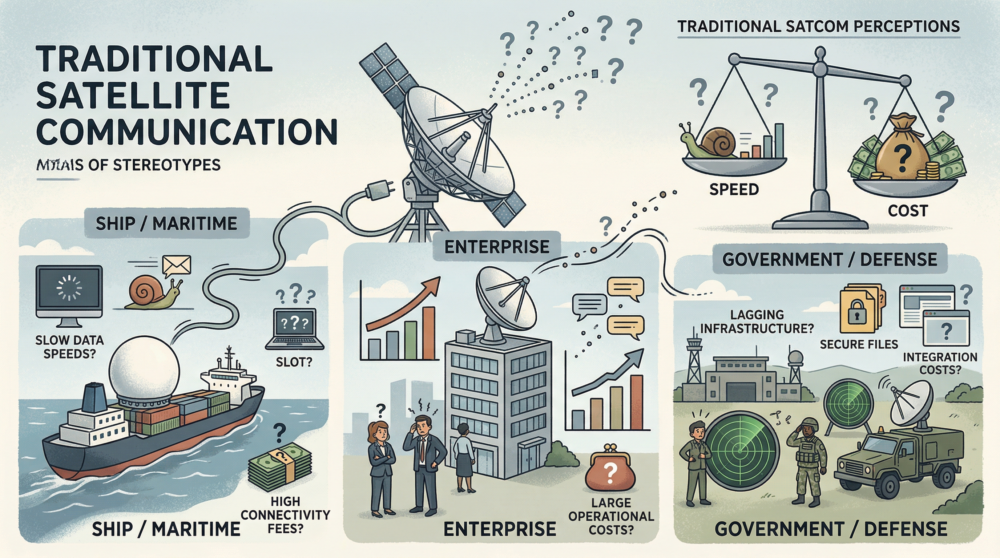
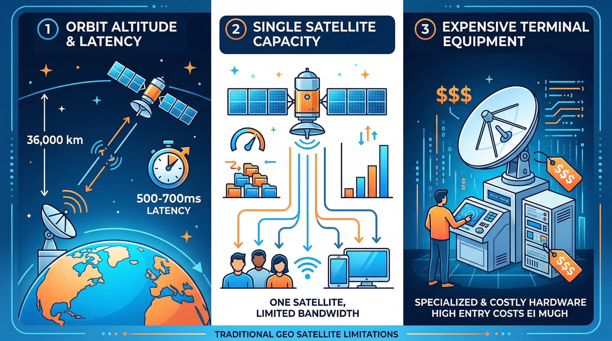
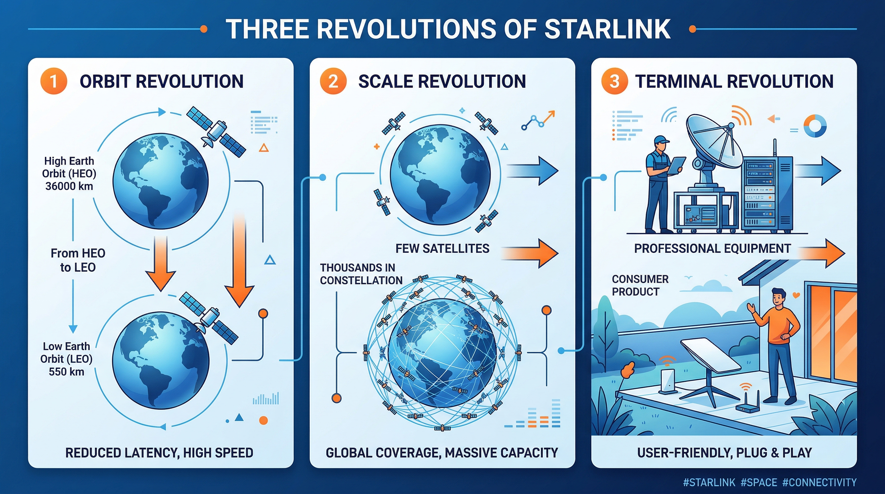
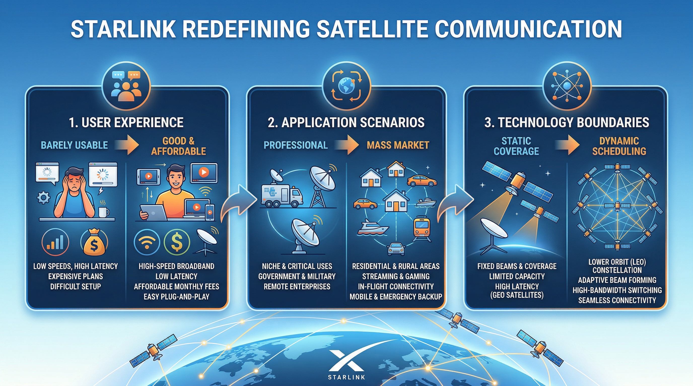
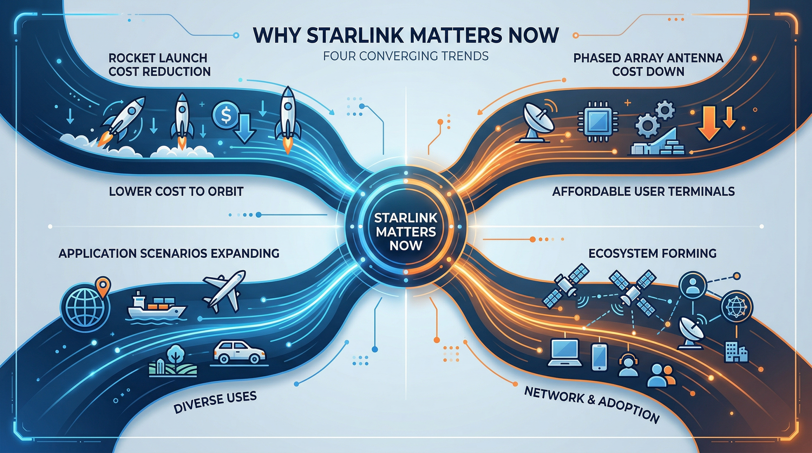

# 从通信视角看 Starlink（01）｜Starlink 到底是什么？它为什么重新定义了卫星通信

> 本文属于「从通信视角看 Starlink」系列第 1 篇
> 目标读者：对 Starlink 有基本好奇的广泛读者、刚接触卫星通信领域的行业新人、关注科技趋势的非技术背景人士

---

## 很多人对卫星通信的印象还停留在"又慢又贵"

提到卫星通信，你的第一反应是什么？

- "那是远洋海员才用的东西"
- "又贵又慢，普通人用不上"
- "只有政府和大企业才负担得起"

这些印象不是凭空来的。在过去几十年里，卫星通信确实是这样——延迟高达 600 毫秒以上，设备动辄几万美元，月费少则数千美元，稍微复杂一点的场景需要专业团队安装调测。

普通人哪怕知道头顶有卫星在转，也不会觉得那跟自己有关系。

但 Starlink 正在改变这一切——而且改变的速度，比大多数人预期的要快得多。

---

## 为什么传统卫星通信给人"又慢又贵"的印象？

要理解 Starlink 的革命性，先要理解传统卫星通信的根本限制。这些限制不是厂商不努力，而是**物理规律和商业逻辑共同决定的结构性约束**。

### 轨道高度决定了延迟

传统通信卫星大多运行在**地球同步轨道（GEO）**，高度约 36,000 公里。

选择这个高度有充分的理由：在这个轨道上，卫星绕地球一圈的时间恰好等于地球自转一圈的时间——24 小时。从地面看，卫星好像"静止"在天空中。这样地面天线不需要转动，对准一次就够了，系统复杂度大幅降低。

但这个高度也带来了无法绕过的问题：

信号从地面发到卫星需要飞行 36,000 公里，卫星处理后再发回地面又是 36,000 公里，往返合计 72,000 公里。光速约 30 万公里/秒，仅光速传播就需要 240 毫秒。加上卫星处理、地面设备处理等各个环节的延迟，实际往返延迟通常在 **500 毫秒到 700 毫秒**之间。

这对文件传输影响不大，但对实时通信来说是灾难级别的：
- 视频通话几乎无法做到流畅——说完一句话，对方要过半秒多才能听到
- 网页加载慢，因为每次 HTTP 请求都要经历这个往返延迟
- 在线游戏完全没法玩，500ms 延迟在竞技游戏里等于你的操作永远慢人一步

这不是技术不行，而是**物理规律决定的**——在那个轨道高度，没有任何方法把延迟降下来。

### 单颗卫星决定了容量

一颗 GEO 卫星通常重达 5 到 8 吨，研制周期 3 到 5 年，造价数亿美元，发射成本又是数千万到数亿美元。加在一起，每颗卫星的总投入轻松超过 10 亿美元。

因为太贵，所以不能多发。整个 GEO 轨道上的商用通信卫星加起来也就数百颗，而且还要避开互相干扰，轨道位置本身就是稀缺资源。

每颗卫星必须覆盖大面积——通常是一整个大洲或大洋——才能摊薄成本。而单颗卫星的频率资源是有限的，覆盖面积越大，分配到每个用户的带宽就越少。当大量用户同时接入时，每人分到的速率会急剧下降。

这就是为什么很多卫星宽带用户会抱怨"黄金时段特别慢"——本质上是容量不足，大家在抢同一块带宽。

### 专业终端决定了门槛

传统的卫星终端是专业设备。因为 GEO 卫星在 36,000 公里外，信号极其微弱，必须用大口径的碟形天线来接收。天线越大，收集到的信号能量越多，通信才能稳定。

普通的 VSAT 终端天线直径 0.9 米到 2.4 米不等，安装时需要用专业仪器精确对准卫星——偏差不能超过一两度，否则信号直接丢失。大型海事或政府用户的天线更大，有些直径超过 4 米。

安装成本、设备成本、专业服务费用加在一起：
- 设备费用：数千到数万美元
- 安装调测：需要专业团队，数百到数千美元
- 月度服务费：数百到数千美元

这把普通用户彻底挡在了门外。能负担得起的，只有远洋船只、偏远地区基站、政府机构、大型企业。

三个限制叠加在一起，传统卫星通信的市场注定是小众的、专业的、昂贵的。

---

## Starlink 的三个革命性改变

Starlink 不是传统卫星通信的升级版，而是**从底层架构开始完全重新设计**的系统。它几乎在每个核心维度上都选择了与传统方案相反的路径。

### 轨道革命：从 36,000 公里到 550 公里

Starlink 把卫星放到了**低地球轨道（LEO）**，高度仅约 550 公里——约为 GEO 的 1/65。

轨道降低直接解决了延迟问题：
- 信号往返距离从 72,000 公里降到约 1,100 公里
- 光速传播时间从约 240ms 降到约 3.7ms
- 加上处理延迟，实际端到端延迟：**20 毫秒到 50 毫秒**

20-50ms 是什么概念？这已经接近很多地面宽带的延迟水平。视频会议、语音通话、网页浏览，这些日常应用在这个延迟下完全可以流畅使用。在极端情况下，Starlink 甚至可以支持网络游戏——这在 GEO 卫星时代是完全不可想象的。

但低轨道带来了一个新问题：卫星移动速度极快。在 550 公里高度，卫星绕地球一圈只需要约 95 分钟，相对地面的角速度很高。每颗卫星飞过你头顶的时间只有几分钟，然后就消失在地平线以下。

这意味着单颗 LEO 卫星根本无法持续覆盖某一地区。要想实现连续服务，必须在天上同时有足够多的卫星，让用户能随时找到一颗在视线范围内的卫星，并在卫星切换时无缝接续。

### 规模革命：从单颗卫星到上万颗星座

这就是 Starlink 的第二个革命：**规模**。

传统 GEO 运营商在轨的卫星通常不超过几十颗。Starlink 目前在轨卫星数量已超过 **6,000 颗**，计划最终部署超过 **42,000 颗**。

这个数量级的差距不是"更多"那么简单，而是完全不同的系统逻辑：

**覆盖逻辑变了。** 传统卫星是"一颗覆盖一片"，而 Starlink 是"多颗轮流覆盖同一点"。任何地面位置上方，几乎随时都有多颗 Starlink 卫星处于可见范围，用户终端选择最优的那颗接入，卫星飞过后自动切换到下一颗，全程无感。

**容量逻辑变了。** 传统卫星是"所有用户共享同一颗卫星"，而 Starlink 是"用户被分配给不同的卫星服务"。随着卫星数量增加，整个系统的总容量线性增长，用户数量增加时可以通过增加卫星来扩容，而不是让现有用户挤占有限资源。

**成本逻辑变了。** Starlink 的卫星小而轻——早期型号约 260 公斤，最新的 v2 mini 约 800 公斤，与传统 GEO 的 5-8 吨根本不在同一量级。小卫星意味着可以批量制造，而 SpaceX 可以用猎鹰 9 号一次发射几十颗，用猎鹰重型一次发射更多。这把单颗卫星的发射成本压到了传统水平的 1/100 以下。

**还有一个维度：星间链路。** Starlink 最新的卫星配备了激光星间链路，卫星之间可以直接传输数据，不必每次都落到地面再传。这让 Starlink 可以在没有地面站的海洋、极地等地区提供服务，也让数据可以走更短的路径——在某些长距离传输场景下，走 Starlink 比走地面光纤的延迟还要低。

### 终端革命：从专业设备到大众产品

第三个革命发生在用户手中。

Starlink 的终端——俗称"锅"——外观只是一块略大的方形平板，内部集成了**相控阵天线（Phased Array Antenna）**。

相控阵天线是什么？简单说，它是一种由大量小型天线单元组成的阵列，通过控制每个单元的发射相位，让信号在不同方向上叠加或抵消，从而在不移动天线的情况下"电子扫描"不同方向的卫星。

这项技术原本是军事雷达和高端通信系统的专利，成本极高。Starlink 做的事情是：**用工程创新和大规模生产把它的成本打到大众可接受的水平。**

相控阵终端带来的体验变化是彻底的：
- **自动追踪**：终端启动后自动搜索卫星、建立连接，无需手动对准
- **自动切星**：当前服务卫星飞过头顶后，终端自动切换到下一颗，用户无感知
- **移动使用**：车载、船载、飞机上的 Starlink 终端版本，可以在移动中保持稳定连接
- **安装简单**：找到开阔视野，插上电，几分钟内自动上线

价格方面：标准款终端售价约 599 美元，月费约 120 美元。这与传统卫星通信动辄数万美元的终端、数千美元的月费相比，已经是质的跨越——虽然对于普通家庭还不算便宜，但对于真正有需要的用户来说，这是第一次"买得起"。

这是把原本只属于军事和航天领域的技术，用工程创新和规模效应真正带进了大众市场。

---

## Starlink 重新定义了什么？

三个革命性改变叠加，带来的是三个维度的重新定义。

### 重新定义了用户体验

传统卫星通信的用户体验是"能用就行"——延迟高、速率不稳定、安装复杂，用户只能接受，没有替代选择。

Starlink 的用户体验目标是"好用且相对便宜"：
- **可用性**：插电即用，自动校准，普通用户可以自行安装
- **性能**：下行速率通常在 50-200 Mbps，延迟 20-50ms，足以支撑日常所有应用
- **稳定性**：多颗卫星冗余，单颗故障不影响服务

当然，Starlink 目前也有不足之处——雨雪天气可能造成信号衰减，树木遮挡会影响连接质量，在高密度城市地区的竞争力不如地面宽带——但对于那些此前完全没有像样宽带选择的地区，Starlink 带来的改变是根本性的。

### 重新定义了应用场景

传统卫星通信的典型用户：
- 政府机构：外交使馆、边境哨所
- 军事：野战通信、情报传输
- 海事：远洋船只、渔船
- 大型企业：石油钻井平台、偏远矿山

Starlink 开拓的新场景：
- **偏远地区家庭宽带**：这是目前最大的市场，美国农村、澳大利亚内陆、非洲偏远社区
- **应急通信**：地震、洪水、火灾后，地面基础设施损毁，Starlink 可以快速恢复通信
- **移动场景**：RV 旅行、帆船航行、山区徒步的实时通信
- **航空互联网**：飞机上的 Wi-Fi，已有多家航空公司部署 Starlink
- **工业物联网**：油气管道监控、远程农业设备管理

最值得关注的是，Starlink 在乌克兰冲突中的表现证明了它在极端环境下的价值——当地面通信基础设施受到攻击，Starlink 终端成为维持通信的关键手段。这让很多国家和军队对 LEO 卫星通信的战略价值有了全新的认识。

### 重新定义了技术边界

在 Starlink 之前，"大规模 LEO 星座是否可行"本身还是一个存疑的问题——技术挑战、成本挑战、监管挑战，每一个都可能是致命的。

Starlink 的成功验证了：
- 大规模 LEO 星座从工程上是可行的
- 大规模批量制造小卫星是可行的
- 相控阵终端可以规模化并降低到大众可接受的价格
- 数千颗卫星的协同管理和频谱共享是可以解决的工程问题

这些验证不只对 Starlink 自己有意义，它打开了整个行业的想象空间，也带动了 OneWeb、Amazon Kuiper、中国的千帆星座等竞争者加速布局。

---

## 为什么现在值得重新讨论卫星通信？

Starlink 的崛起不是一个孤立事件，它是多个技术趋势同时成熟的产物。

### 发射成本出现了历史性拐点

卫星通信的根本成本是把卫星送上天。在 SpaceX 之前，将 1 公斤货物送入低轨的成本约为 **5 万美元**。猎鹰 9 号的出现把这个数字降到了 **2,000-3,000 美元**，猎鹰重型降到更低，而正在研发的星舰理论上可以把成本压到 **100 美元/公斤**以下。

发射成本下降 10 到 100 倍，意味着原本因为"太贵发不起"的星座计划，现在变成了可以计算商业回报的方案。没有可回收火箭这个前提，Starlink 的商业模式根本无法成立。

### 半导体技术使相控阵天线成本大幅下降

相控阵天线的核心是射频芯片（RFIC）。以前，每个天线单元需要独立的 RFIC，成本极高。随着半导体工艺进步，现在可以把大量天线单元的收发功能集成到单块芯片上，成本呈数量级下降。

Starlink 终端内有约 1,280 个天线单元，用了大量定制射频芯片。2020 年，市场估计单个终端的物料成本约为 **3,000 美元**；到 2023 年，据报道已降至 **500 美元**以下。终端成本的下降直接决定了 Starlink 能否做到大众化。

### 软件定义网络让星座管理成为可能

管理 6,000 颗（未来 42,000 颗）卫星的动态网络，在过去是不可想象的。每颗卫星都在移动，覆盖区域在变，不同卫星之间需要协调频率、切换用户、分配带宽……

这在"人工管理"的时代根本无法实现，只有软件定义网络（SDN）和人工智能调度算法的成熟，才让大规模星座的自动化运营成为现实。Starlink 的地面控制系统，本质上是一个全球规模的实时网络调度系统。

### 需求侧的爆发：连接鸿沟依然巨大

根据 ITU 的数据，全球仍有约 **26 亿人**没有互联网接入，大多数分布在偏远地区、发展中国家的农村地区和海洋上。传统地面网络的基础设施建设需要大量资本投入，在人口稀少的地区商业上不可行。

卫星通信不需要铺设电缆，不需要建设基站，覆盖边际成本极低——这在逻辑上是解决"最后一公里"问题的理想方案。Starlink 的出现，让这个逻辑第一次有了规模化落地的可能。

---

## Starlink 不只是技术进步，更是范式革命

真正的革命性创新有一个特征：它不是让现有方案"更好"，而是让之前"不可能的事情"变得可能。

Starlink 之前，对于偏远地区的普通用户来说，"用卫星上网"意味着忍受 600ms 延迟、每月数千美元费用、专业团队安装——这不是选择，这是门槛。

Starlink 之后，同样的用户可以：自己安装、自己开通、实测延迟 30ms、下载速度 150Mbps、月费 120 美元。

这个改变的意义，不是"卫星宽带变便宜了"，而是**整个应用场景的可能性边界被重新划定**。

从通信技术发展的视角看，Starlink 的价值在于：

**它证明了 LEO 星座通信是一条可走的路。** 在 Starlink 之前，很多业内人士对大规模 LEO 星座持怀疑态度——铱星的失败案例历历在目。Starlink 的商业成功改变了这个判断，带动了整个行业的战略转向。

**它把专业技术大众化。** 相控阵天线、精密轨道控制、星间激光链路——这些技术此前只出现在军事和高端商业场景。Starlink 用工业化的方式把它们带进了大众消费市场，这个路径本身就是一种示范。

**它重新定义了竞争格局。** 传统电信运营商的核心护城河是"基础设施"——你没有光纤，就没有带宽，就只能用我的服务。Starlink 带来了一个不依赖地面基础设施的替代方案，这对全球电信市场格局的影响还在慢慢展开。

---

## 本文解决了什么？

- 解释了传统卫星通信"又慢又贵"的根本原因——轨道高度、卫星数量、终端成本三重结构性约束
- 详细说明了 Starlink 在轨道、规模、终端三个维度的革命性突破，以及背后的技术逻辑
- 澄清了 Starlink 如何重新定义用户体验、应用场景和行业技术边界
- 回答了为什么"现在"是卫星通信范式转变的关键窗口期

---

## 下一篇预告

**从通信视角看 Starlink（02）｜从一张图看懂 Starlink 的整体系统**

很多人以为 Starlink 就是"用户终端直接连卫星"，但真相要复杂得多。

下一篇我会带你：
- 看清 Starlink 的完整系统结构
- 理解卫星、地面站、终端、互联网出口之间的关系
- 明白星间链路如何改变了整个系统的设计逻辑

---

**栏目**：从通信视角看 Starlink
**系列索引**：第 1 篇 / 第一阶段 6 篇
**目标读者**：对 Starlink 有基本好奇的广泛读者、刚接触卫星通信领域的行业新人、关注科技趋势的非技术背景人士
