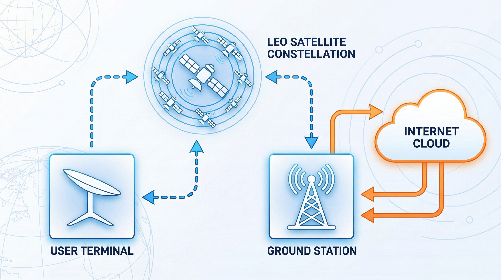
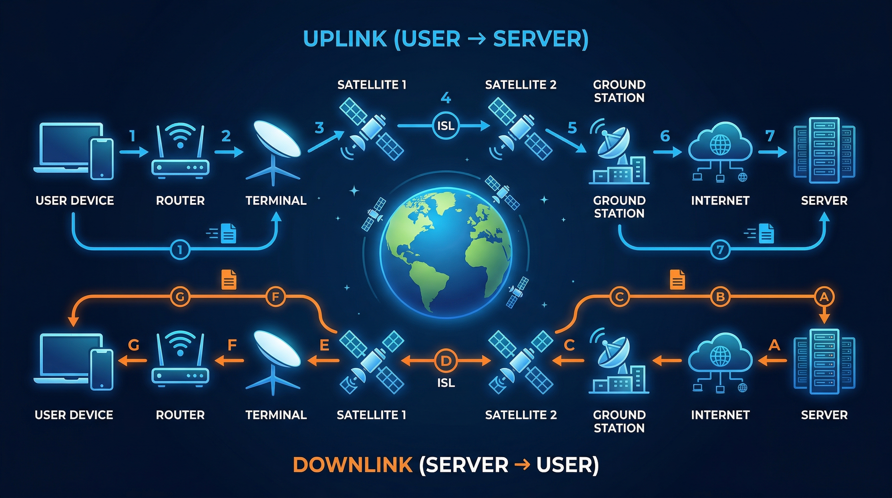
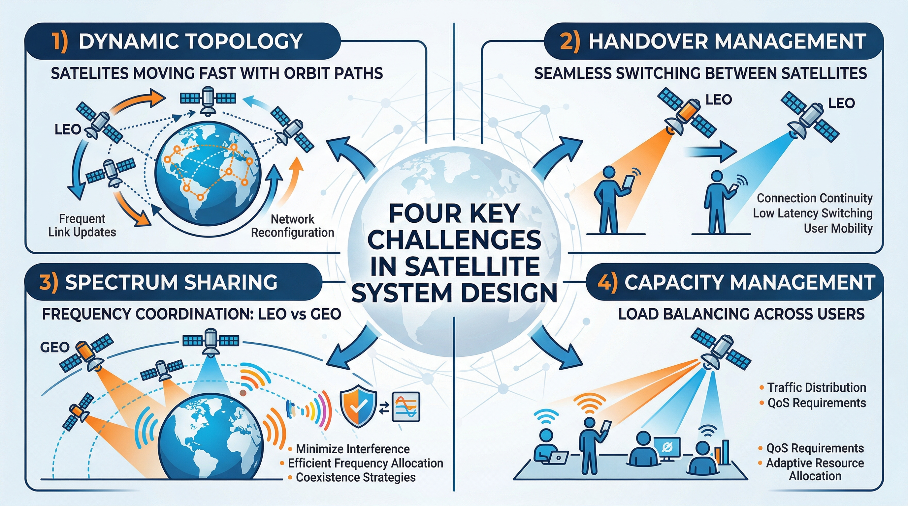
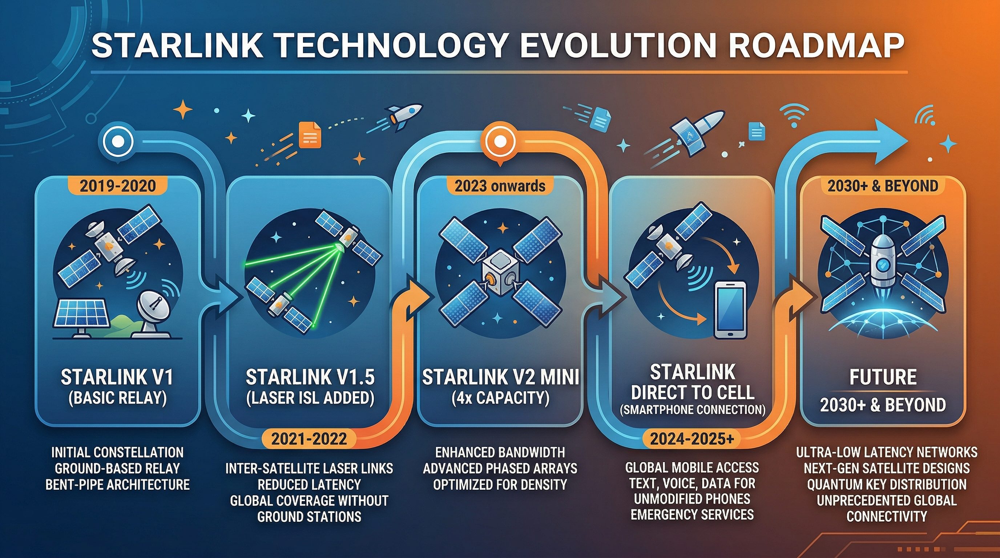

# 从通信视角看 Starlink（02）｜从一张图看懂 Starlink 的整体系统：卫星、地面站、终端、互联网出口怎么连起来

> 本文属于「从通信视角看 Starlink」系列第 2 篇
> 目标读者：想了解 Starlink 工作原理的广泛读者、需要系统级理解的通信从业者、关注系统架构的技术背景读者

---

## 很多人以为 Starlink 就是"用户终端直接连卫星"

这个理解对吗？

对，但不完整。

一个更接近真相的描述是：**Starlink 是一个精密的端到端通信系统**，卫星只是其中一个环节——尽管是最显眼的那个。

如果你只知道"终端 + 卫星"，会错过很多关键的设计逻辑，也很难理解为什么 Starlink 在某些场景下表现出色，而在另一些场景下有局限。

这篇文章的目标，就是帮你把整个系统结构看清楚。

---

## Starlink 系统的四大核心组件

Starlink 系统由四个主要部分构成，缺一不可。

### 1. LEO 卫星星座：在轨运行的通信节点

**轨道高度**：约 340 公里至 570 公里（不同轨道壳层）
**在轨数量**：截至 2024 年底已超过 6,000 颗，计划最终部署超过 42,000 颗
**卫星重量**：v1 型约 260 公斤，v2 mini 约 800 公斤，v2 full size 约 1,250 公斤

每颗卫星的核心功能是**通信中继**：接收来自用户终端或其他卫星的信号，处理后转发到下一个节点——可能是地面站，也可能是另一颗卫星。

有一个常见的误解需要澄清：卫星不是"太空基站"，它本身不存储任何互联网内容，也不是互联网的源头。互联网的内容还是在地面的各个服务器上，卫星只是把用户和地面之间的数据搬来搬去。

这个区别很重要，因为它意味着：**卫星的价值在于链路，而不是内容**。

**星间链路（Inter-Satellite Link, ISL）**是 Starlink 后期卫星的重要特性。早期的 Starlink 卫星没有星间链路，卫星之间无法直接通信，每次数据传输都必须"落地"到地面站再"上行"。这限制了 Starlink 的覆盖范围——没有地面站的地方（如海洋中央、极地）无法提供服务。

v1.5 版本开始，Starlink 卫星增加了激光星间链路。每颗卫星配备 4 条激光链路（前后左右各一条），可以直接与相邻卫星通信，数据可以在太空中一颗接一颗地转发，无需每次都落地。这让 Starlink 实现了真正的全球覆盖，包括海洋和极地地区。

星间链路还带来了一个意想不到的优势：**在某些超长距离路由场景下，走 Starlink 的延迟比走地面光纤还低**。原因是光在真空中的传播速度是光在光纤中传播速度的约 1.5 倍，而且地面光纤路由并不总是最短路径——它受制于地理和政治因素。Starlink 的星间链路在太空中走直线，没有这些限制。

### 2. 用户终端：用户侧的通信设备

用户终端——俗称"锅"或"碟"——是大多数用户唯一看得见、摸得着的 Starlink 组件。但它的内部，比外表复杂得多。

**核心技术：相控阵天线**

传统碟形卫星天线依靠物理旋转来对准卫星。这在 GEO 场景下没问题——卫星位置固定，对准一次够用很久。但在 LEO 场景下，卫星以每秒 7.8 公里的速度飞过，每隔几分钟就需要切换一颗卫星，物理旋转根本跟不上。

相控阵天线的解决方案是**电子波束赋形**：天线由数百到上千个小型天线单元（阵元）组成，通过精确控制每个阵元的发射相位，可以让信号在特定方向叠加增强、在其他方向相消，从而在不移动天线的情况下将波束"指向"任意方向。切换方向只需改变一组数字，速度远超机械旋转，理论上可以在几毫秒内完成。

Starlink 标准版终端的天线阵列含约 1,280 个阵元，工作在 Ku 频段（用户下行：10.7-12.7 GHz，用户上行：14.0-14.5 GHz）。

**终端型号**

Starlink 目前有多款终端，适配不同场景：

| 型号 | 适用场景 | 特点 |
|------|---------|------|
| Standard（圆形/方形） | 家庭固定宽带 | 最常见，安装简单 |
| Standard with Motion | 低速移动（RV、帆船） | 支持移动中使用 |
| Flat High Performance | 极端天气、高需求场景 | 更大天线，信号更强 |
| Maritime | 船载，高速海上移动 | 防水防盐雾，双天线 |
| Aviation | 机载 | 超薄机身，极低风阻 |
| Enterprise | 企业级 | 更高 SLA，优先保障 |

**安装过程**

标准版终端的安装异常简单：找一个没有遮挡（障碍仰角 <25°）的位置，把天线架好，插上电源线和网线，终端自动完成校准和连接，通常 5-20 分钟内上线。Starlink App 提供了"遮挡检测"功能，用手机扫一圈就能评估安装位置是否合适。

不需要专业技师，不需要精确对准，普通用户自己可以完成全程安装——这在卫星通信领域是颠覆性的。

### 3. 地面站（网关站/PoP）：卫星与互联网的桥梁

地面站是 Starlink 系统中最容易被忽视、但实际上极为关键的组件。

**基本功能**：地面站扮演"网关"角色，负责：
- 接收卫星下行的用户数据，转发到公共互联网
- 将来自公共互联网的数据，上行发送给卫星
- 维护与多颗卫星的同时连接，处理切换

**物理形态**：一个地面站通常由多个大型平板相控阵天线组成，同时追踪多颗卫星，24 小时不间断运行。地面站通过高速光纤专线连接到互联网 PoP（接入点），再接入骨干网。

**地理分布的重要性**：地面站的位置直接决定了用户的网络体验。

在没有星间链路的早期 Starlink，用户的数据必须先上传到卫星，卫星必须找到视野内的地面站才能"落地"。如果某个地区上空的卫星视野内没有地面站，用户根本无法上网。这就是早期 Starlink 无法覆盖海洋中央和极地的原因——那些地方上空的卫星找不到地面站。

有了星间链路之后，数据可以在卫星之间传递，最终找到一颗能"看到"地面站的卫星再落地。地面站的地理约束大幅放宽，但仍然是系统的重要组成部分。

**数量与分布**：Starlink 在全球设有数百个地面站，覆盖所有已开放服务的国家和地区。在进入新市场时，获得当地的频谱许可和地面站建设许可，是 Starlink 扩张的核心门槛之一。

### 4. 运控系统：隐藏在背后的大脑

很多介绍 Starlink 的文章只讲前三个组件，忽略了第四个：**运控系统（Network Operations Center, NOC）**。

这是整个系统的大脑，负责：
- 实时追踪所有在轨卫星的位置和状态
- 动态分配每颗卫星的波束覆盖方向和频率资源
- 调度用户终端与卫星之间的连接（决定哪个用户接入哪颗卫星）
- 管理卫星之间的路由（数据在哪颗卫星上走星间链路、在哪里落地）
- 预测和处理卫星故障、软件更新、轨道机动

运控系统处理的数据规模极大：6,000 颗卫星、数百万用户、实时变化的网络拓扑——这是一个全球规模的实时调度问题，只有用软件定义网络（SDN）和人工智能调度才能实现。

用户感知不到运控系统的存在，但它的质量直接决定了 Starlink 的整体网络体验。

---

## 数据流路径：一次完整的通信过程

理解了组件，再来看数据是如何流动的。

以你用 Starlink 打开一个网页为例：

**上行路径（你发出请求）：**

1. 你在浏览器地址栏输入网址，按下回车
2. 你的电脑/手机通过 Wi-Fi 连接到 Starlink 路由器
3. 路由器将数据包转发给用户终端（"锅"）
4. 终端的相控阵天线将数据以无线电信号发射给头顶的卫星（Ku 频段上行）
5. 卫星收到信号后有两条路：
   - **有星间链路的情况**：数据在卫星之间传递，找到最优路径，最终到达一颗能与地面站通信的卫星
   - **无星间链路的情况**：等到一颗视野内有地面站的卫星来接收
6. 卫星将数据下传到地面站
7. 地面站通过光纤接入互联网，将请求发送到目标网站的服务器

**下行路径（响应返回给你）：**

1. 目标服务器返回网页数据
2. 数据通过互联网路由到最近的 Starlink 地面站
3. 地面站将数据上传到卫星
4. 卫星（经过星间链路或直接）将数据下传给你的终端
5. 终端接收信号，解码后转发给路由器
6. 你的设备收到数据，浏览器渲染出网页

整个往返过程在正常情况下需要 **40-80 毫秒**，在极端情况下（如系统拥塞、星间链路绕行）可能达到 100 毫秒以上。

注意这里的一个细节：数据上行（终端到卫星）和下行（卫星到终端）**不一定经过同一颗卫星**。运控系统会选择当时最优的卫星组合，用户完全无感知。

---

## 系统复杂性：真正的挑战在哪里？

### 动态拓扑：永不停歇的星座

GEO 卫星的网络拓扑是静态的——卫星固定，终端固定，地面站固定，网络连接关系基本不变。

Starlink 的网络拓扑是**动态变化的**。每颗卫星以每秒 7.8 公里的速度飞行，每 95 分钟绕地球一圈。任意两颗卫星之间的距离、任意卫星与地面之间的仰角，都在时刻变化。

这意味着：网络路由必须在毫秒级别内实时重算。用户终端与哪颗卫星连接、这颗卫星的数据走哪条星间链路、在哪个地面站落地——这些决策每隔几秒就需要更新一次。

这是一个巨大的工程挑战，也是 Starlink 的核心技术壁垒之一。

### 切换管理：无缝的接力赛

当你正在用 Starlink 视频通话时，头顶的卫星每隔几分钟就会飞过地平线，终端需要切换到下一颗卫星。如果切换处理不好，你会听到一声"卡"，或者通话直接中断。

Starlink 的切换机制是**预先建立 + 无缝切换**：在当前卫星还在视野内的时候，终端就已经预先和下一颗卫星建立好连接，切换时刻到来时只是把流量转移过去，用户感知不到任何中断。

这要求运控系统提前预测每颗卫星的轨道位置，提前调度资源，并在正确的时刻触发切换——对调度精度要求极高。

### 频谱共享：避免干扰的精密博弈

Starlink 使用的 Ku 频段是一个有其他用户的频段——包括传统 GEO 卫星运营商。大量 LEO 卫星在全球运行，必须保证与 GEO 卫星之间不产生有害干扰，这是监管层面的强制要求。

Starlink 的解决方案是**动态频率协调**：在卫星飞越可能干扰 GEO 卫星的位置时，自动调整发射功率和频率使用，避让干扰保护区。这是一个实时的、全球规模的频率管理问题。

### 容量管理：公平与效率的平衡

当某个热门地区的 Starlink 用户数量超过卫星容量上限时，所有用户的速率都会下降。Starlink 目前的策略是：**所有用户共享可用容量，不设单用户速率上限，但高峰期速率可能降低**。

为了解决这个问题，Starlink 推出了"Priority"服务（高优先级通道）——支付更高费用的用户在拥塞时可以获得优先保障。这本质上是一种**QoS（服务质量）分级**机制，在资源受限时保证付费更高用户的体验。

---

## 地面站：系统的地理约束

### 为什么地面站位置很重要？

Starlink 的服务范围不只取决于卫星覆盖，还取决于地面站的分布。要进入一个国家提供服务，Starlink 需要：

1. 获得该国的频谱使用许可（通常由电信监管机构颁发）
2. 在该国境内或邻近地区建设地面站（或获得豁免）
3. 满足该国对数据本地化、监管接入的要求

这是一个复杂的政治和监管问题。一些国家因为监管要求无法满足，至今 Starlink 无法提供服务。另一些国家出于战略考虑，禁止或限制 Starlink 进入。

这意味着：**Starlink 的全球覆盖是一张有很多"空白区域"的地图**，而这些空白区域的形成不是技术原因，而是政治和监管原因。

### 有了星间链路，地面站还重要吗？

依然重要。星间链路解决的是"数据能不能在太空中传递"的问题，但数据最终还是要"落地"到互联网——而互联网在地面。

有了星间链路，数据可以绕行更远，找到一个可用的地面站落地；但如果某片区域方圆几千公里内都没有地面站，星间链路再强也无法提供服务（数据无处落地）。

实际上，星间链路让 Starlink 可以用更少的地面站覆盖更大的区域，大幅降低了地面站建设成本，但不能完全取消地面站。

---

## 为什么理解系统结构很重要？

### 避免"黑盒思维"

把 Starlink 当黑盒用（插上就能上网），用户体验很好。但一旦遇到问题——速度慢、延迟高、某个地区无法使用——黑盒思维就无法帮你分析原因，更无法做出正确的决策。

理解了系统结构，你就能判断：
- 延迟高是卫星问题，还是地面站远，还是网络拥塞？
- 某地区不能用，是技术限制还是监管限制？
- 移动场景能不能用，具体是哪款终端支持？

### 理解性能边界

Starlink 的性能不是一个固定数字，而是由多个因素共同决定的：
- **轨道高度**：决定了传播延迟的下限
- **卫星密度**：决定了覆盖质量和容量
- **用户密度**：用户越多，单人分到的带宽越少
- **地面站距离**：星间链路延迟与地面站到用户的路由路径有关
- **天气条件**：大雨、大雪会造成 Ku 频段信号衰减

理解了这些因素，你就能对 Starlink 的实际表现有更合理的预期。

### 预判技术演进方向

了解系统架构之后，你能更好地理解 Starlink 下一步的技术方向：

- **卫星容量提升**：v2 卫星的容量是 v1 的 4 倍以上，未来版本还会继续提升
- **直连手机（Direct to Cell）**：新增基站频段，让普通手机无需特殊终端直接接入 Starlink
- **激光星间链路扩展**：进一步减少对地面站的依赖
- **更低轨道壳层**：在更低高度部署卫星，进一步降低延迟

每一个方向都对应着目前架构中的某个瓶颈。

---

## 整体系统的一张图

至此，Starlink 系统的全貌可以这样总结：

**用户终端** → （Ku/Ka 频段无线链路）→ **LEO 卫星**
**LEO 卫星** → （激光星间链路，可选）→ **其他 LEO 卫星**
**LEO 卫星** → （Ka 频段馈电链路）→ **地面站**
**地面站** → （光纤专线）→ **互联网骨干网**
**互联网骨干网** → （全球互联网）→ **目标服务器**

这五个环节，每一个都有自己的延迟、带宽、可靠性约束。Starlink 整体的性能，是这五个环节协同优化的结果——而不只是"卫星够低"这么简单。

---

## 本文解决了什么？

- 清晰展示了 Starlink 的完整系统结构（四大核心组件 + 运控系统）
- 深入解释了每个组件的功能、原理和重要性
- 详细说明了数据流的完整路径（含星间链路场景）
- 揭示了系统复杂性的四个主要来源
- 解释了地面站的地理约束及其政治含义
- 阐明了理解系统结构对判断性能、预期局限、把握技术演进的价值

---

## 下一篇预告

**从通信视角看 Starlink（03）｜Starlink 和传统卫星通信、5G、地面宽带，到底有什么本质区别**

很多人想知道"Starlink 和 5G 哪个好"——但这个问题本身就问错了。

下一篇我会带你：
- 建立正确的技术比较框架
- 从延迟、速率、覆盖、移动性、成本五个维度做系统对比
- 给出不同场景下的选型建议

---

**栏目**：从通信视角看 Starlink
**系列索引**：第 2 篇 / 第一阶段 6 篇
**目标读者**：想了解 Starlink 工作原理的广泛读者、需要系统级理解的通信从业者、关注系统架构的技术背景读者
