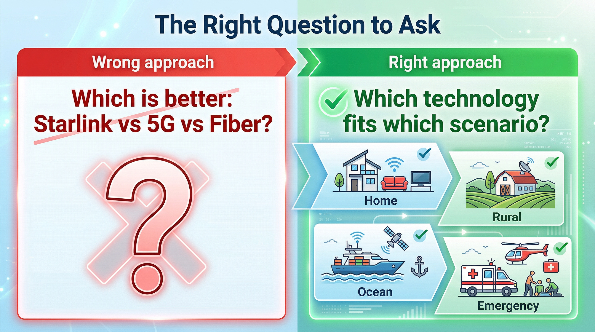
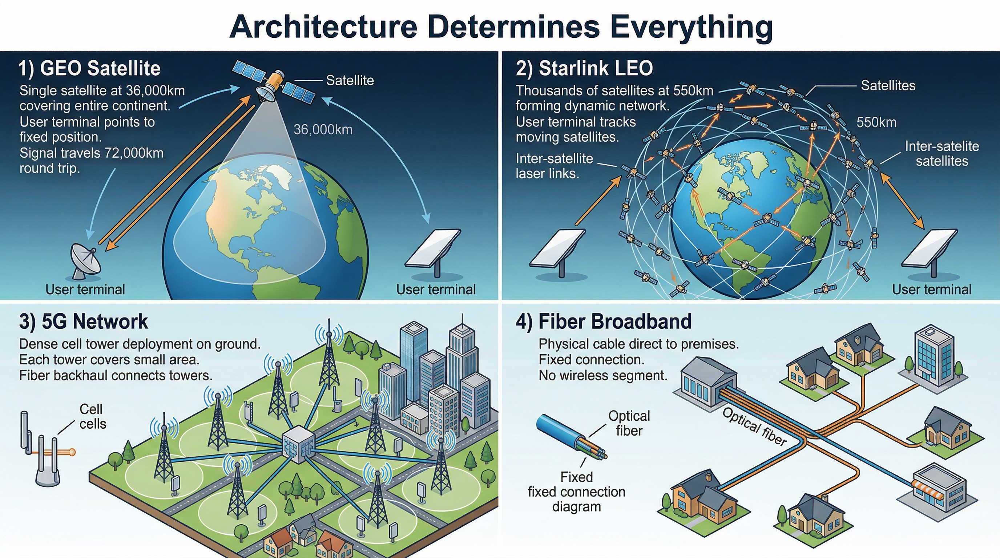
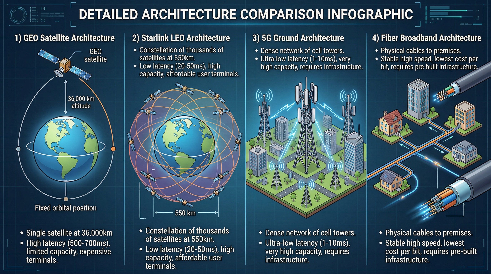
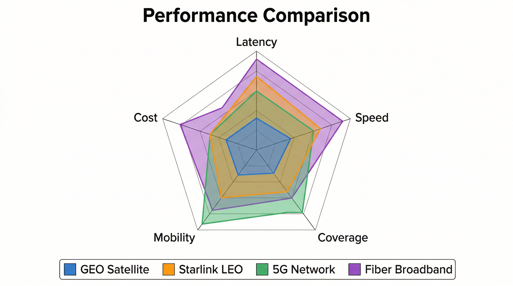
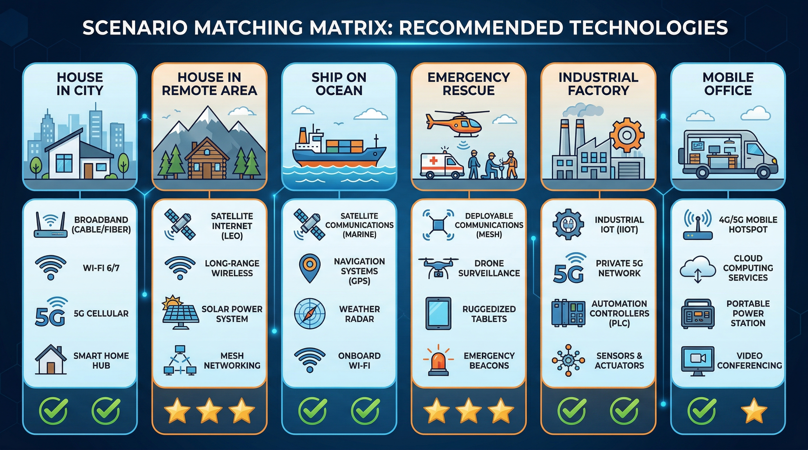
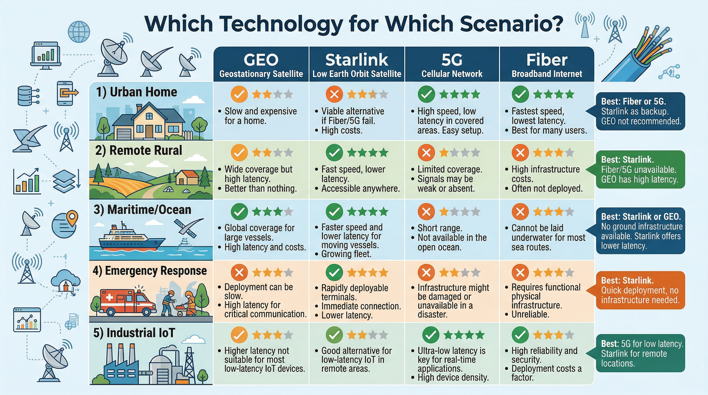
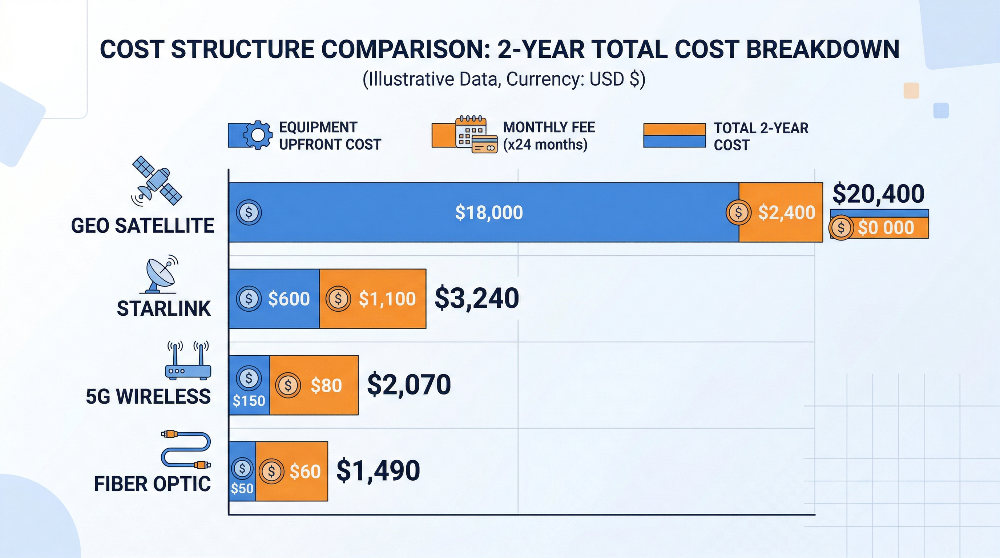
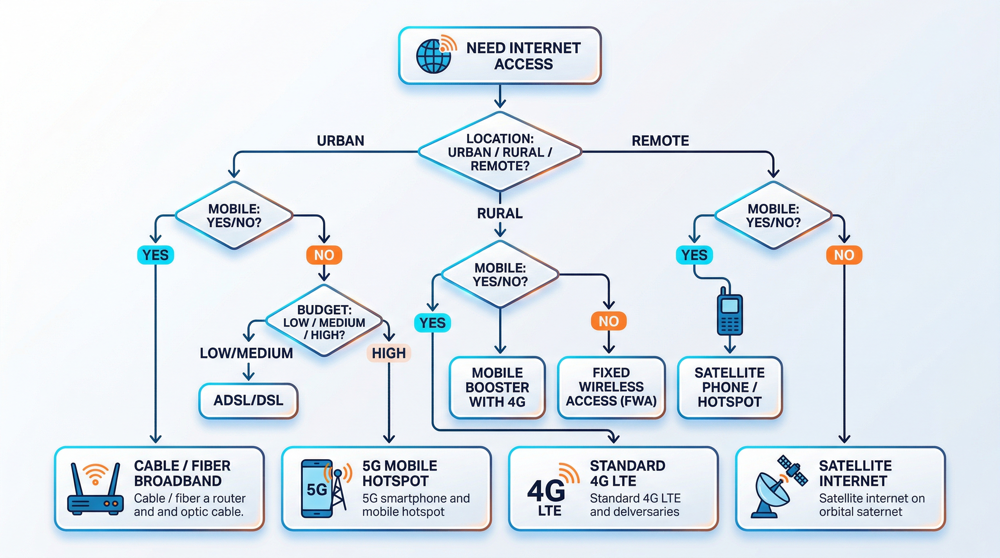

# 从通信视角看 Starlink（03）｜Starlink 和传统卫星通信、5G、地面宽带，到底有什么本质区别

> 本文属于「从通信视角看 Starlink」系列第 3 篇
> 目标读者：对 Starlink 有好奇但不了解细节的广泛读者、需要清晰对比框架的通信从业者、需要技术评估的决策者

---

## 为什么不能简单地说谁更好？

很多人问我："Starlink 到底比 5G 好还是差？"、"它能不能取代地面宽带？"

这类问题本身就暴露了一个误区：**把不同技术当成直接竞争对手**。

实际上，Starlink、传统 GEO 卫星、5G、地面宽带，它们解决的是**不同场景下的不同问题**。就像问"飞机和汽车哪个更好"——答案取决于你要去哪里，而不是交通工具本身的"强弱"。

真正的问题应该是：**在什么情况下，哪种技术更合适？**

---

## 架构差异：根本原因在这里

要理解它们的区别，先看架构。架构决定了一切——延迟、容量、成本、适用场景，都源于此。

### 传统 GEO 卫星

**架构描述**：
单颗卫星在 36,000 公里高空，覆盖大面积区域（通常是一个大洲或大洋）。用户终端直接连接卫星，卫星再连接地面站，地面站接入互联网。

**技术细节**：
- **轨道特性**：地球同步轨道（Geostationary Earth Orbit），卫星相对地面静止
- **覆盖范围**：单颗卫星覆盖约 1/3 地球表面
- **频段使用**：主要使用 Ku 频段（12-18 GHz）和 Ka 频段（26.5-40 GHz）
- **转发器数量**：通常 24-48 个转发器，每个转发器带宽有限

这种架构决定了：
- **高延迟**：信号往返 72,000 公里，仅光速传播就需要 240 毫秒，加上处理延迟达到 500-700 毫秒
- **容量有限**：单颗卫星带宽资源固定，通常总容量 50-100 Gbps，所有用户共享
- **成本高昂**：卫星制造 3-5 年，造价 3-5 亿美元，发射成本 5000 万 -1 亿美元
- **寿命限制**：设计寿命 10-15 年，到期需要替换

**典型代表**：Viasat、HughesNet、Inmarsat

---

### Starlink LEO 星座

**架构描述**：
上万颗卫星在 550 公里低轨组成动态网络。用户终端连接最近的卫星，卫星通过星间链路（激光）或其他卫星连接，最终通过地面站接入互联网。

**技术细节**：
- **轨道特性**：低地球轨道（Low Earth Orbit），卫星相对地面高速移动
- **覆盖方式**：多颗卫星轮流覆盖同一地区，实现连续服务
- **频段使用**：Ku 频段（用户链路）、Ka 频段（馈电链路）、激光（星间链路）
- **卫星容量**：v1 卫星约 20 Gbps，v2 mini 约 100 Gbps，v2 full size 预计 300-500 Gbps

这种架构带来了：
- **低延迟**：信号往返仅 1,100 公里左右，实际端到端延迟 20-50 毫秒
- **高容量**：大量卫星分担负载，系统总容量可达数百 Tbps
- **动态调度**：资源可根据需求实时分配，热点区域可增加卫星密度
- **全球覆盖**：包括海洋、极地等传统网络无法覆盖的区域

**关键创新**：
- **星间激光链路**：卫星之间直接通信，减少对地面站的依赖
- **相控阵用户终端**：电子波束转向，毫秒级卫星切换
- **批量生产模式**：工业化卫星制造，成本大幅降低

---

### 5G 地面网络

**架构描述**：
密集部署的地面基站，每个基站覆盖小范围（城市 1-3 公里，郊区 5-10 公里）。用户设备直连基站，基站通过光纤回传网络接入核心网。

**技术细节**：
- **频段使用**：Sub-6 GHz（覆盖层）、毫米波 24-100 GHz（容量层）
- **基站密度**：城市区域每平方公里 10-50 个基站
- **单站容量**：Sub-6 GHz 约 1-2 Gbps，毫米波约 5-10 Gbps
- **回传要求**：每个基站需要光纤回传，带宽需求 10 Gbps+

这种架构的特点是：
- **超低延迟**：通常 1-10 毫秒，适合实时应用
- **超高容量**：毫米波频段提供极大带宽，理论峰值 10-20 Gbps
- **覆盖受限**：需要大量基础设施，难以覆盖偏远地区
- **部署成本高**：城市区域每基站部署成本 5-20 万美元

**典型代表**：Verizon 5G、AT&T 5G、中国移动 5G

---

### 地面宽带

**架构描述**：
固定线路（光纤/电缆）直接到户。用户通过路由器接入，线路直接连接运营商网络。

**技术细节**：
- **接入技术**：FTTH（光纤到户）、DOCSIS（有线电视网络）、xDSL（电话线）
- **单户带宽**：光纤可达 1-10 Gbps，有线电视 100-1000 Mbps，DSL 10-100 Mbps
- **共享模式**：同一区域用户共享骨干带宽，但入户带宽独享
- **维护成本**：线路维护成本低，但初始铺设成本高

优势在于：
- **稳定高速**：不受无线干扰影响，延迟稳定在 5-20 毫秒
- **成本效益**：长期使用成本低，月费 30-100 美元
- **技术成熟**：数十年发展，可靠性高
- **依赖基建**：需要预先铺设线路，偏远地区不经济

**典型代表**：Comcast、AT&T Fiber、中国电信光纤

---

## 性能维度对比

让我们用具体数据说话。下表总结了四种技术的关键性能指标：

### 延迟对比

| 技术 | 理论最低 | 实际平均 | 最差情况 | 适用应用 |
|------|----------|----------|----------|----------|
| **地面宽带** | 5ms | 10-20ms | 50ms | 所有应用 |
| **5G** | 1ms | 10-30ms | 100ms | 所有应用 |
| **Starlink** | 20ms | 30-60ms | 100ms+ | 大部分应用 |
| **GEO 卫星** | 500ms | 600-800ms | 1000ms+ | 仅非实时应用 |

**关键洞察**：Starlink 的延迟已经进入了"可用"范围，可以支持视频通话、网页浏览、甚至轻度在线游戏。但与地面网络相比仍有差距。

### 速率对比

| 技术 | 下行峰值 | 下行平均 | 上行平均 | 适用场景 |
|------|----------|----------|----------|----------|
| **地面光纤** | 1-10 Gbps | 100-500 Mbps | 50-200 Mbps | 所有场景 |
| **5G 毫米波** | 2-10 Gbps | 200-500 Mbps | 50-100 Mbps | 城市热点 |
| **Starlink** | 50-200 Mbps | 50-150 Mbps | 10-30 Mbps | 大部分场景 |
| **GEO 卫星** | 25-100 Mbps | 10-50 Mbps | 1-5 Mbps | 基本需求 |

**关键洞察**：Starlink 的速率对于家庭宽带应用已经足够，可以支持 4K 视频流媒体、在线会议、文件下载等常见需求。

### 覆盖对比

| 技术 | 覆盖类型 | 覆盖范围 | 部署难度 |
|------|----------|----------|----------|
| **GEO 卫星** | 广域覆盖 | 全球（除极地） | 中等 |
| **Starlink** | 广域覆盖 | 全球（含极地） | 低 |
| **5G** | 点状覆盖 | 城市/郊区 | 高 |
| **地面宽带** | 线状覆盖 | 沿线路区域 | 高 |

**关键洞察**：Starlink 和 GEO 卫星的覆盖优势是地面网络无法比拟的，这是它们存在的核心价值。

### 移动性对比

| 技术 | 静止支持 | 低速移动 | 高速移动 | 典型场景 |
|------|----------|----------|----------|----------|
| **5G** | ✅ | ✅ | ✅ | 车载、高铁 |
| **Starlink** | ✅ | ✅ | ✅（航空版） | 车载、船载、航空 |
| **GEO 卫星** | ✅ | ✅ | ⚠️（需专业终端） | 船载、航空 |
| **地面宽带** | ✅ | ❌ | ❌ | 固定场所 |

**关键洞察**：Starlink 在移动场景下的表现优于地面网络，特别是航空和海事场景。

---

很多读者最关心的就是性能参数。下面这张架构对比图能帮你快速建立判断框架：

从这张对比图可以看出四种技术的根本架构差异：

- **延迟方面**：5G 和地面宽带明显领先，Starlink 比传统 GEO 卫星好一个数量级
- **速率方面**：5G 理论峰值最高，但 Starlink 在实际使用中已经能满足大部分需求
- **覆盖方面**：Starlink 和 GEO 卫星具有天然优势，5G 和地面宽带受限于基础设施
- **移动性方面**：Starlink 和 5G 支持高移动性，地面宽带固定不动
- **成本方面**：地面宽带长期成本最低，Starlink 提供了卫星通信中相对合理的价格

这些数据告诉我们：**没有绝对的赢家，只有最适合的场景**。

为了更直观地理解各技术在不同维度的表现差异，这里有一张性能对比雷达图：

---

## 适用场景：什么情况下该选哪种？

理解了性能差异，我们来看看实际应用场景。

### 场景 1：城市家庭宽带

**场景描述**：
位于城市或郊区的住宅，需要满足家庭日常上网需求，包括视频流媒体、在线会议、文件下载、智能家居等。

**技术对比**：

| 技术 | 适用性 | 月费 | 安装难度 | 推荐理由 |
|------|--------|------|----------|----------|
| **地面光纤** | ⭐⭐⭐⭐⭐ | $30-80 | 低（已有线路） | 稳定、高速、经济 |
| **5G 家庭宽带** | ⭐⭐⭐⭐ | $50-90 | 极低（插电即用） | 无需布线，灵活 |
| **Starlink** | ⭐⭐ | $120-150 | 中（需开阔视野） | 备用方案 |
| **GEO 卫星** | ⭐ | $100-200 | 高（专业安装） | 不推荐 |

- **最佳选择**：地面光纤
- **原因**：稳定、高速、成本低，延迟 10-20ms，速率 100-500 Mbps
- **Starlink 定位**：备用方案或临时使用（如光纤施工期间）

---

### 场景 2：偏远地区住宅

**场景描述**：
位于农村、山区、海岛等偏远地区，地面网络基础设施不完善或完全没有覆盖。

**技术对比**：

| 技术 | 适用性 | 月费 | 可用性 | 推荐理由 |
|------|--------|------|--------|----------|
| **Starlink** | ⭐⭐⭐⭐⭐ | $120-150 | 全球 | 唯一可行方案 |
| **GEO 卫星** | ⭐⭐ | $100-200 | 全球 | 延迟太高 |
| **5G** | ⚠️ | $50-90 | 极少覆盖 | 信号弱或无 |
| **地面光纤** | ❌ | $30-80 | 无覆盖 | 无法部署 |

- **最佳选择**：Starlink
- **原因**：地面宽带无法覆盖，5G 信号弱，Starlink 延迟 30-60ms 可接受
- **传统 GEO**：延迟 600ms+，仅适合基本网页浏览和邮件

**实际案例**：
澳大利亚内陆农场主使用 Starlink 后，首次能够进行视频会议、远程医疗、子女在线教育——这些在 GEO 卫星时代是无法实现的。

---

### 场景 3：海上船舶通信

**场景描述**：
远洋货轮、渔船、游艇、海上石油平台等海上场景，完全脱离地面基础设施。

**技术对比**：

| 技术 | 适用性 | 月费 | 终端成本 | 推荐理由 |
|------|--------|------|----------|----------|
| **Starlink Maritime** | ⭐⭐⭐⭐⭐ | $250-1000 | $2500 | 低延迟、高速率 |
| **GEO 海事卫星** | ⭐⭐⭐⭐ | $500-5000 | $10000+ | 成熟可靠 |
| **5G** | ❌ | - | - | 近岸才有信号 |
| **地面宽带** | ❌ | - | - | 无法使用 |

- **最佳选择**：Starlink 或传统 GEO
- **原因**：完全脱离地面基础设施
- **Starlink 优势**：低延迟适合视频通话、在线游戏、远程办公等实时应用
- **GEO 优势**：技术成熟、服务稳定、全球支持网络完善

**实际案例**：
美国海军已部署 Starlink 用于舰船通信，成本仅为传统海事卫星的 1/10，速率提升 10 倍。

---

### 场景 4：应急通信

**场景描述**：
地震、洪水、飓风、火灾等自然灾害后，地面通信基础设施损毁，需要快速恢复通信。

**技术对比**：

| 技术 | 适用性 | 部署时间 | 终端便携性 | 推荐理由 |
|------|--------|----------|------------|----------|
| **Starlink** | ⭐⭐⭐⭐⭐ | 5-30 分钟 | 高（背包可携带） | 快速部署 |
| **便携式 GEO** | ⭐⭐⭐ | 30-60 分钟 | 中（需对准卫星） | 需要专业操作 |
| **5G 应急车** | ⭐⭐ | 2-4 小时 | 低（需车辆） | 覆盖范围有限 |
| **地面宽带** | ❌ | 数天 - 数周 | - | 依赖基础设施 |

- **最佳选择**：Starlink
- **原因**：快速部署，不依赖地面设施，普通人员可操作
- **传统方案**：需要专业设备和复杂设置，部署时间长

**实际案例**：
2023 年土耳其地震后，Starlink 在 48 小时内部署超过 1000 个终端，成为灾区主要通信手段。传统卫星通信需要专业团队，部署速度慢 5-10 倍。

---

### 场景 5：工业物联网

**场景描述**：
工厂、矿山、油田、管道等工业场景，需要连接大量传感器和设备，对延迟和可靠性要求高。

**技术对比**：

| 技术 | 适用性 | 延迟 | 连接数 | 推荐理由 |
|------|--------|------|--------|----------|
| **5G 专网** | ⭐⭐⭐⭐⭐ | 1-10ms | 百万级/km² | 超低延迟、高可靠 |
| **Starlink** | ⭐⭐⭐ | 30-60ms | 千级 | 偏远地区补充 |
| **GEO 卫星** | ⭐ | 600ms+ | 百级 | 不适用 |
| **地面光纤** | ⭐⭐⭐⭐ | 5-20ms | 万级 | 固定场景可用 |

- **最佳选择**：5G
- **原因**：超低延迟、高可靠性、大连接数，适合工业控制
- **Starlink 定位**：偏远地区工业场景的补充（如远程矿山、油气管道）

**实际案例**：
澳大利亚力拓矿业使用 5G 专网实现远程采矿控制，延迟<10ms。但在偏远矿区，Starlink 作为回传网络提供骨干连接。

---

为了帮你更快做决策，这里有一个简单的场景适配矩阵：

这个矩阵从四个维度帮你判断：
- **地理位置**：城市 vs 偏远 vs 海上
- **移动性需求**：固定 vs 移动
- **带宽要求**：基础 vs 高速
- **预算限制**：低成本 vs 中等 vs 高预算

---

## 成本结构：不只是设备价格

很多人只看设备价格，但真正的成本结构要复杂得多。我们需要考虑**总拥有成本（TCO）**，包括：
- 前期投入（终端设备、安装费用）
- 月度服务费
- 维护成本
- 2-5 年总成本

### 传统 GEO 卫星

**成本明细**：
- **前期投入**：极高（专业终端设备 1-10 万美元，安装 5000-20000 美元）
- **月费**：中等（几百到几千美元，取决于带宽）
- **维护成本**：高（需要专业维护团队）
- **5 年 TCO**：10-50 万美元

**适用对象**：主要面向企业/政府用户，个人用户难以负担

**成本分析**：
GEO 卫星的高成本源于：
1. 卫星制造和发射成本极高（单颗 3-5 亿美元）
2. 终端需要大口径天线和专业设备
3. 安装和维护需要专业团队
4. 用户基数小，无法形成规模效应

---

### Starlink

**成本明细**：
- **前期投入**：中等（终端设备 500-2500 美元，根据型号）
- **月费**：中等（50-500 美元，根据套餐）
- **维护成本**：低（用户自助安装，无需专业维护）
- **5 年 TCO**：3600-30000 美元（消费者版）

**适用对象**：大众可接受，个人用户也能负担

**成本分析**：
Starlink 的成本优势源于：
1. 卫星批量生产，单颗成本约 30-100 万美元
2. 可回收火箭，发射成本降低 10 倍以上
3. 相控阵终端工业化生产，成本快速下降
4. 用户基数大（400 万+），规模效应显著

**关键洞察**：Starlink 的革命性不在于绝对成本最低，而在于把卫星通信的成本降到了大众市场水平。

---

### 5G

**成本明细**：
- **前期投入**：低（手机/热点设备几百美元）
- **月费**：低到中等（20-100 美元，取决于套餐）
- **维护成本**：无（运营商负责）
- **5 年 TCO**：1200-6000 美元

**适用对象**：大众市场，但仅限有覆盖的区域

**成本分析**：
5G 的低成本源于：
1. 终端设备成熟，规模生产
2. 运营商承担基础设施成本
3. 用户基数巨大，摊薄成本
4. 但覆盖区域有限，偏远地区无法使用

---

### 地面宽带

**成本明细**：
- **前期投入**：很低（调制解调器几十到几百美元，通常运营商免费提供）
- **月费**：低（30-100 美元）
- **维护成本**：无（运营商负责）
- **5 年 TCO**：1800-6000 美元

**适用对象**：有基础设施覆盖的区域

**成本分析**：
地面宽带的最低成本源于：
1. 基础设施已部署，边际成本低
2. 技术成熟，运维成本可控
3. 用户基数大，规模效应
4. 但初始铺设成本高，偏远地区不经济

---

### 成本对比总结

| 技术 | 5 年 TCO（消费者） | 5 年 TCO（企业） | 性价比评价 |
|------|-------------------|-----------------|------------|
| **地面宽带** | $1,800-6,000 | $5,000-20,000 | ⭐⭐⭐⭐⭐ 最优 |
| **5G** | $1,200-6,000 | $3,000-15,000 | ⭐⭐⭐⭐⭐ 最优（有覆盖） |
| **Starlink** | $3,600-30,000 | $10,000-50,000 | ⭐⭐⭐⭐ 良好（无地面网络时） |
| **GEO 卫星** | N/A | $50,000-500,000 | ⭐⭐ 较低 |

---

## 技术选择的本质

回到最初的问题：Starlink 到底好不好？

答案是：**它在合适的场景下非常好，在不合适的场景下可能不是最佳选择**。

真正的技术选择不应该基于"谁更强"，而应该基于"谁更适合"。

### 决策框架

**第一步：确定你的场景**
- 地理位置：城市/郊区/偏远/海上？
- 移动性：固定/低速移动/高速移动？
- 带宽需求：基础网页/视频流媒体/4K/工业应用？
- 预算限制：低成本/中等/高预算？

**第二步：排除不可用选项**
- 城市有光纤 → 优先考虑光纤
- 偏远无地面网络 → 排除光纤和 5G
- 海上场景 → 只考虑卫星
- 超低延迟需求 → 排除 GEO 卫星

**第三步：在可用选项中比较**
- 比较成本（TCO）
- 比较性能（延迟、速率）
- 比较可靠性
- 比较扩展性

### 实际决策案例

**案例 1：加州城市家庭**
- 场景：城市住宅，光纤覆盖
- 选择：光纤（$50/月，500 Mbps，10ms 延迟）
- Starlink 定位：不推荐（成本高，性能无优势）

**案例 2：蒙大拿州农场**
- 场景：偏远农村，无光纤，5G 信号弱
- 选择：Starlink（$120/月，100 Mbps，30ms 延迟）
- 替代方案：GEO 卫星（$150/月，25 Mbps，600ms 延迟）
- 推荐：Starlink（性能更好，成本相当）

**案例 3：远洋货轮**
- 场景：海上，完全脱离地面基础设施
- 选择：Starlink Maritime（$250/月，100 Mbps，30ms 延迟）
- 替代方案：海事 GEO 卫星（$1000/月，10 Mbps，600ms 延迟）
- 推荐：Starlink（性能 10 倍，成本 1/4）

**案例 4：应急救灾组织**
- 场景：灾区，地面设施损毁
- 选择：Starlink（快速部署，5-30 分钟上线）
- 替代方案：便携式 GEO（需要专业团队，30-60 分钟）
- 推荐：Starlink（部署更快，操作更简单）

---

## 常见误区澄清

### 误区 1："Starlink 会取代 5G"

**真相**：不会。Starlink 和 5G 是互补关系，不是替代关系。
- 5G 在城市区域的容量和成本优势明显
- Starlink 在偏远地区和移动场景有优势
- 未来更可能是融合：Starlink 作为 5G 回传，5G 作为最后一公里

### 误区 2："Starlink 延迟和光纤一样"

**真相**：Starlink 延迟（30-60ms）明显高于光纤（5-20ms），但已经足够支持大部分应用。
- 网页浏览：无明显差异
- 视频通话：Starlink 足够
- 在线游戏：Starlink 可接受，光纤更好
- 高频交易：必须光纤，Starlink 不适用

### 误区 3："Starlink 太贵，用不起"

**真相**：相比传统卫星通信，Starlink 已经便宜 10 倍以上。
- GEO 卫星：$500-5000/月
- Starlink：$50-500/月
- 地面宽带：$30-100/月（但有覆盖限制）

对于没有地面网络的用户，Starlink 是性价比最高的选择。

### 误区 4："Starlink 速率很慢"

**真相**：Starlink 平均速率 50-150 Mbps，足以支持 4K 视频流媒体（需要 25 Mbps）。
- 单用户 4K 视频：完全足够
- 多用户家庭：可以支持 2-4 个并发 4K 流
- 大文件下载：1 GB 文件约 1-2 分钟

---

## 本文解决了什么？

- 建立了 Starlink 与传统技术的对比框架
- 解释了架构差异带来的根本影响
- 提供了具体的性能数据和场景适配指南
- 澄清了成本结构的误解
- 给出了"适合性"而非"强弱"的技术选择思路
- 提供了实际决策框架和案例

---

## 下一篇预告

**从通信视角看 Starlink（04）｜为什么 Starlink 能把延迟打下来？答案不只是因为低轨**

很多人以为低轨就等于低延迟，但真相更复杂。

下一篇我会带你深入：
- 传播时延 vs 处理时延
- 为什么低轨只是必要条件，不是充分条件
- 还有哪些因素影响实际延迟
- Starlink 的延迟优化策略

---

**栏目**：从通信视角看 Starlink
**系列索引**：第 3 篇 / 第一阶段 6 篇
**目标读者**：对 Starlink 有好奇但不了解细节的广泛读者、需要清晰对比框架的通信从业者、需要技术评估的决策者
