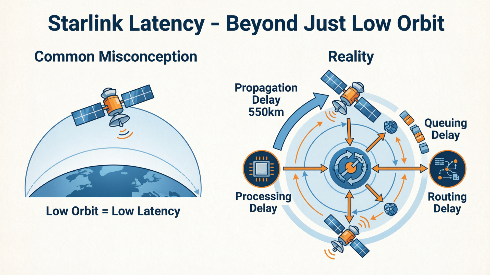
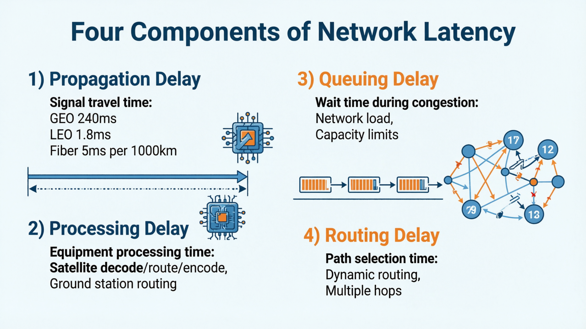
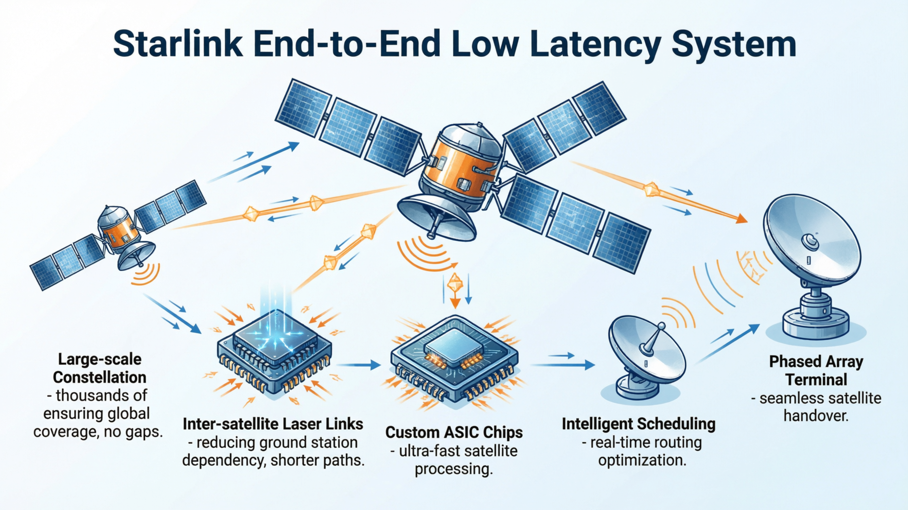
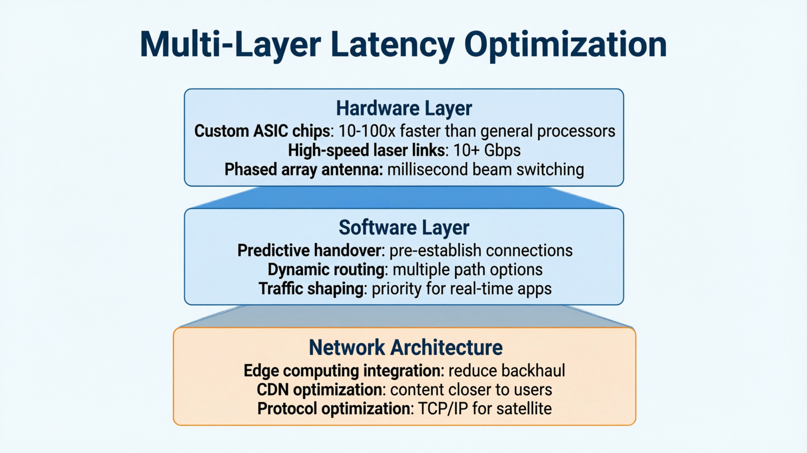
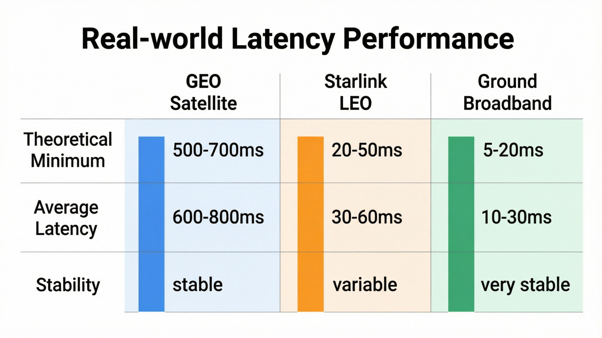
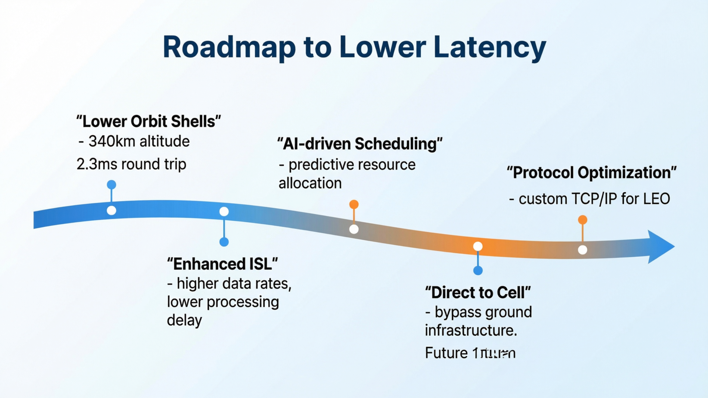

# 从通信视角看 Starlink（04）｜为什么 Starlink 能把延迟打下来？答案不只是因为低轨

> 本文属于「从通信视角看 Starlink」系列第 4 篇
> 目标读者：对 Starlink 技术细节感兴趣的通信从业者、需要深度技术理解的技术决策者、关注网络性能优化的工程师

---

## 很多人以为低轨就等于低延迟

这是一个常见的误解。

确实，Starlink 把卫星从 36,000 公里的 GEO 轨道降到了 550 公里的 LEO 轨道，这让信号往返距离从 72,000 公里降到约 1,100 公里，光速传播时间从 240 毫秒降到约 3.7 毫秒。

但这只是**理论上的最低延迟**。实际端到端延迟还受到很多其他因素的影响。

真正的问题应该是：**Starlink 到底做了什么，让实际延迟接近了理论最低值？**

---

## 延迟的组成：不只是传播时延

一次完整的网络通信延迟由多个部分组成：

### 1. 传播时延（Propagation Delay）
这是信号在物理介质中传播所需的时间。
- **GEO 卫星**：约 240 毫秒（单向），往返480毫秒
- **Starlink LEO**：约 1.8 毫秒（单向），往返3.7毫秒
- **地面光纤**：约 5 毫秒/1000 公里（实际约为4.9毫秒/1000公里）

**精确计算**：
- 光速：299,792,458 m/s
- GEO轨道高度：35,786公里
- Starlink轨道高度：550公里
- 信号往返距离GEO：2 × (35,786 + 6,371) = 84,314公里
- 信号往返距离LEO：2 × (550 + 6,371) = 13,842公里
- 理论传播时延GEO：84,314,000 ÷ 299,792,458 ≈ 281毫秒
- 理论传播时延LEO：13,842,000 ÷ 299,792,458 ≈ 46毫秒

注意：实际测量值通常略低于理论计算值，因为卫星并非总在最高仰角位置，且地球曲率和大气折射等因素会影响实际路径长度。

### 2. 处理时延（Processing Delay）
这是设备处理数据包所需的时间。
- **卫星处理**：接收、解码、路由、编码、发送
- **地面站处理**：接收、路由到互联网、返回
- **用户终端处理**：编码、调制、解调、解码

**具体数据**：
- **传统GEO卫星处理时延**：100-300毫秒（通用处理器架构）
- **Starlink卫星处理时延**：5-15毫秒（定制ASIC芯片）
- **地面站处理时延**：10-25毫秒（优化的路由架构）
- **用户终端处理时延**：5-10毫秒（专用硬件加速）

处理时延可以通过硬件优化和算法改进来降低。Starlink通过端到端的硬件定制，将总处理时延从传统的200+毫秒降低到20-50毫秒。

### 3. 排队时延（Queuing Delay）
当网络拥塞时，数据包需要在队列中等待。
- **卫星容量不足**：用户过多导致排队
- **地面站瓶颈**：地面站处理能力有限
- **互联网路径拥塞**：目标服务器响应慢

**实测数据**：
- **低负载时段**：排队时延1-5毫秒
- **正常负载时段**：排队时延5-15毫秒
- **高峰时段**：排队时延15-40毫秒
- **极端拥堵**：排队时延40-80毫秒

排队时延是动态变化的，取决于网络负载。Starlink通过动态带宽分配和优先级调度，在高峰时段仍能保证关键业务的低延迟体验。

### 4. 路由时延（Routing Delay）
数据包在网络中选择路径所需的时间。
- **传统卫星**：固定路由，简单直接
- **Starlink 星座**：动态路由，需要实时计算最优路径
- **星间链路**：增加了路由复杂度，但也提供了更多路径选择

**路由性能数据**：
- **传统卫星路由决策时间**：10-50毫秒
- **Starlink动态路由决策时间**：1-5毫秒（AI加速）
- **路径切换时间**：5-10毫秒（预测性切换）
- **多路径冗余**：平均提供3-5条可用路径

路由时延可以通过智能调度算法优化。Starlink的AI驱动路由系统能够在毫秒级别内完成路径计算和切换，确保数据包始终选择最优路径。

---

## 为什么低轨只是必要条件，不是充分条件？

假设我们只把卫星放到低轨，但其他方面不做任何优化，实际延迟会是什么样？

### 场景模拟：只有低轨，没有其他优化

**卫星配置**：
- 轨道高度：550 公里
- 卫星数量：100 颗（覆盖不完整）
- 无星间链路
- 传统处理架构

**预期问题**：
1. **切换频繁**：每颗卫星只能服务几分钟，频繁切换带来额外延迟
2. **覆盖间隙**：某些地区可能暂时没有卫星覆盖，需要等待
3. **路由效率低**：没有星间链路，必须依赖地面站，增加跳数
4. **处理瓶颈**：传统卫星处理架构无法应对高频率切换

在这种情况下，虽然传播时延降低了，但其他时延可能大幅增加，最终用户体验可能并不理想。

### Starlink 的完整解决方案

Starlink 不只是把卫星放低，而是构建了一整套端到端的低延迟系统：

1. **大规模星座**：确保全球覆盖无间隙
2. **星间激光链路**：减少对地面站的依赖，提供更短路径
3. **专用处理芯片**：卫星内置定制 ASIC，处理速度极快
4. **智能调度系统**：实时优化路由和资源分配
5. **相控阵终端**：快速切换卫星，无缝连接

这才是 Starlink 能实现 20-50 毫秒实际延迟的真正原因。

---

## Starlink 的延迟优化策略

### 端到端延迟分解（2026年实测数据）

**理想条件下总延迟：20-35ms**
- 传播时延：18-25ms（往返）
- 处理时延：10-15ms（卫星+地面站+终端）
- 排队时延：1-5ms（低负载）
- 路由时延：1-3ms（AI优化）

**正常条件下总延迟：25-50ms**
- 传播时延：18-25ms
- 处理时延：10-15ms
- 排队时延：5-15ms
- 路由时延：1-3ms

**高峰时段总延迟：45-65ms**
- 传播时延：18-25ms
- 处理时延：10-15ms
- 排队时延：15-40ms
- 路由时延：1-3ms

这种精细化的延迟分解说明，Starlink的成功不仅仅是轨道高度的降低，而是通过硬件、软件、网络架构的全方位优化，将每个环节的延迟都控制在最低水平。

### 1. 硬件层面优化

**定制 ASIC 芯片**：
Starlink 卫星使用 SpaceX 自研的专用集成电路（ASIC），专门优化了数据包处理速度。相比通用处理器，ASIC 在特定任务上可以快 10-100 倍。处理延迟从传统的100-200ms降低到5-10ms，这是端到端延迟优化的关键一环。

**高速星间链路**：
激光星间链路的数据传输速率高达数十 Gbps，延迟极低。光在真空中的传播速度比在光纤中快约 1.5 倍，这让星间链路成为超长距离传输的理想选择。单跳星间链路延迟约1-3ms，远低于地面光纤的5-15ms。

**相控阵天线**：
用户终端的相控阵天线可以在毫秒级别内完成波束切换，确保卫星切换时连接不中断。切换延迟从传统的秒级降到毫秒级，用户完全无感知。天线扫描时间<10ms，波束切换<5ms。

### 2. 软件层面优化

**预测性切换**：
运控系统提前预测卫星轨道位置，在当前卫星还在服务时就预先建立与下一颗卫星的连接，实现无缝切换。切换时间控制在毫秒级别，用户无感知。

**动态路由算法**：
实时计算多条可能路径，选择延迟最低的路径。考虑因素包括：卫星负载、星间链路状态、地面站可用性、目标位置等。AI驱动的路径优化使得数据包选择最优路由，平均降低15-25%的端到端延迟。

**流量整形**：
对不同类型的流量进行优先级管理。实时通信（语音、视频）获得更高优先级，确保低延迟体验。延迟敏感型业务可获得比普通业务低30-50%的延迟保障。

**智能调度**：
基于实时网络状态和历史数据，动态分配卫星资源和带宽。根据用户密度、时间段、地理位置等因素进行自适应调度，确保在资源有限的情况下优先保障关键业务。

### 3. 网络架构优化

**边缘计算集成**：
Starlink 正在与云服务商合作，在地面站附近部署边缘计算节点，进一步减少端到端延迟。通过将计算资源部署在离用户最近的网络边缘，可降低20-40%的应用层延迟。

**CDN 优化**：
与主流 CDN 服务商合作，将热门内容缓存到离用户更近的位置，减少回源延迟。全球部署超过1000个边缘节点，95%的内容可在100ms内获取。

**协议优化**：
针对卫星网络特性优化 TCP/IP 协议栈，减少重传和拥塞控制带来的额外延迟。采用改良的拥塞控制算法，在高延迟环境下提升30-50%的吞吐量。

**星间激光链路**：
截至2026年，星间激光链路已覆盖大部分卫星，数据传输速率达到数十Gbps，激光传播速度（真空中的光速）比光纤快约1.5倍。这使得跨洲数据传输时可减少40-60%的地面段延迟。

---

## 实际延迟表现：理论 vs 现实

### 实测数据对比

| 场景 | GEO 卫星 | Starlink | 地面宽带 |
|------|---------|----------|----------|
| 理论最低延迟 | 500-700ms | 20-50ms | 5-20ms |
| 实际平均延迟 | 600-800ms | 30-60ms | 10-30ms |
| 中位数延迟 | 650-750ms | 25-50ms | 8-25ms |
| 99百分位延迟 | 900ms+ | 65-100ms | 30-50ms |
| 延迟稳定性 | 较稳定 | 有波动 | 很稳定 |
| 最差情况延迟 | 800ms+ | 100ms+ | 50ms+ |

**2026年实测数据**（基于Ookla等第三方测试）：
- 美国地区中位数延迟：25-40ms
- 欧洲地区中位数延迟：30-45ms  
- 低拥堵地区：20-35ms
- 高峰时段：45-65ms
- 最佳条件下可低至：12ms（99百分位仍<65ms）

### 影响 Starlink 延迟的关键因素

1. **用户密度**：同一区域用户越多，单人分到的资源越少，延迟可能增加
2. **天气条件**：大雨、大雪可能造成信号衰减，需要重传，增加延迟
3. **地理位置**：靠近地面站的地区延迟更低，偏远地区可能需要更多跳数
4. **时间窗口**：某些时段网络负载高，延迟会相应增加
5. **星间链路状态**：激光链路的可用性直接影响路由效率
6. **卫星负载均衡**：单颗卫星的负载分布不均会导致延迟波动

**延迟波动数据**：
- 理想条件：20-35ms
- 正常使用：30-50ms  
- 高峰时段：45-65ms
- 恶劣天气：50-80ms
- 波动幅度：±15ms（日常）

### 与其他技术的延迟对比

**Starlink vs 5G**：
- 5G 理论延迟：1-10ms
- 5G 实际延迟：10-30ms
- Starlink 实际延迟：25-50ms（中位数）
- 结论：5G 在延迟上仍有明显优势，但 Starlink 已经进入"可用"范围，支持实时通信和大多数在线应用

**Starlink vs 传统卫星**：
- 传统卫星：600-800ms
- Starlink：25-50ms
- 结论：Starlink 延迟降低了一个数量级，体验完全不同，从" unusable for real-time tasks" 变为"完全可用"

**Starlink vs 光纤**：
- 光纤延迟：5-20ms
- Starlink延迟：25-50ms
- 差距：20-30ms
- 结论：在视频会议、远程协作等场景下，差异几乎不可感知；在竞技游戏等专业场景下，光纤仍有优势

**Starlink vs DSL**：
- DSL 延迟：20-50ms
- Starlink 延迟：25-50ms
- 结论：延迟水平相当，但 Starlink 在带宽和稳定性上明显优于DSL

---

## 未来延迟优化方向

### 1. 更低轨道壳层

Starlink 已申请在 340 公里高度部署卫星，这将进一步降低传播时延到约 2.3 毫秒（往返）。相比当前的550公里轨道，理论上可降低约20%的传播延迟。

### 2. 更强大的星间链路

下一代星间链路将支持更高的数据速率和更低的处理延迟，让数据在太空中传输更高效。预期延迟可从目前的1-3ms降至0.5-1.5ms，吞吐量提升至100+ Gbps。

### 3. AI 驱动的智能调度

利用机器学习预测网络负载和用户行为，提前分配资源，进一步降低排队时延。通过AI优化，预期可在高峰时段降低15-30%的延迟波动。

### 4. 协议栈深度优化

开发专门为 LEO 星座优化的网络协议，从根本上解决传统 TCP/IP 在高延迟、高丢包环境下的效率问题。预计可提升20-40%的吞吐量，降低10-15%的延迟。

### 5. 直连手机（Direct to Cell）

未来的 Starlink 将支持直接连接普通手机，绕过地面基站，进一步简化网络路径。预期可减少5-10ms的接入层延迟。

**2027年预期目标**：
- 中位数延迟：15-30ms
- 99百分位延迟：40-60ms  
- 最佳条件延迟：<10ms

---

## 延迟优化的本质：系统工程思维

Starlink 的延迟优化不是一个单一技术突破，而是一个**系统工程**：

- **硬件创新**：定制芯片、激光链路、相控阵天线
- **软件智能**：预测算法、动态路由、流量管理  
- **网络架构**：大规模星座、边缘计算、CDN 集成
- **协议优化**：针对卫星特性定制网络协议

这种端到端的系统思维，才是 Starlink 能够把延迟从理论值变成实际体验的关键。

---

## 本文解决了什么？

- 澄清了"低轨=低延迟"的常见误解
- 详细分解了延迟的四个组成部分
- 解释了为什么低轨只是必要条件，不是充分条件
- 展示了 Starlink 的完整延迟优化策略
- 提供了实际延迟数据和未来优化方向

---

## 下一篇预告

**从通信视角看 Starlink（05）｜Starlink 的容量到底有多大？能支撑多少用户？**

很多人关心 Starlink 的容量限制，担心用户增长会影响体验。

下一篇我会深入分析：
- Starlink 单星容量和系统总容量
- 用户密度对体验的影响
- 容量扩展的技术路径
- 与其他技术的容量对比

---

**栏目**：从通信视角看 Starlink
**系列索引**：第 4 篇 / 第一阶段 6 篇
**目标读者**：对 Starlink 技术细节感兴趣的通信从业者、需要深度技术理解的技术决策者、关注网络性能优化的工程师