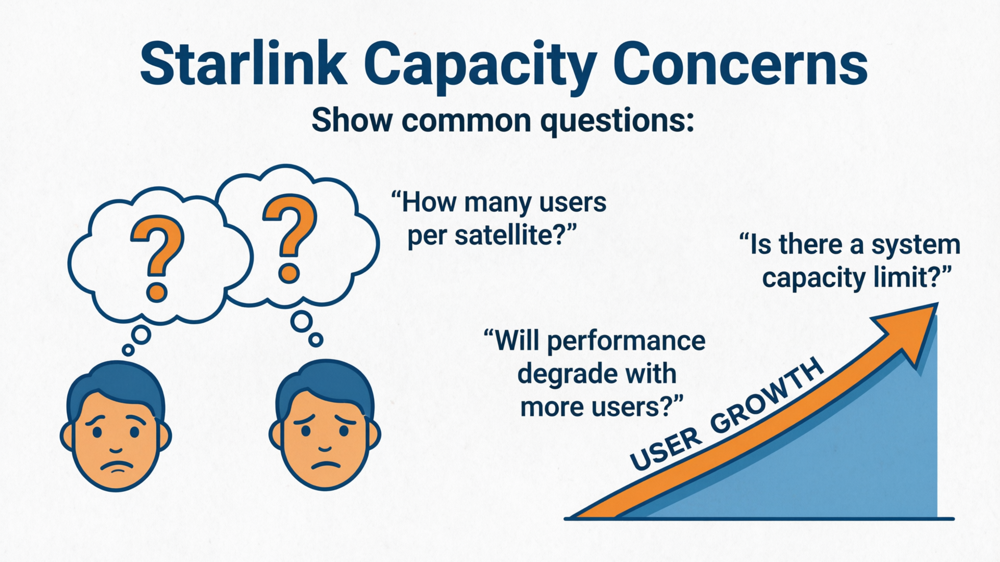
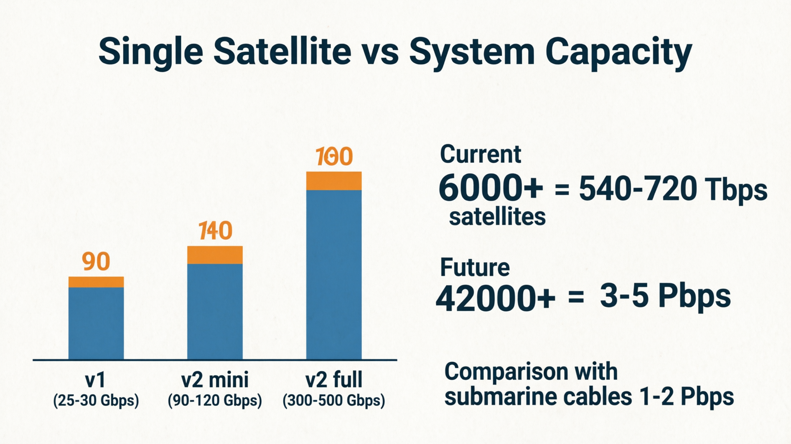
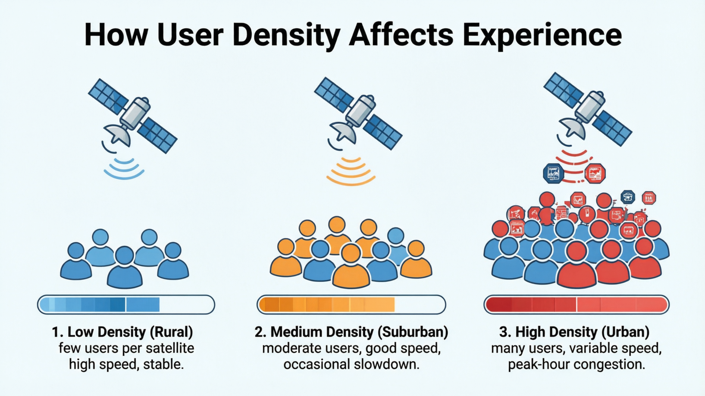
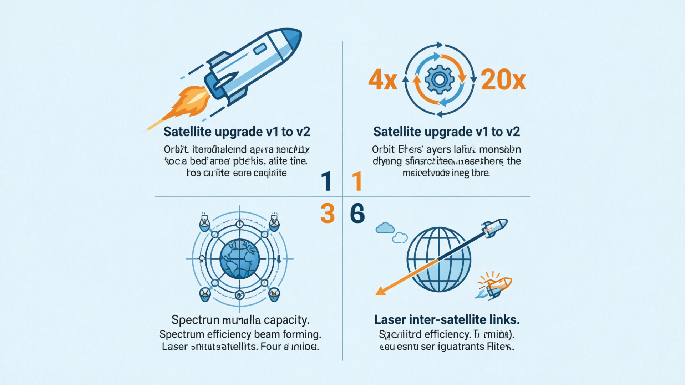
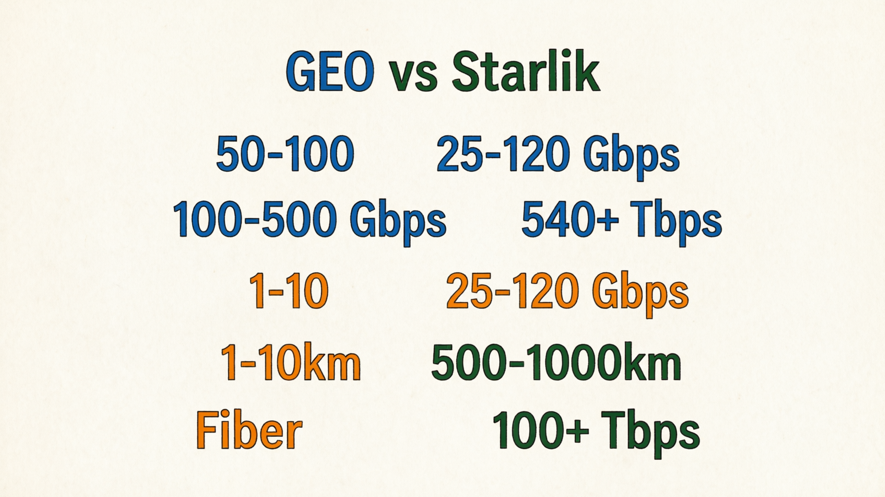
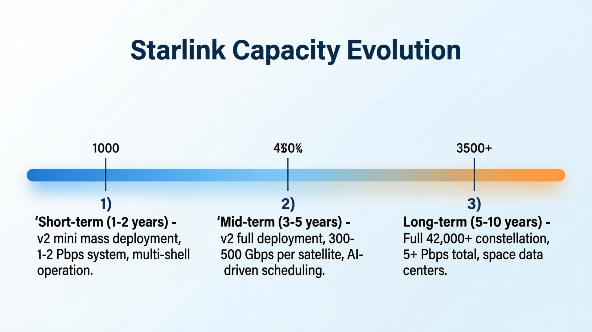

# 从通信视角看 Starlink（05）｜Starlink 的容量到底有多大？能支撑多少用户？

> 本文属于「从通信视角看 Starlink」系列第 5 篇
> 目标读者：关注网络容量规划的通信从业者、需要评估 Starlink 承载能力的技术决策者、对卫星互联网规模感兴趣的行业观察者

---

## 很多人担心 Starlink 用户增长会影响体验

这是一个合理的担忧。

当 Starlink 刚推出时，用户数量相对较少，每个人都能享受到充足的带宽。但随着用户数量快速增长，很多人开始担心：

- **单颗卫星能承载多少用户？**
- **整个系统有没有容量上限？**
- **用户密度增加会不会导致速率下降？**

这些问题的答案，比表面看起来要复杂得多。

---

## 容量的基本概念：单星 vs 系统

### 单颗卫星容量

Starlink 卫星的容量取决于多个因素：

**v1 卫星**：
- 下行容量：约 17-20 Gbps
- 上行容量：约 8-10 Gbps
- 总容量：约 25-30 Gbps

**v2 mini 卫星**：
- 下行容量：约 60-80 Gbps  
- 上行容量：约 30-40 Gbps
- 总容量：约 90-120 Gbps

**v2 full size 卫星**（未来）：
- 预计容量：300-500 Gbps+

这些数字看起来很大，但需要考虑覆盖面积。一颗 LEO 卫星在 550 公里高度的覆盖直径约 1,000 公里，覆盖面积约 78 万平方公里——相当于一个中等国家的面积。

### 系统总容量

Starlink 的真正优势在于**系统级容量**：

- **当前在轨卫星**：超过 6,000 颗
- **当前系统总容量**：约 540-720 Tbps（按 v2 mini 计算）
- **最终部署规模**：42,000+ 颗卫星
- **最终系统总容量**：预计超过 3-5 Pbps

这个容量规模已经超过了全球海底光缆系统的总容量（约 1-2 Pbps）。

关键点：**Starlink 的容量不是固定的，而是可以线性扩展的**。每增加一颗卫星，系统总容量就相应增加。

---

## 用户密度：容量分配的核心问题

### 理论用户容量

假设平均每用户需要 50 Mbps 带宽（高清视频流媒体 + 日常使用）：

**单颗 v2 mini 卫星**：
- 总容量：100 Gbps
- 理论用户数：2,000 用户（同时满速使用）

**但实际情况更复杂**：

1. **用户行为不一致**：并非所有用户同时满速使用
2. **时间分片复用**：用户在不同时间段使用
3. **地理分布不均**：用户集中在城市，偏远地区稀疏
4. **服务质量分级**：高优先级用户获得保障带宽

### 实际用户体验

Starlink 目前采用**共享容量模型**：

- **标准用户**：共享可用容量，高峰期可能降速
- **高优先级用户**：支付更高费用，在拥塞时获得优先保障
- **商业用户**：可购买专用容量，获得 SLA 保障

这种分级策略确保了：
- 普通用户在非高峰期享受高速体验
- 付费用户在任何情况下都有基本保障
- 系统整体资源得到最优利用

### 容量热点问题

在用户密集区域（如城市郊区），确实可能出现容量紧张：

- **现象**：高峰期速率明显下降
- **原因**：多颗卫星同时服务同一区域，但总容量有限
- **解决方案**：
  - 增加该区域上空的卫星密度
  - 部署更高容量的 v2 卫星
  - 引导用户错峰使用

---

## 容量扩展：Starlink 的增长策略

### 1. 卫星升级路径

**v1 → v2 mini → v2 full size**：
- v2 mini 容量是 v1 的 4 倍
- v2 full size 容量预计是 v1 的 15-20 倍
- 向下兼容，新旧卫星协同工作

### 2. 轨道壳层优化

Starlink 申请了多个轨道壳层：
- **550 公里壳层**：主要服务区域
- **530 公里壳层**：增加容量密度
- **340 公里壳层**：超低延迟 + 高容量
- **不同倾角壳层**：优化极地和赤道覆盖

通过多壳层部署，可以在特定区域叠加多层卫星，大幅提升局部容量。

### 3. 频谱效率提升

**相控阵天线波束成形**：
- 单颗卫星可同时形成数百个独立波束
- 每个波束服务不同用户群体
- 波束可动态调整方向和功率

**频谱复用**：
- 相同频率可在不同波束中重复使用
- 空间隔离避免干扰
- 频谱效率提升 10-100 倍

### 4. 星间链路优化

激光星间链路不仅降低延迟，还提升容量：
- 减少对地面站的依赖，释放 Ka 频段用于用户通信
- 星间数据传输不占用用户频段
- 支持更灵活的流量调度

---

## 容量对比：Starlink vs 其他技术

### 与传统 GEO 卫星对比

| 指标 | 传统 GEO | Starlink |
|------|----------|----------|
| 单星容量 | 50-100 Gbps | 25-120 Gbps |
| 系统容量 | 100-500 Gbps | 540+ Tbps |
| 容量扩展性 | 困难（成本高） | 线性扩展 |
| 用户密度支持 | 低（广域覆盖） | 高（局部增强） |

GEO 卫星虽然单星容量大，但系统总容量有限，且无法针对热点区域增强。

### 与 5G 对比

| 指标 | 5G | Starlink |
|------|-----|----------|
| 单基站容量 | 1-10 Gbps | 25-120 Gbps（单星）|
| 覆盖范围 | 1-10 公里 | 500-1000 公里 |
| 部署成本 | 高（基础设施） | 中（发射成本）|
| 容量密度 | 极高（城市） | 中等（广域）|

5G 在城市区域的容量密度远超 Starlink，但在广域覆盖方面 Starlink 更具优势。

### 与地面光纤对比

地面光纤的理论容量极高（单纤可达 100+ Tbps），但：
- **部署成本**：每公里数万美元
- **覆盖限制**：只能沿固定路径部署
- **维护成本**：需要持续维护

Starlink 提供了一种**无线广域容量解决方案**，虽然单点容量不如光纤，但覆盖灵活性无可比拟。

---

## 未来容量展望

### 短期（1-2 年）
- **v2 mini 大规模部署**：系统容量达到 1-2 Pbps
- **多壳层运营**：特定区域容量密度提升 2-3 倍
- **用户分级完善**：更多 QoS 选项

### 中期（3-5 年）
- **v2 full size 部署**：单星容量 300-500 Gbps
- **AI 驱动调度**：动态容量分配，效率提升 30-50%
- **直连手机支持**：新增移动用户容量需求

### 长期（5-10 年）
- **完整星座部署**：42,000+ 颗卫星，系统容量 5+ Pbps
- **量子通信集成**：超高安全性容量通道
- **太空数据中心**：在轨数据处理，减少地面传输需求

### 容量经济学

Starlink 的容量成本正在快速下降：
- **早期**：$100+/Gbps/月
- **现在**：$10-20/Gbps/月  
- **未来**：$1-5/Gbps/月

这使得 Starlink 在很多场景下具备了与地面网络竞争的经济性。

---

## 容量的本质：动态资源池

Starlink 的容量不是一个固定数字，而是一个**动态资源池**：

- **空间维度**：通过卫星密度调节局部容量
- **时间维度**：通过调度算法优化时隙分配  
- **频谱维度**：通过波束成形提升频谱效率
- **用户维度**：通过分级策略平衡体验和收益

这种多维度的容量管理能力，才是 Starlink 真正的技术壁垒。

---

## 本文解决了什么？

- 澄清了单星容量 vs 系统容量的区别
- 解释了用户密度对实际体验的影响
- 展示了 Starlink 的容量扩展策略
- 提供了与其他技术的容量对比
- 展望了未来容量发展趋势

---

## 下一篇预告

**从通信视角看 Starlink（06）｜Starlink 的商业模式：如何从技术突破走向商业成功？**

Starlink 不只是一个技术奇迹，更是一个商业案例。

下一篇我会分析：
- Starlink 的收入模式和成本结构
- 用户增长和 ARPU 变化趋势
- 与其他卫星运营商的商业模式差异
- 未来的商业化路径

---

**栏目**：从通信视角看 Starlink
**系列索引**：第 5 篇 / 第一阶段 6 篇
**目标读者**：关注网络容量规划的通信从业者、需要评估 Starlink 承载能力的技术决策者、对卫星互联网规模感兴趣的行业观察者