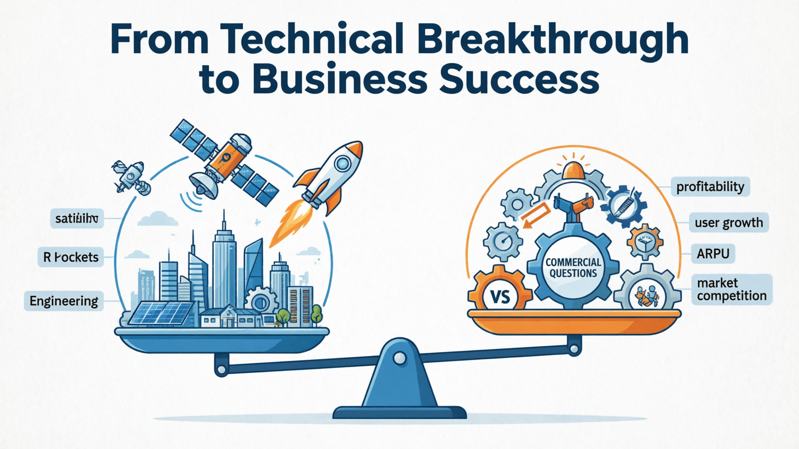
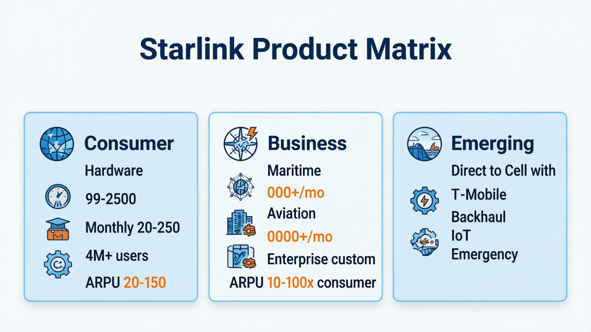
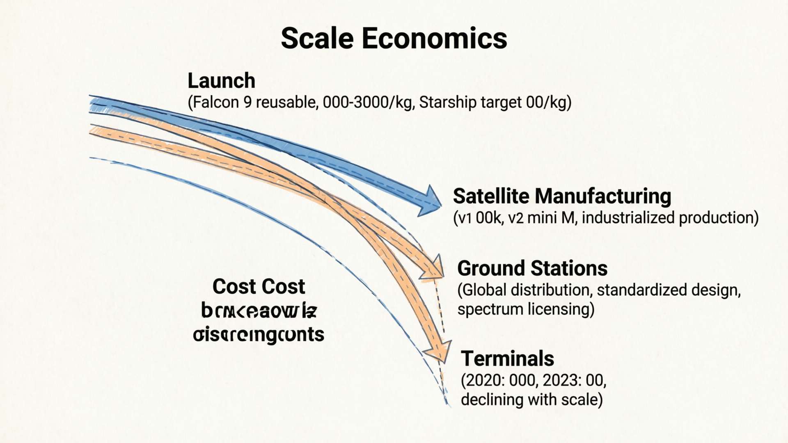
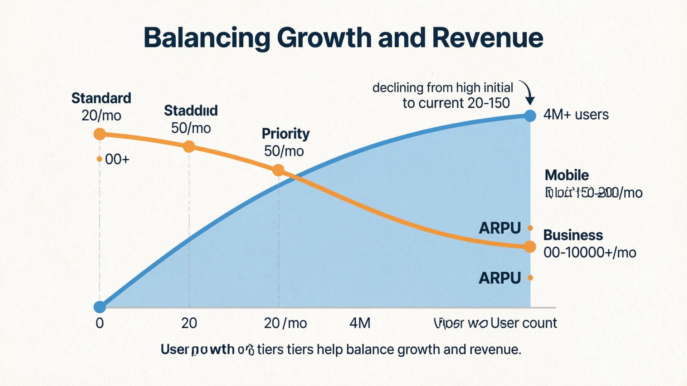
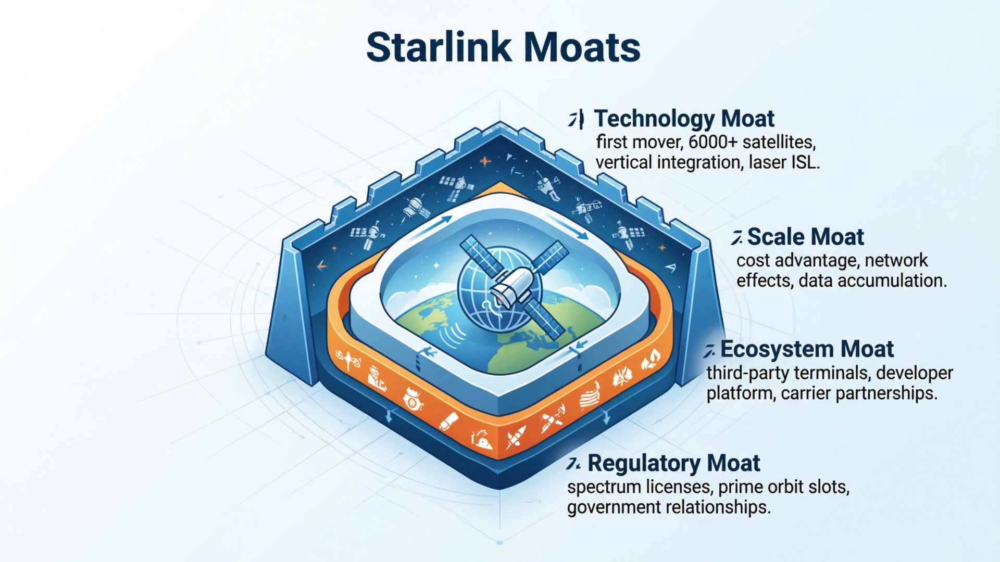
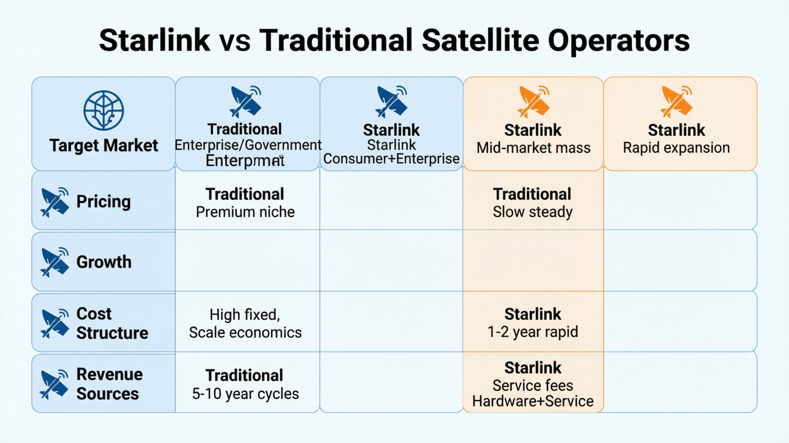
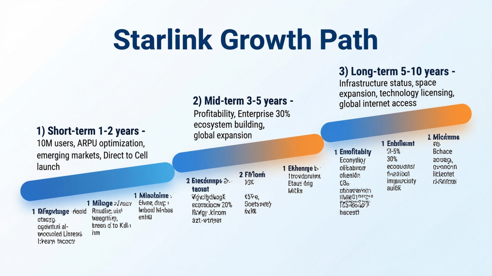

# 从通信视角看 Starlink（06）｜Starlink 的商业模式：如何从技术突破走向商业成功？

> 本文属于「从通信视角看 Starlink」系列第 6 篇（最终篇）
> 目标读者：关注卫星互联网商业化的行业观察者、需要评估 Starlink 商业前景的投资人、对技术商业化路径感兴趣的企业管理者

---

## Starlink 不只是一个技术奇迹

从技术角度看，Starlink 已经证明了大规模 LEO 星座的可行性。

但从商业角度看，更大的挑战才刚刚开始：
- **如何实现可持续盈利？**
- **如何平衡用户增长和 ARPU（每用户平均收入）？**
- **如何在不同市场建立竞争优势？**

这些问题的答案，将决定 Starlink 能否从技术突破走向真正的商业成功。

---

## 收入模式：多元化的产品矩阵

### 消费者业务（Consumer）

这是 Starlink 最广为人知的业务：
- **硬件销售**：终端设备一次性收费（$599-$2,500）
- **月度服务费**：标准套餐 $120/月，高优先级 $250/月
- **用户规模**：截至 2024 年底超过 400 万用户
- **ARPU**：约 $120-150/月（含硬件摊销）

消费者业务的特点是：
- **高增长**：用户数量快速增长
- **低门槛**：普通用户可以自助安装
- **标准化**：产品和服务高度标准化

### 商业业务（Business）

面向企业用户的定制化解决方案：
- **Maritime**：船舶通信，$5,000/月起
- **Aviation**：航空互联网，$10,000+/月
- **Enterprise**：企业级服务，SLA 保障
- **Government**：政府和军事应用，定制化方案

商业业务的特点是：
- **高 ARPU**：单用户收入是消费者的 10-100 倍
- **高粘性**：一旦部署，切换成本很高
- **定制化**：需要针对场景优化解决方案

### 新兴业务（Emerging）

正在发展的新业务线：
- **Direct to Cell**：与 T-Mobile 合作，直接连接普通手机
- **Backhaul**：为传统运营商提供回传服务
- **IoT**：物联网连接服务
- **Emergency Services**：应急通信解决方案

这些新兴业务代表了 Starlink 的未来增长方向。

---

## 成本结构：规模效应的关键

### 发射成本

这是 Starlink 最大的成本优势：
- **自研火箭**：猎鹰 9 号可回收，发射成本大幅降低
- **批量发射**：一次发射 20-60 颗卫星，规模效应显著
- **垂直整合**：从制造到发射全流程控制

发射成本从早期的 $5,000/公斤降到现在的 $2,000-3,000/公斤，未来星舰可能降到 $100/公斤。

### 卫星制造

Starlink 采用了工业化生产模式：
- **标准化设计**：v1/v2 mini/v2 full size 逐步迭代
- **批量生产**：每周生产数十颗卫星
- **成本控制**：v1 卫星成本约 $30 万，v2 mini 约 $100 万

相比传统 GEO 卫星数亿美元的成本，Starlink 的成本优势巨大。

### 地面站建设

地面站是另一个重要成本项：
- **全球分布**：数百个地面站覆盖主要市场
- **标准化设计**：相控阵天线阵列，自动化运维
- **频谱许可**：各国频谱许可申请和维护成本

### 终端设备

终端设备成本正在快速下降：
- **2020 年**：物料成本约 $3,000
- **2023 年**：物料成本约 $500
- **规模效应**：产量越大，单位成本越低

这使得 Starlink 可以降低硬件售价，加速用户增长。

---

## 用户增长 vs ARPU：平衡的艺术

### 用户增长策略

Starlink 采用了激进的用户增长策略：
- **降低门槛**：硬件价格从 $2,500 降到 $599
- **简化流程**：在线订购，自助安装
- **全球扩张**：快速进入新市场

这种策略带来了用户数量的快速增长，但也带来了 ARPU 下降的压力。

### ARPU 变化趋势

Starlink 的 ARPU 呈现以下特点：
- **初期高 ARPU**：早期用户愿意支付高价
- **中期 ARPU 下降**：市场竞争和用户基数扩大导致降价
- **长期 ARPU 稳定**：通过产品分层和增值服务稳定收入

关键洞察：**Starlink 正在从"高 ARPU 小众市场"向"中等 ARPU 大众市场"转型**。

### 产品分层策略

为了平衡增长和收入，Starlink 推出了多层次产品：
- **Standard**：大众市场，$120/月
- **Priority**：高优先级通道，$250/月  
- **Mobile**：移动场景，$150-200/月
- **Business**：企业级，$500-10,000+/月

这种分层策略让 Starlink 能够同时服务不同需求和预算的用户群体。

---

## 市场竞争：护城河在哪里？

### 技术护城河

Starlink 的技术优势包括：
- **先发优势**：已部署 6,000+ 颗卫星，竞争对手难以追赶
- **垂直整合**：从火箭到终端的全栈能力
- **运营经验**：大规模星座管理的实际经验
- **星间链路**：激光 ISL 提供独特优势

### 规模护城河

规模效应带来的护城河：
- **成本优势**：发射和制造成本持续下降
- **网络效应**：用户越多，系统越稳定
- **数据积累**：运营数据用于持续优化

### 生态护城河

Starlink 正在构建生态系统：
- **终端生态**：第三方终端制造商
- **应用生态**：开发者平台和 API
- **合作伙伴**：电信运营商、设备制造商

### 监管护城河

频谱和轨道资源的稀缺性：
- **频谱许可**：已获得主要市场的频谱许可
- **轨道位置**：最佳轨道壳层已被占用
- **监管关系**：与各国监管机构建立了合作关系

这些护城河共同构成了 Starlink 的竞争优势。

---

## 商业模式对比：Starlink vs 传统卫星运营商

| 维度 | 传统 GEO 运营商 | Starlink |
|------|------------------|----------|
| **目标市场** | 企业/政府/海事 | 消费者+企业 |
| **定价策略** | 高价小众 | 中等价格大众 |
| **增长模式** | 缓慢稳定 | 快速扩张 |
| **成本结构** | 高固定成本 | 规模效应降低成本 |
| **技术迭代** | 5-10 年周期 | 1-2 年快速迭代 |
| **收入来源** | 服务费为主 | 硬件+服务费 |

Starlink 的商业模式更接近互联网公司，而传统运营商更像基础设施提供商。

这种差异决定了它们在市场上的不同定位和竞争策略。

### 与地面网络运营商的竞合关系

Starlink 与传统电信运营商的关系复杂：
- **竞争关系**：在偏远地区直接竞争
- **合作关系**：在城市地区互补，Starlink 作为备份
- **合作机会**：Starlink 提供回传，运营商提供最后一公里

未来的趋势可能是**融合而非替代**。

---

## 未来商业化路径

### 短期（1-2 年）

- **用户规模**：达到 1,000 万用户
- **ARPU 优化**：通过产品分层提升收入
- **新兴市场**：进入更多发展中国家
- **Direct to Cell**：开始商用部署

### 中期（3-5 年）

- **盈利能力**：实现稳定盈利
- **企业市场**：商业用户占比提升到 30%
- **生态系统**：建立完整的开发者生态
- **国际化**：成为真正的全球通信服务商

### 长期（5-10 年）

- **基础设施地位**：成为全球通信基础设施的一部分
- **太空经济**：拓展到其他太空服务领域
- **技术输出**：向其他行业输出航天技术
- **社会影响**：真正实现全球互联网接入

### 商业化挑战

Starlink 面临的主要商业化挑战：
- **资本需求**：仍需大量资本投入
- **监管风险**：各国政策不确定性
- **技术风险**：大规模系统的技术复杂性
- **竞争压力**：来自地面网络和其他卫星运营商

这些挑战需要 Starlink 在技术和商业之间找到平衡点。

---

## 商业模式的本质：从技术到价值

Starlink 的商业模式创新在于：

**它把原本只属于专业领域的卫星通信技术，通过工业化和规模化，变成了大众消费品。**

这种转变不仅仅是技术突破，更是**商业模式的重构**：

- **从项目制到产品化**：不再是一个个项目定制，而是标准化产品
- **从 B2B 到 B2C**：直接面向消费者，而不是通过集成商
- **从高门槛到低门槛**：用户可以自助安装，无需专业团队
- **从昂贵到可负担**：价格从数万美元降到数百美元

这种商业模式重构，才是 Starlink 真正的护城河。

---

## 本文解决了什么？

- 分析了 Starlink 的多元化收入模式
- 解释了成本结构和规模效应
- 探讨了用户增长与 ARPU 的平衡策略
- 识别了 Starlink 的核心竞争优势
- 对比了与传统卫星运营商的商业模式差异
- 展望了未来的商业化路径

---

## 系列总结

**「从通信视角看 Starlink」系列六篇文章，我们完成了以下探索：**

1. **Starlink 是什么？** - 理解基本概念和革命性突破
2. **系统架构如何工作？** - 看清端到端系统结构
3. **与其他技术如何对比？** - 建立正确的比较框架
4. **延迟如何优化？** - 深入技术细节
5. **容量有多大？** - 评估系统承载能力
6. **商业模式如何？** - 理解商业化路径

这个系列的目标不是简单地介绍 Starlink，而是**帮助通信从业者建立系统性的理解框架**，能够在自己的工作中做出更好的技术选择和商业决策。

---

**栏目**：从通信视角看 Starlink
**系列索引**：第 6 篇（最终篇）/ 第一阶段 6 篇
**目标读者**：关注卫星互联网商业化的行业观察者、需要评估 Starlink 商业前景的投资人、对技术商业化路径感兴趣的企业管理者