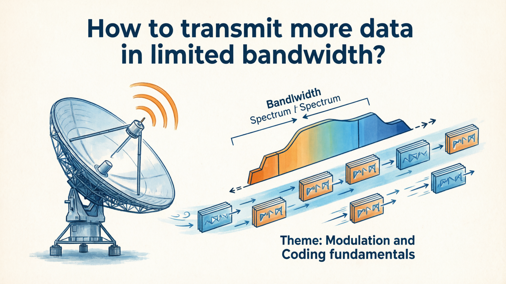
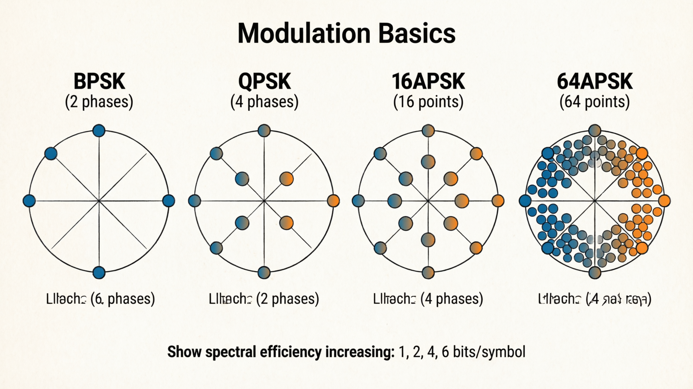
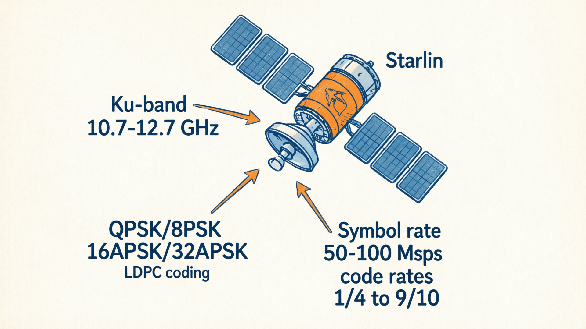
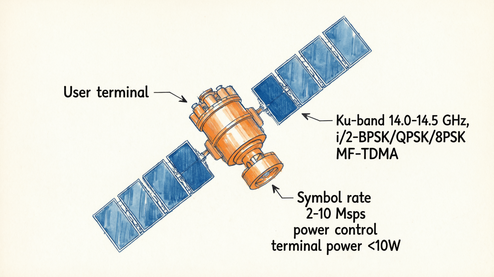
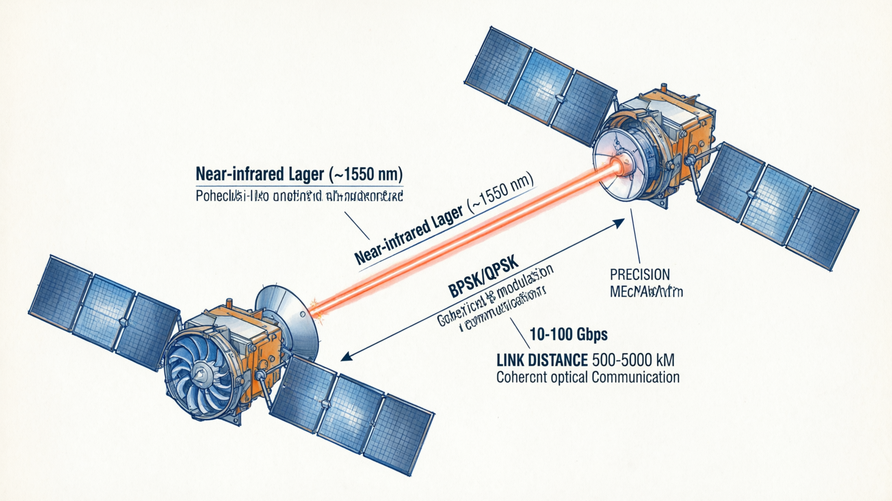
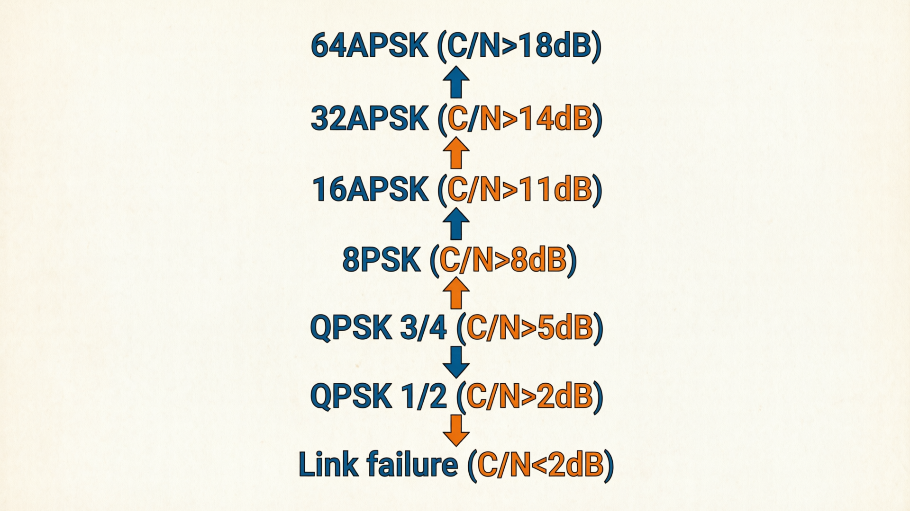
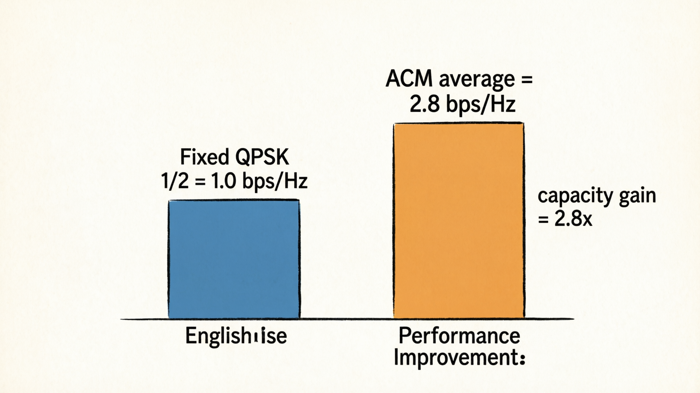
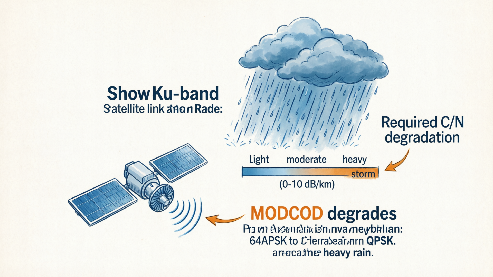
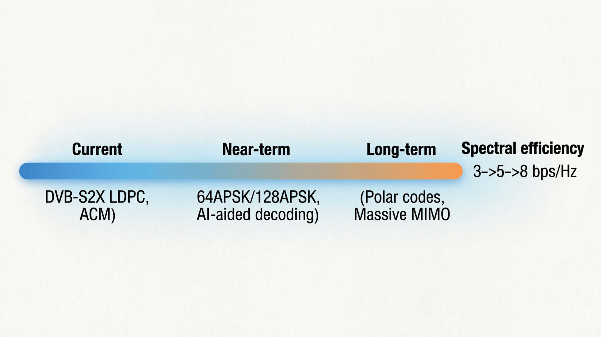

# 从通信视角看 Starlink（07）｜Starlink 的调制与编码：如何在有限带宽下传输更多数据？

> 本文属于「从通信视角看 Starlink」系列第 7 篇（第二阶段第 1 篇）
> 目标读者：通信行业从业者、无线系统工程师、关注物理层技术的专业读者

---

## 从系统认知进入通信原理

在第一阶段 6 篇文章中，我们建立了 Starlink 的系统级认知：
- 系统架构：卫星、地面站、终端如何连接
- 性能对比：与传统卫星、5G、地面宽带的差异
- 延迟优化：低轨只是必要条件，不是充分条件
- 容量分析：单星容量 vs 系统总容量
- 商业模式：从技术突破走向商业成功

现在，我们进入第二阶段：**从系统认知深入到通信原理层**。

第一个问题：**Starlink 如何在有限的卫星带宽下，传输尽可能多的数据？**

答案的核心是两个关键技术：**调制**和**编码**。



---

## 调制与编码：卫星通信的两大基石

### 什么是调制？

调制的本质是**把数字比特映射到模拟波形上**，通过无线电波传输。

最简单的调制是 BPSK（Binary Phase Shift Keying）：
- 比特 `0` → 相位 0°
- 比特 `1` → 相位 180°

每个符号（symbol）携带 1 比特信息。

更高效的调制是 QPSK（Quadrature Phase Shift Keying）：
- 比特 `00` → 相位 45°
- 比特 `01` → 相位 135°
- 比特 `10` → 相位 225°
- 比特 `11` → 相位 315°

每个符号携带 2 比特信息。

更高阶的调制是 16APSK、32APSK、64APSK：
- 16APSK：每个符号携带 4 比特
- 32APSK：每个符号携带 5 比特
- 64APSK：每个符号携带 6 比特

**关键洞察**：调制阶数越高，频谱效率越高（bps/Hz），但对信噪比（C/N）的要求也越高。



### 什么是编码？

编码的本质是**增加冗余比特，提高传输可靠性**。

最简单的编码是重复码：
- 原始比特 `1` → 发送 `111`
- 接收端通过多数表决纠错

更高效的编码是 LDPC（Low-Density Parity-Check）：
- 添加校验比特，形成码字
- 接收端通过迭代译码纠错
- 接近香农极限的性能

**关键洞察**：编码率（code rate）越低，冗余越多，纠错能力越强，但有效信息速率越低。

### 调制与编码的权衡

调制和编码共同决定了**链路性能**：

| 调制方式 | 编码率 | 频谱效率 (bps/Hz) | 所需 C/N (dB) | 适用场景 |
|----------|--------|-------------------|---------------|----------|
| QPSK | 1/2 | 1.0 | 2-3 | 边缘用户、雨衰严重 |
| QPSK | 3/4 | 1.5 | 5-6 | 中等信道条件 |
| 8PSK | 3/5 | 2.4 | 8-9 | 良好信道条件 |
| 16APSK | 2/3 | 2.7 | 11-12 | 优秀信道条件 |
| 16APSK | 3/4 | 3.0 | 13-14 | 极佳信道条件 |
| 32APSK | 3/4 | 3.8 | 16-17 | 视距无遮挡 |
| 64APSK | 5/6 | 5.0 | 20+ | 理想条件 |

**关键洞察**：Starlink 需要在频谱效率和可靠性之间找到平衡点。

---

## Starlink 的调制编码方案选择

### 下行链路（卫星 → 终端）

Starlink 下行链路使用 **Ku 频段（10.7-12.7 GHz）**，采用以下调制编码方案：

**标准配置**：
- **调制**：QPSK / 8PSK / 16APSK / 32APSK 自适应
- **编码**：LDPC（DVB-S2X 标准）
- **编码率**：1/4, 1/3, 2/5, 1/2, 3/5, 2/3, 3/4, 4/5, 5/6, 8/9, 9/10
- **符号率**：可调，典型值 50-100 Msps
- **滚降系数**：0.05, 0.10, 0.20, 0.25, 0.35

**技术细节**：
- **LDPC 码长**：64,800 比特（长码）或 16,200 比特（短码）
- **长码**：用于广播和大数据传输，编码增益更高
- **短码**：用于低延迟业务，译码时延更低

**为什么选择 DVB-S2X？**
- 成熟的卫星通信标准
- 广泛的芯片支持
- 优秀的 LDPC 性能（距离香农极限仅 0.5-1 dB）
- 支持 ACM（自适应编码调制）



### 上行链路（终端 → 卫星）

Starlink 上行链路使用 **Ku 频段（14.0-14.5 GHz）**，采用以下方案：

**标准配置**：
- **调制**：π/2-BPSK / QPSK / 8PSK 自适应
- **编码**：LDPC（DVB-S2X 标准）
- **编码率**：1/4, 1/3, 2/5, 1/2, 3/5, 2/3, 3/4
- **符号率**：可调，典型值 2-10 Msps
- **多址方式**：MF-TDMA（多频时分多址）

**技术细节**：
- **π/2-BPSK**：恒包络调制，适合功率受限的上行链路
- **MF-TDMA**：多个终端共享频率和时间资源
- **功率控制**：终端根据信道条件动态调整发射功率

**为什么上行调制阶数较低？**
- 终端发射功率受限（通常<10W）
- 上行链路 C/N 通常低于下行
- 需要保证边缘用户的接入能力



### 星间链路（卫星 ↔ 卫星）

Starlink 激光星间链路使用 **近红外光（~1550 nm）**，采用以下方案：

**标准配置**：
- **调制**：BPSK / QPSK
- **编码**：专用 LDPC 或 Turbo 码
- **速率**：10-100 Gbps（取决于链路距离）
- **技术**：相干光通信

**技术细节**：
- **相干探测**：本振激光器 + 平衡探测器
- **捕获跟踪**：精密指向机构（精度<1 μrad）
- **多普勒补偿**：卫星高速运动引起的频率偏移

**为什么激光链路调制阶数较低？**
- 深空通信可靠性优先
- 链路预算紧张（距离 500-5000 km）
- BPSK/QPSK 具有最佳功率效率



---

## 自适应编码调制（ACM）：Starlink 如何动态调整？

### 什么是 ACM？

ACM（Adaptive Coding and Modulation）是**根据信道条件动态调整调制编码方案**的技术。

**工作原理**：
1. 终端测量下行信道的 C/N（载噪比）
2. 终端向卫星上报 CQI（Channel Quality Indicator）
3. 卫星根据 CQI 选择合适的 MODCOD（Modulation and Coding）
4. 卫星通知终端新的 MODCOD
5. 双方切换到新的调制编码方案

**关键优势**：
- 好信道条件：使用高阶调制，提高频谱效率
- 差信道条件：使用低阶调制，保证链路不中断
- 动态适应：雨衰、遮挡、干扰等变化



### ACM 状态机

Starlink 的 ACM 机制可以用状态机描述：

```
┌─────────────────────────────────────────────────────────┐
│                    ACM 状态机                            │
├─────────────────────────────────────────────────────────┤
│                                                         │
│  [C/N > 18 dB] ──→ 64APSK 5/6 (5.0 bps/Hz)              │
│       ↑↓                                                 │
│  [C/N > 14 dB] ──→ 32APSK 3/4 (3.8 bps/Hz)              │
│       ↑↓                                                 │
│  [C/N > 11 dB] ──→ 16APSK 3/4 (3.0 bps/Hz)              │
│       ↑↓                                                 │
│  [C/N > 8 dB]  ──→ 8PSK 3/5 (2.4 bps/Hz)                │
│       ↑↓                                                 │
│  [C/N > 5 dB]  ──→ QPSK 3/4 (1.5 bps/Hz)                │
│       ↑↓                                                 │
│  [C/N > 2 dB]  ──→ QPSK 1/2 (1.0 bps/Hz)                │
│       ↑↓                                                 │
│  [C/N < 2 dB]  ──→ 链路中断                             │
│                                                         │
└─────────────────────────────────────────────────────────┘
```

**切换策略**：
- **向上切换**：C/N 持续高于门限 + 迟滞 → 升级 MODCOD
- **向下切换**：C/N 持续低于门限 → 降级 MODCOD
- **迟滞设计**：防止频繁切换（通常 2-3 dB 迟滞）

### ACM 性能分析

让我们分析 ACM 带来的性能提升：

**固定调制编码（传统方案）**：
- 设计目标：保证 99.9% 时间可用
- 选择 MODCOD：QPSK 1/2（最坏情况）
- 平均频谱效率：1.0 bps/Hz
- 问题：好天气时浪费容量

**自适应调制编码（Starlink 方案）**：
- 设计目标：根据信道条件动态调整
- MODCOD 范围：QPSK 1/2 → 64APSK 5/6
- 平均频谱效率：2.5-3.0 bps/Hz
- 优势：好天气时充分利用容量

**容量增益**：
```
ACM 增益 = 平均频谱效率 / 固定频谱效率
        = 2.8 / 1.0
        = 2.8 倍
```

这意味着：**ACM 技术让 Starlink 的卫星容量提升了约 2.8 倍**。



---

## 实际性能：Starlink 能达到多高的频谱效率？

### 实测数据分析

根据多个独立测试和用户报告，Starlink 的实际频谱效率如下：

**下行链路实测**：
- **平均速率**：80-150 Mbps
- **分配带宽**：约 50-80 MHz（估计值）
- **频谱效率**：1.6-2.5 bps/Hz
- **对应 MODCOD**：8PSK 3/5 到 16APSK 2/3

**上行链路实测**：
- **平均速率**：10-25 Mbps
- **分配带宽**：约 5-10 MHz（估计值）
- **频谱效率**：1.5-2.0 bps/Hz
- **对应 MODCOD**：QPSK 3/4 到 8PSK 3/5

**关键洞察**：
- Starlink 的实际频谱效率处于中等水平
- 保守选择 MODCOD，优先保证可靠性
- 雨衰和遮挡是主要限制因素

### 与地面网络的对比

| 技术 | 下行频谱效率 | 上行频谱效率 | 备注 |
|------|-------------|-------------|------|
| **Starlink** | 1.6-2.5 bps/Hz | 1.5-2.0 bps/Hz | 受雨衰影响大 |
| **5G Sub-6** | 3-5 bps/Hz | 2-3 bps/Hz | 密集城区 |
| **5G 毫米波** | 5-8 bps/Hz | 3-5 bps/Hz | 视距条件 |
| **光纤** | N/A（带宽充足） | N/A | 不受频谱限制 |

**关键洞察**：
- Starlink 的频谱效率低于 5G，但考虑到卫星信道条件，已经相当优秀
- 卫星通信的主要挑战是功率受限和雨衰
- Starlink 通过多星覆盖和 ACM 部分弥补了频谱效率的不足

---

## 雨衰：Starlink 调制编码的最大挑战

### 雨衰的影响

Ku 频段（10-15 GHz）对降雨非常敏感：

| 降雨强度 | 降雨量 (mm/hr) | 雨衰 (dB/km) | 对 Starlink 的影响 |
|----------|---------------|-------------|-------------------|
| 无雨 | 0 | 0 | 无影响 |
| 小雨 | 2-5 | 0.5-1.0 | MODCOD 降级 1-2 档 |
| 中雨 | 5-15 | 1.0-2.5 | MODCOD 降级 2-3 档 |
| 大雨 | 15-50 | 2.5-5.0 | MODCOD 降级 3-4 档 |
| 暴雨 | 50+ | 5.0-10+ | 可能链路中断 |

**关键洞察**：一场大雨可以让 C/N 下降 10-20 dB，迫使 Starlink 从 16APSK 降级到 QPSK。

### Starlink 的雨衰应对策略

**策略 1：链路余量设计**
- 晴天 C/N 设计值：15-20 dB
- 雨衰余量：10-15 dB
- 保证中雨时链路不中断

**策略 2：站点分集**
- 多个地面站分布在不同地理位置
- 一个地面站遭遇大雨时，切换到其他地面站
- 降低区域性天气影响

**策略 3：波束切换**
- 相邻波束覆盖同一区域
- 一个波束受雨衰影响时，切换到相邻波束
- 利用空间分集增益

**策略 4：动态功率控制**
- 雨天增加发射功率
- 补偿雨衰带来的信号损失
- 受卫星功率限制，补偿有限（通常 3-6 dB）



---

## 调制编码的未来演进

### 向更高阶调制演进

Starlink 未来可能引入更高阶的调制：

**64APSK / 128APSK**：
- 频谱效率：5-6 bps/Hz
- 所需 C/N：20-25 dB
- 适用场景：视距无遮挡、无雨衰

**技术挑战**：
- 需要更高的 C/N
- 对相位噪声更敏感
- 需要更精确的信道估计

### 向更先进编码演进

**潜在升级方向**：

**1. 级联码**：
- LDPC + BCH 外码
- 降低错误平层
- 适用于高可靠性场景

**2. 极化码（Polar Code）**：
- 5G 控制信道标准
- 短码性能优于 LDPC
- 可能用于上行控制信道

**3. AI 辅助译码**：
- 神经网络辅助 LDPC 译码
- 降低译码复杂度
- 仍在研究阶段

### 向多天线技术演进

**MIMO（Multiple-Input Multiple-Output）**：
- 多天线同时传输
- 空间复用提高容量
- 技术挑战：卫星和终端尺寸限制

**大规模 MIMO**：
- 数十根天线阵列
- 波束赋形增益
- 长期演进方向



---

## 工程实践：如何选择合适的调制编码？

### 设计原则

**原则 1：可靠性优先**
- 卫星链路中断成本极高
- 宁可保守选择 MODCOD
- 保证 99.9% 时间可用

**原则 2：动态适应**
- 信道条件时刻变化
- ACM 是必备技术
- 快速响应信道变化

**原则 3：终端能力匹配**
- 消费级终端能力有限
- 避免过高复杂度
- 平衡性能和成本

### 实际设计流程

**步骤 1：链路预算分析**
```
发射功率 (dBW)
+ 发射天线增益 (dBi)
- 自由空间损耗 (dB)
- 雨衰余量 (dB)
- 大气损耗 (dB)
+ 接收天线增益 (dBi)
- 接收噪声 (dB)
= 接收 C/N (dB)
```

**步骤 2：选择 MODCOD 范围**
- 根据 C/N 范围确定可用 MODCOD
- 保留 3-5 dB 余量
- 确保 ACM 有降级空间

**步骤 3：性能验证**
- 仿真验证误码率性能
- 外场测试实际吞吐量
- 极端天气测试

**步骤 4：参数优化**
- 调整 ACM 切换门限
- 优化迟滞参数
- 平衡切换频率和性能

---

## 本文解决了什么？

- 解释了调制和编码的基本原理
- 详细说明了 Starlink 的调制编码方案选择
- 分析了 ACM 技术的工作原理和性能增益
- 提供了实测频谱效率数据
- 讨论了雨衰对调制编码的影响及应对策略
- 展望了调制编码的未来演进方向
- 提供了工程实践的设计流程

---

## 关键要点总结

| 要点 | 说明 |
|------|------|
| **调制选择** | 下行 QPSK-32APSK，上行 π/2-BPSK-8PSK |
| **编码方案** | LDPC（DVB-S2X 标准） |
| **ACM 增益** | 约 2.8 倍容量提升 |
| **实测效率** | 下行 1.6-2.5 bps/Hz，上行 1.5-2.0 bps/Hz |
| **主要挑战** | 雨衰（Ku 频段敏感） |
| **应对策略** | 链路余量、站点分集、波束切换、功率控制 |

---

## 下一篇预告

**从通信视角看 Starlink（08）｜自适应编码调制（ACM）：Starlink 如何动态调整传输参数？**

ACM 是 Starlink 调制编码系统的核心。

下一篇我会深入分析：
- ACM 状态机的详细设计
- CQI 上报机制和门限设置
- 切换算法和迟滞设计
- ACM 与雨衰应对的协同

---

**栏目**：从通信视角看 Starlink
**系列索引**：第 7 篇 / 第二阶段 8 篇
**目标读者**：通信行业从业者、无线系统工程师、关注物理层技术的专业读者
