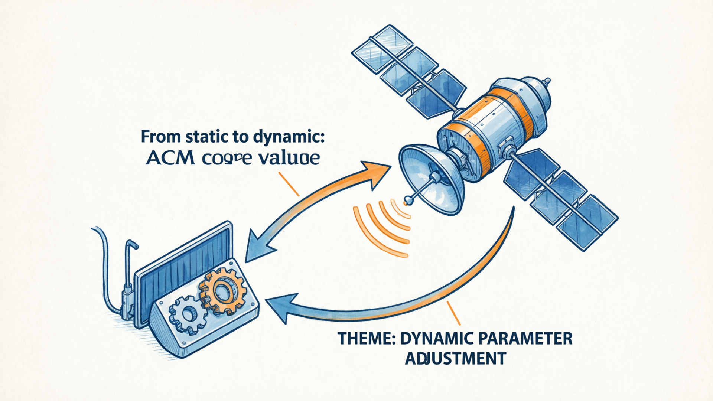
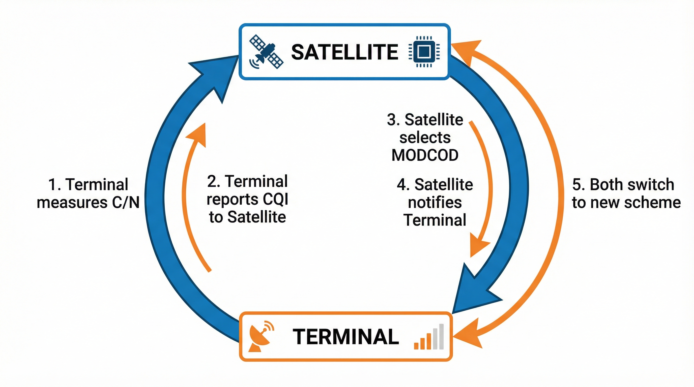
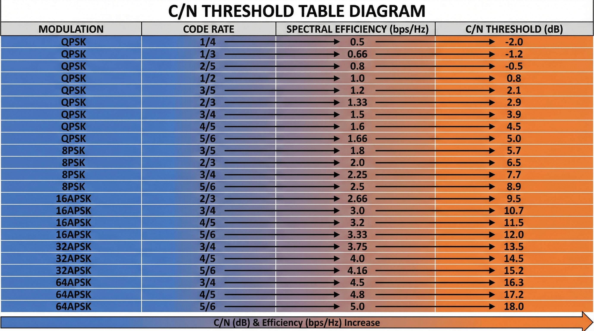
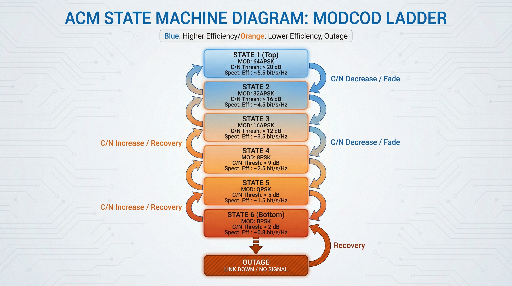
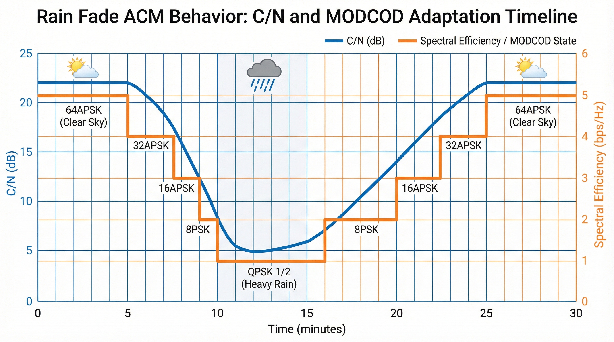
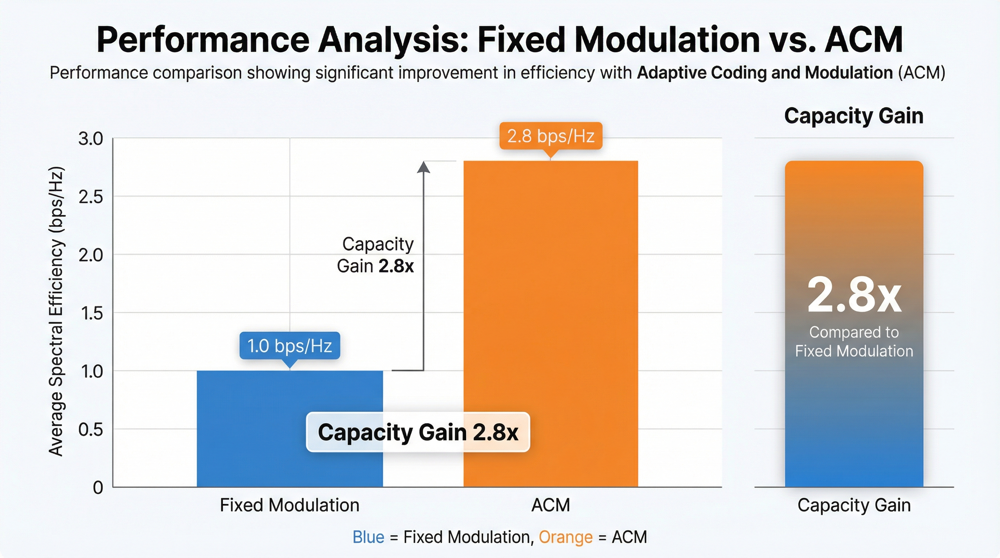
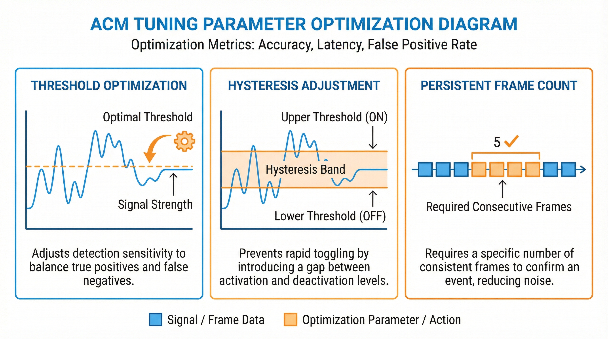
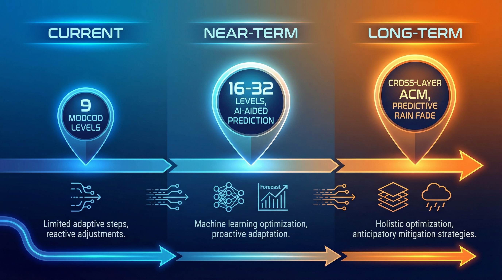

# 从通信视角看 Starlink（08）｜自适应编码调制（ACM）：Starlink 如何动态调整传输参数？

> 本文属于「从通信视角看 Starlink」系列第 8 篇（第二阶段第 2 篇）
> 目标读者：通信行业从业者、无线系统工程师、关注链路自适应技术的专业读者

---

## 从静态到动态：ACM 的核心价值

在第（07）篇文章中，我们介绍了 Starlink 的调制编码方案：
- 下行链路：QPSK / 8PSK / 16APSK / 32APSK 自适应
- 上行链路：π/2-BPSK / QPSK / 8PSK 自适应
- 编码方案：LDPC（DVB-S2X 标准）

但有一个关键问题：**Starlink 如何在变化的信道条件下，动态选择最优的调制编码方案？**

答案是：**ACM（Adaptive Coding and Modulation，自适应编码调制）**。



---

## ACM 的工作原理

### 基本流程

ACM 的核心是一个**闭环反馈系统**：

```
┌─────────────────────────────────────────────────────────────┐
│                    ACM 闭环反馈系统                          │
├─────────────────────────────────────────────────────────────┤
│                                                             │
│  ┌──────────┐    CQI 上报    ┌──────────┐                   │
│  │  终端    │ ────────────> │  卫星    │                   │
│  │          │               │          │                   │
│  │ 测量 C/N │               │ 选择     │                   │
│  │          │               │ MODCOD   │                   │
│  │          │ <──────────── │          │                   │
│  │          │  MODCOD 通知  │          │                   │
│  └──────────┘               └──────────┘                   │
│       │                          │                          │
│       │ 切换 MODCOD              │ 切换 MODCOD              │
│       ↓                          ↓                          │
│                                                             │
└─────────────────────────────────────────────────────────────┘
```

**步骤详解**：

**步骤 1：信道测量**
- 终端持续测量下行链路的 C/N（载噪比）
- 测量周期：通常每帧（~100ms）一次
- 测量方法：基于导频符号（pilot symbols）

**步骤 2：CQI 上报**
- 终端将 C/N 量化为 CQI（Channel Quality Indicator）
- CQI 通常用 4-6 比特表示（16-64 个等级）
- 通过上行控制信道发送给卫星

**步骤 3：MODCOD 选择**
- 卫星根据 CQI 查表选择合适的 MODCOD
- 考虑因素：C/N 门限、历史趋势、雨衰预测
- 目标：最大化频谱效率，同时保证 BLER<10%

**步骤 4：MODCOD 通知**
- 卫星通过下行控制信道通知终端新的 MODCOD
- 通知时机：帧边界或时隙边界
- 通知方式：DCI（Downlink Control Information）

**步骤 5：同步切换**
- 卫星和终端在约定时刻同步切换到新 MODCOD
- 切换时延：通常<10ms
- 确保数据不丢失、不重复



### C/N 门限表

ACM 的核心是**C/N 门限表**，定义了每个 MODCOD 所需的最小 C/N：

| MODCOD | 调制 | 编码率 | 频谱效率 (bps/Hz) | C/N 门限 (dB) | 适用场景 |
|--------|------|--------|-------------------|---------------|----------|
| 0 | π/2-BPSK | 1/4 | 0.5 | -2 | 极端雨衰 |
| 1 | QPSK | 1/4 | 0.5 | 0 | 严重雨衰 |
| 2 | QPSK | 1/2 | 1.0 | 2 | 大雨 |
| 3 | QPSK | 3/4 | 1.5 | 5 | 中雨 |
| 4 | 8PSK | 3/5 | 2.4 | 8 | 小雨/阴天 |
| 5 | 16APSK | 2/3 | 2.7 | 10 | 晴天边缘 |
| 6 | 16APSK | 3/4 | 3.0 | 12 | 晴天 |
| 7 | 32APSK | 3/4 | 3.8 | 15 | 视距无遮挡 |
| 8 | 64APSK | 5/6 | 5.0 | 18 | 理想条件 |

**关键设计原则**：
- **门限间隔**：相邻 MODCOD 之间保留 2-3 dB 间隔
- **迟滞设计**：向上切换和向下切换使用不同门限（通常 2-3 dB 迟滞）
- **安全余量**：实际 C/N 比理论门限高 1-2 dB，保证 BLER 目标



---

## ACM 状态机设计

### 状态机模型

Starlink 的 ACM 机制可以用**有限状态机（FSM）**描述：

```
┌─────────────────────────────────────────────────────────────┐
│                    ACM 状态机                                │
├─────────────────────────────────────────────────────────────┤
│                                                             │
│         ┌─────────────────────────────────────────┐        │
│         │          C/N > 18 + 迟滞                │        │
│         └─────────────────────────────────────────┘        │
│                    │ ↑                                     │
│                    │ │ C/N < 18                            │
│                    ↓ │                                     │
│    ┌───────────────────────────────────┐                  │
│    │ State 8: 64APSK 5/6 (5.0 bps/Hz) │                  │
│    └───────────────────────────────────┘                  │
│                    │ ↑                                     │
│                    │ │ C/N < 15 + 迟滞                     │
│                    ↓ │                                     │
│    ┌───────────────────────────────────┐                  │
│    │ State 7: 32APSK 3/4 (3.8 bps/Hz) │                  │
│    └───────────────────────────────────┘                  │
│                    │ ↑                                     │
│                    │ │ C/N < 12 + 迟滞                     │
│                    ↓ │                                     │
│    ┌───────────────────────────────────┐                  │
│    │ State 6: 16APSK 3/4 (3.0 bps/Hz) │                  │
│    └───────────────────────────────────┘                  │
│                    │ ↑                                     │
│                    │ │ C/N < 8 + 迟滞                      │
│                    ↓ │                                     │
│    ┌───────────────────────────────────┐                  │
│    │ State 5: 8PSK 3/5 (2.4 bps/Hz)   │                  │
│    └───────────────────────────────────┘                  │
│                    │ ↑                                     │
│                    │ │ C/N < 5 + 迟滞                      │
│                    ↓ │                                     │
│    ┌───────────────────────────────────┐                  │
│    │ State 4: QPSK 3/4 (1.5 bps/Hz)   │                  │
│    └───────────────────────────────────┘                  │
│                    │ ↑                                     │
│                    │ │ C/N < 2 + 迟滞                      │
│                    ↓ │                                     │
│    ┌───────────────────────────────────┐                  │
│    │ State 3: QPSK 1/2 (1.0 bps/Hz)   │                  │
│    └───────────────────────────────────┘                  │
│                    │ ↑                                     │
│                    │ │ C/N < 0 + 迟滞                      │
│                    ↓ │                                     │
│    ┌───────────────────────────────────┐                  │
│    │ State 2: QPSK 1/4 (0.5 bps/Hz)   │                  │
│    └───────────────────────────────────┘                  │
│                    │                                       │
│                    │ C/N < -2                              │
│                    ↓                                       │
│         ┌─────────────────────┐                           │
│         │  链路中断 (Outage)  │                           │
│         └─────────────────────┘                           │
│                                                             │
└─────────────────────────────────────────────────────────────┘
```

### 切换策略

**向上切换（升级 MODCOD）**：
```
IF (C/N > 目标门限 + 迟滞) AND (持续 N 帧) THEN
    升级到更高 MODCOD
END IF
```

**向下切换（降级 MODCOD）**：
```
IF (C/N < 当前门限) THEN
    降级到更低 MODCOD
END IF
```

**关键参数**：
- **迟滞（Hysteresis）**：2-3 dB，防止乒乓切换
- **持续帧数（N）**：3-5 帧（~300-500ms），确认趋势
- **切换保护时间**：切换后 100ms 内不再次切换

### 切换性能指标

| 指标 | 目标值 | 说明 |
|------|--------|------|
| **切换时延** | <10ms | 从决策到生效的时间 |
| **乒乓切换率** | <1% | 频繁切换的比例 |
| **切换成功率** | >99.9% | 切换成功概率 |
| **切换数据丢失** | 0 | 应无数据丢失 |



---

## 雨衰场景下的 ACM 行为

### 雨衰对 C/N 的影响

在第（07）篇中我们提到，Ku 频段对降雨非常敏感：

| 降雨强度 | 降雨量 (mm/hr) | 雨衰 (dB) | C/N 下降 |
|----------|---------------|-----------|----------|
| 无雨 | 0 | 0 | 0 |
| 小雨 | 2-5 | 3-5 | 3-5 dB |
| 中雨 | 5-15 | 5-10 | 5-10 dB |
| 大雨 | 15-50 | 10-20 | 10-20 dB |
| 暴雨 | 50+ | 20+ | 20+ dB |

### ACM 应对雨衰的策略

**策略 1：快速降级**
- 检测到 C/N 快速下降时，立即降级 MODCOD
- 响应时间：<100ms
- 目标：保证链路不中断

**策略 2：预测性降级**
- 基于历史数据和天气信息预测雨衰
- 提前降级到更稳健的 MODCOD
- 减少突发降级带来的吞吐量波动

**策略 3：多站分集**
- 多个地面站分布在不同地理位置
- 一个地面站遭遇大雨时，切换到其他地面站
- 降低区域性天气影响

**策略 4：功率补偿**
- 雨天增加卫星发射功率
- 补偿雨衰带来的信号损失
- 补偿范围：通常 3-6 dB（受卫星功率限制）

### 雨衰场景下的 ACM 轨迹

典型大雨场景下的 ACM 行为：

```
时间轴 (分钟)    C/N (dB)    MODCOD          频谱效率
────────────────────────────────────────────────────
0               18          64APSK 5/6      5.0 bps/Hz
                ↓ 开始下雨
2               15          32APSK 3/4      3.8 bps/Hz
5               12          16APSK 3/4      3.0 bps/Hz
8               8           8PSK 3/5        2.4 bps/Hz
10              5           QPSK 3/4        1.5 bps/Hz
                ↓ 雨势最大
12              3           QPSK 1/2        1.0 bps/Hz
15              5           QPSK 3/4        1.5 bps/Hz
                ↓ 雨势减小
20              10          16APSK 3/4      3.0 bps/Hz
25              15          32APSK 3/4      3.8 bps/Hz
30              18          64APSK 5/6      5.0 bps/Hz
```

**关键洞察**：
- ACM 让 Starlink 在大雨中仍能保持连接（虽然速率下降）
- 雨停后自动恢复到最优 MODCOD
- 用户体验：速率波动，但连接不中断



---

## ACM 性能分析

### 频谱效率增益

让我们量化 ACM 带来的性能提升：

**固定 MODCOD 方案**：
- 设计目标：保证 99.9% 时间可用
- 选择 MODCOD：QPSK 1/2（最坏情况）
- 平均频谱效率：1.0 bps/Hz
- 问题：好天气时浪费容量

**ACM 方案**：
- 设计目标：根据信道条件动态调整
- MODCOD 范围：QPSK 1/2 → 64APSK 5/6
- 平均频谱效率：2.5-3.0 bps/Hz（取决于地理位置）

**ACM 增益计算**：
```
ACM 增益 = ACM 平均频谱效率 / 固定频谱效率
        = 2.8 / 1.0
        = 2.8 倍
```

这意味着：**ACM 技术让 Starlink 的卫星容量提升了约 2.8 倍**。

### 不同地理位置的 ACM 性能

| 地理位置 | 晴天比例 | ACM 平均效率 | 容量增益 |
|----------|----------|-------------|----------|
| 沙漠地区（如迪拜） | 95% | 3.5 bps/Hz | 3.5x |
| 温带地区（如欧洲） | 70% | 2.8 bps/Hz | 2.8x |
| 热带雨林（如新加坡） | 40% | 2.0 bps/Hz | 2.0x |
| 多雨地区（如伦敦） | 50% | 2.2 bps/Hz | 2.2x |

**关键洞察**：
- ACM 在晴天比例高的地区收益更大
- 多雨地区 ACM 收益相对较低，但仍是必需的
- Starlink 在全球部署时需要考虑地区差异

### 切换频率分析

典型的 ACM 切换频率：

| 场景 | 每小时切换次数 | 主要切换方向 |
|------|---------------|-------------|
| 晴天稳定 | 0-2 | 偶尔上下波动 |
| 晴天边缘 | 2-5 | 16APSK ↔ 32APSK |
| 阴天变化 | 5-10 | 8PSK ↔ 16APSK |
| 小雨 | 10-20 | QPSK ↔ 8PSK |
| 大雨 | 20-50 | 频繁降级/升级 |

**设计目标**：
- 正常天气：切换频率<5 次/小时
- 避免乒乓切换：迟滞设计确保稳定性
- 快速响应雨衰：降级优先级高于升级



---

## 工程实践：ACM 参数优化

### 门限优化

**问题**：C/N 门限设置过高或过低都会影响性能。

**门限过高**：
- 过早降级，浪费容量
- 用户体验下降

**门限过低**：
- 降级不及时，BLER 超标
- 可能导致链路中断

**优化方法**：
1. **基于 BLER 统计**：
   - 目标 BLER：<10%
   - 如果 BLER 持续>10%，提高门限
   - 如果 BLER 持续<1%，降低门限

2. **基于历史数据**：
   - 分析不同 MODCOD 下的实际性能
   - 调整门限使容量最大化

3. **A/B 测试**：
   - 在不同波束使用不同门限
   - 比较吞吐量和 BLER

### 迟滞优化

**问题**：迟滞太大响应慢，迟滞太小乒乓切换。

**迟滞太大**：
- 降级延迟，可能链路中断
- 升级延迟，浪费容量

**迟滞太小**：
- 频繁切换（乒乓效应）
- 增加信令开销

**优化方法**：
- 默认迟滞：2-3 dB
- 根据切换频率动态调整
- 雨衰场景下减小迟滞（快速响应）

### 持续帧数优化

**问题**：持续帧数太多响应慢，太少容易误判。

**优化方法**：
- 默认：3-5 帧（~300-500ms）
- 快速下降场景：减少到 1-2 帧
- 缓慢变化场景：增加到 5-10 帧



---

## ACM 与 5G 的对比

### 相似之处

| 特性 | Starlink ACM | 5G AMC |
|------|-------------|--------|
| **基本原理** | 根据 CQI 调整 MODCOD | 根据 CQI 调整 MCS |
| **反馈机制** | 终端上报 CQI | UE 上报 CQI/PMI/RI |
| **切换时延** | <10ms | <8ms |
| **调制方案** | QPSK-64APSK | QPSK-256QAM |
| **编码方案** | LDPC | LDPC (数据信道) |

### 关键差异

| 特性 | Starlink ACM | 5G AMC |
|------|-------------|--------|
| **信道变化速度** | 慢（秒级） | 快（毫秒级） |
| **主要干扰** | 雨衰、遮挡 | 多径、多用户干扰 |
| **覆盖范围** | 500-1000km | 1-10km |
| **多普勒频移** | 显著（LEO 高速运动） | 较小 |
| **CQI 上报周期** | ~100ms | 1-10ms |

### 经验借鉴

Starlink 的 ACM 设计借鉴了 5G 的经验：
- 使用 LDPC 编码（5G 数据信道标准）
- 采用类似的 CQI 上报机制
- 借鉴了 5G 的切换算法

但 Starlink 也有独特挑战：
- 雨衰影响远大于 5G
- 卫星高速运动带来的多普勒效应
- 覆盖范围大，信道条件差异大

---

## 未来演进方向

### 更精细的 MODCOD 粒度

**当前**：9 个 MODCOD 等级
**未来**：16-32 个 MODCOD 等级

**优势**：
- 更精确匹配信道条件
- 频谱效率提升 10-20%

**挑战**：
- CQI 上报开销增加
- 状态机复杂度提高

### AI 辅助 ACM

**AI 预测雨衰**：
- 基于天气数据和历史模式
- 提前 1-5 分钟预测雨衰
- 提前调整 MODCOD，减少突发降级

**AI 优化门限**：
- 实时学习信道特性
- 动态调整 C/N 门限
- 最大化长期吞吐量

### 跨层 ACM

**当前**：仅物理层 ACM
**未来**：跨物理层 + MAC 层 + 应用层

**跨层优化**：
- 物理层：调整 MODCOD
- MAC 层：调整调度策略
- 应用层：调整视频码率、缓冲策略

**优势**：
- 端到端体验优化
- 减少应用层卡顿



---

## 本文解决了什么？

- 详细解释了 ACM 的工作原理和闭环反馈机制
- 提供了 C/N 门限表和 ACM 状态机设计
- 分析了雨衰场景下的 ACM 行为
- 量化了 ACM 带来的频谱效率增益（2.8 倍）
- 讨论了 ACM 参数优化方法
- 对比了 Starlink ACM 与 5G AMC 的异同
- 展望了 ACM 的未来演进方向

---

## 关键要点总结

| 要点 | 说明 |
|------|------|
| **ACM 核心** | 根据 C/N 动态调整 MODCOD |
| **C/N 门限** | 9 个等级，-2dB 到 18dB |
| **切换策略** | 向上切换需迟滞，向下切换快速响应 |
| **雨衰应对** | 快速降级 + 功率补偿 + 站点分集 |
| **容量增益** | 约 2.8 倍频谱效率提升 |
| **切换时延** | <10ms |
| **优化方向** | 更细粒度、AI 辅助、跨层优化 |

---

## 下一篇预告

**从通信视角看 Starlink（09）｜波束赋形与相控阵天线：Starlink 终端如何实现毫秒级卫星跟踪？**

相控阵天线是 Starlink 终端的核心技术。

下一篇我会深入分析：
- 相控阵天线的工作原理
- 波束赋形与波束扫描
- 多波束形成技术
- T/R 模块设计与功耗优化

---

**栏目**：从通信视角看 Starlink
**系列索引**：第 8 篇 / 第二阶段 8 篇
**目标读者**：通信行业从业者、无线系统工程师、关注链路自适应技术的专业读者
