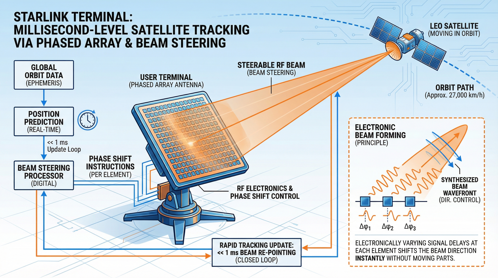
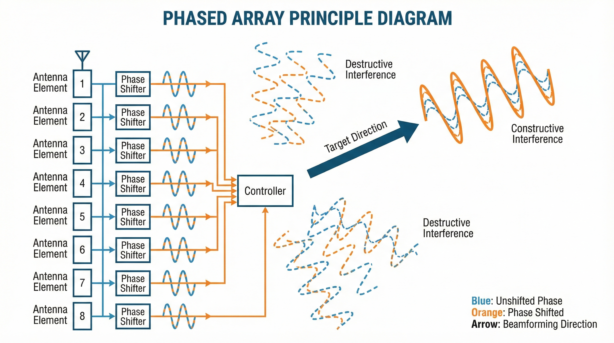
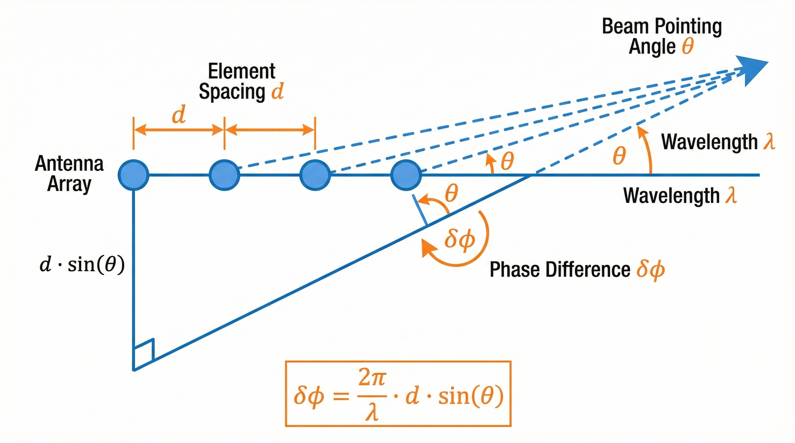
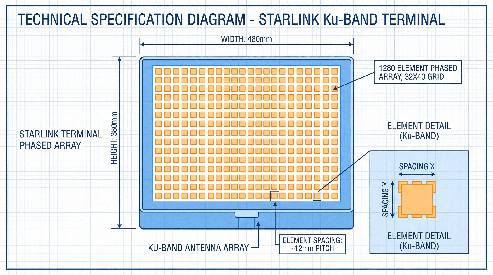
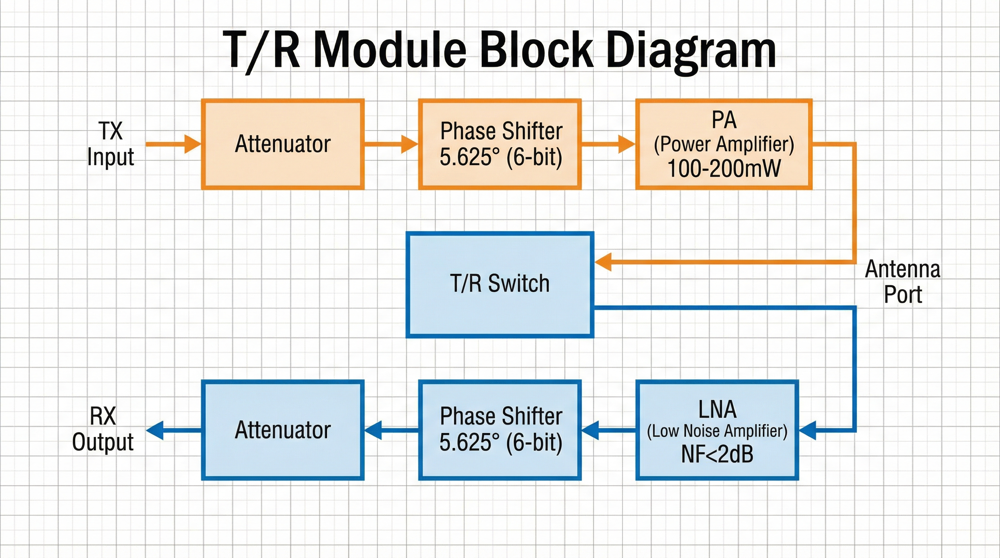
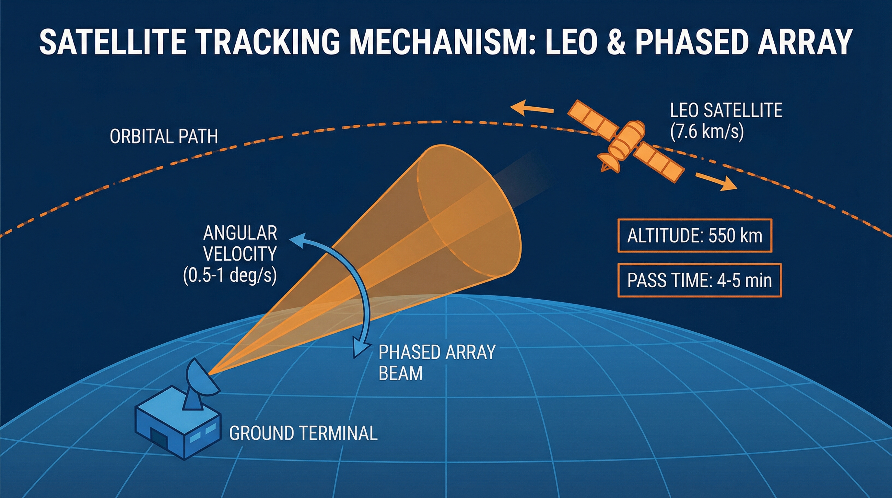
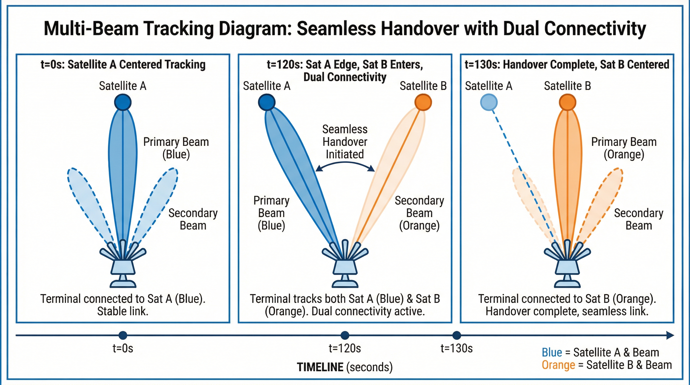
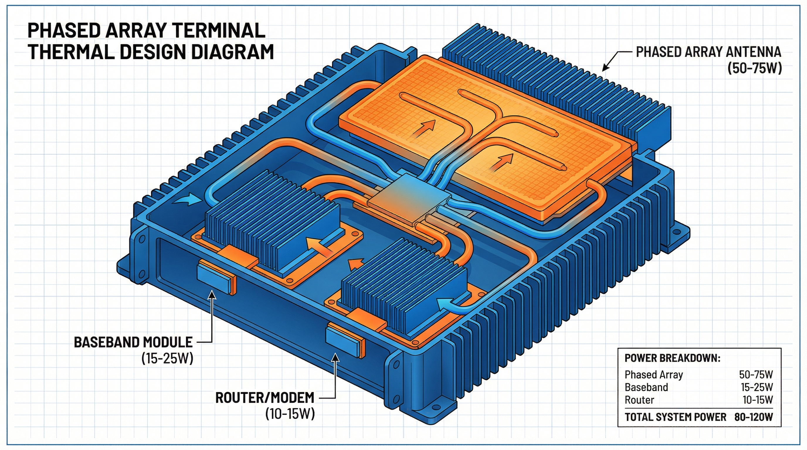
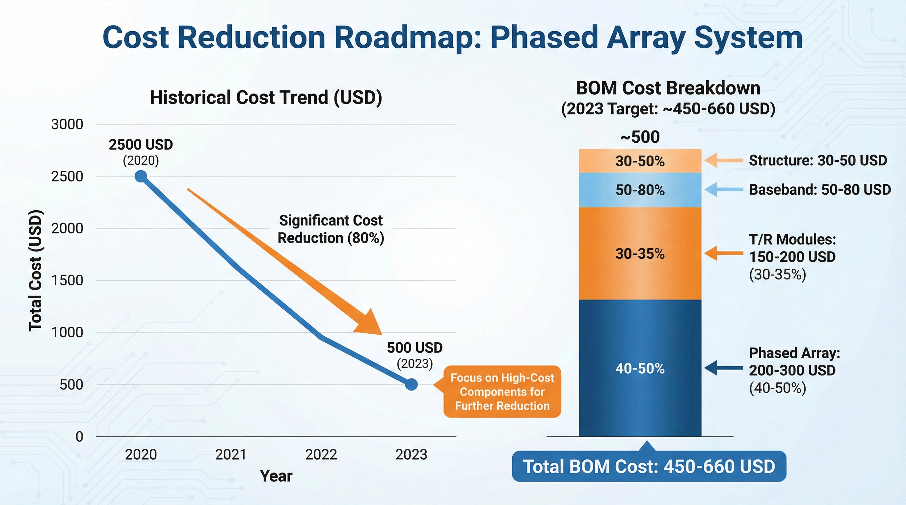
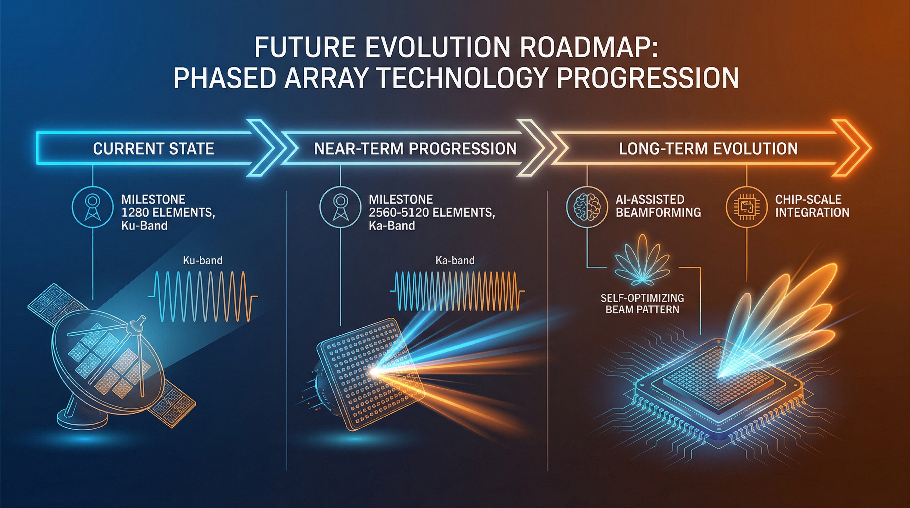

# 从通信视角看 Starlink（09）｜波束赋形与相控阵天线：Starlink 终端如何实现毫秒级卫星跟踪？

> 本文属于「从通信视角看 Starlink」系列第 9 篇（第二阶段第 3 篇）
> 目标读者：通信行业从业者、天线工程师、关注终端技术的专业读者

---

## 从 ACM 进入天线技术

在第（08）篇文章中，我们介绍了 ACM（自适应编码调制）技术：
- 根据 C/N 动态调整 MODCOD
- 雨衰场景下的快速降级
- 2.8 倍频谱效率增益

但有一个关键问题：**Starlink 终端如何在卫星高速运动的情况下，始终保持对准？**

答案是：**相控阵天线（Phased Array Antenna）**。



---

## 相控阵天线的基本原理

### 什么是相控阵？

相控阵的核心思想是**通过控制多个天线单元的相位，实现波束的电子转向**。

传统机械天线：
- 需要物理旋转天线
- 转向速度慢（秒级）
- 机械磨损，可靠性低

相控阵天线：
- 电子波束转向，无需机械运动
- 转向速度快（微秒级）
- 无机械磨损，可靠性高



### 波束赋形原理

相控阵通过**相长干涉**和**相消干涉**实现波束赋形：

**相长干涉**：
- 多个天线单元的信号在目标方向同相叠加
- 信号增强，形成主瓣

**相消干涉**：
- 多个天线单元的信号在其他方向反相抵消
- 信号减弱，形成旁瓣和零陷

**数学描述**：
```
E(θ) = Σ A_n × exp(j × φ_n) × exp(j × k × d_n × sin(θ))

其中：
- E(θ): 方向θ处的电场
- A_n: 第 n 个单元的幅度
- φ_n: 第 n 个单元的相位（可控）
- k: 波数 (2π/λ)
- d_n: 第 n 个单元的位置
- θ: 观察角度
```

通过调整 φ_n（每个单元的相位），可以控制波束指向θ。

### 波束转向公式

波束指向角度θ与相位差Δφ的关系：

```
Δφ = (2π/λ) × d × sin(θ)

其中：
- Δφ: 相邻单元的相位差
- λ: 工作波长
- d: 单元间距
- θ: 波束指向角度
```

**关键洞察**：
- 相位差Δφ决定波束指向θ
- 电子调整相位，实现波束转向
- 转向速度仅受限于相位调整速度（微秒级）



---

## Starlink 终端的相控阵设计

### 天线阵列规模

Starlink 标准版终端的天线阵列：

| 参数 | 值 | 说明 |
|------|-----|------|
| **天线单元数** | ~1,280 个 | 32×40 矩形阵列 |
| **工作频段** | Ku 波段 (10.7-12.7 GHz) | 下行接收 |
| **单元间距** | ~λ/2 (~12mm) | 避免栅瓣 |
| **阵列尺寸** | ~380mm × 480mm | 有效孔径 |
| **天线增益** | ~30-35 dBi | 高增益 |
| **波束宽度** | ~2-3° | 窄波束 |

**关键设计考虑**：
- **单元数量**：决定天线增益和波束宽度
- **单元间距**：λ/2 避免栅瓣，但增加互耦
- **阵列尺寸**：决定有效孔径和增益
- **工作频段**：Ku 波段平衡增益和雨衰



### T/R 模块设计

每个天线单元连接一个**T/R 模块**（Transmit/Receive Module）：

**T/R 模块组成**：
- **功率放大器（PA）**：发射时放大信号
- **低噪声放大器（LNA）**：接收时放大微弱信号
- **移相器**：调整相位，实现波束转向
- **衰减器**：调整幅度，控制旁瓣
- **开关**：切换发射/接收模式

**T/R 模块关键指标**：

| 参数 | 发射模式 | 接收模式 |
|------|---------|---------|
| **输出功率** | ~100-200 mW | - |
| **噪声系数** | - | <2 dB |
| **移相精度** | 5.625° (6 bit) | 5.625° (6 bit) |
| **功耗** | ~1-2 W | ~0.5-1 W |

**关键洞察**：
- 1,280 个 T/R 模块 × 1-2W = 1-2kW 总功耗
- 实际终端功耗~50-100W（占空比和效率优化）
- T/R 模块是相控阵的核心，成本占比高



### 波束形成网络

波束形成网络（Beamforming Network）负责：
- 分配信号到各个 T/R 模块
- 收集各个 T/R 模块的信号
- 控制移相器和衰减器

**Starlink 的波束形成架构**：

```
┌─────────────────────────────────────────────────────────────┐
│              Starlink 波束形成架构                           │
├─────────────────────────────────────────────────────────────┤
│                                                             │
│  ┌──────────┐    ┌──────────┐    ┌──────────┐              │
│  │ 基带处理 │ -> │ 波束形成 │ -> │ T/R 阵列 │              │
│  │  单元    │    │  网络    │    │ (1280 个) │              │
│  └──────────┘    └──────────┘    └──────────┘              │
│       │                │                │                   │
│       │                │                │                   │
│  ┌────┴────┐     ┌─────┴─────┐    ┌────┴────┐             │
│  │ 数字波束 │     │ 模拟波束  │    │ 射频    │             │
│  │ 形成    │     │ 形成      │    │ 辐射    │             │
│  └─────────┘     └───────────┘    └─────────┘             │
│                                                             │
└─────────────────────────────────────────────────────────────┘
```

**数字波束形成（DBF）**：
- 在基带处理
- 灵活、可编程
- 支持多波束

**模拟波束形成**：
- 在射频/中频处理
- 功耗低、延迟低
- Starlink 主要采用

---

## 卫星跟踪机制

### 为什么需要跟踪？

Starlink 卫星在 LEO 轨道高速运动：
- **轨道高度**：550 km
- **轨道速度**：~7.6 km/s
- **过顶时间**：~4-5 分钟
- **角速度**：~0.5-1°/s

如果不跟踪：
- 卫星快速飞出波束范围
- 链路中断

**跟踪要求**：
- 波束指向精度：<0.5°
- 跟踪更新频率：>10 Hz
- 切换时延：<100 ms



### 跟踪流程

**步骤 1：卫星星历获取**
- 终端从卫星广播获取星历数据
- 或从网络侧获取预测星历
- 星历精度：~100 m

**步骤 2：位置计算**
- 根据终端 GPS 位置和卫星星历
- 计算卫星方位角和仰角
- 更新频率：1-10 Hz

**步骤 3：波束指向**
- 根据方位角和仰角计算相位
- 调整 T/R 模块移相器
- 波束指向卫星

**步骤 4：闭环跟踪**
- 测量接收信号强度（RSSI）
- 微调波束指向，最大化 RSSI
- 补偿星历误差和终端姿态变化

### 多波束跟踪

Starlink 终端支持**同时跟踪多颗卫星**：

**为什么需要多波束？**
- 当前卫星即将飞出视野
- 提前建立与下一颗卫星的连接
- 实现无缝切换

**多波束实现**：
- 数字波束形成（DBF）
- 同时生成多个独立波束
- 每个波束跟踪一颗卫星

**切换流程**：
```
时间 (s)    事件
────────────────────────────────────────
0           当前卫星 A 在视野中心
120         卫星 A 接近边缘，卫星 B 进入视野
125         开始建立与卫星 B 的连接（双连接）
130         数据流切换到卫星 B
135         断开与卫星 A 的连接
```

**关键指标**：
- **切换准备时间**：~5-10 s
- **切换执行时间**：<100 ms
- **数据丢失**：0（双连接缓冲）



---

## 功耗与散热

### 功耗分析

Starlink 终端的功耗分布：

| 组件 | 功耗 | 占比 |
|------|------|------|
| **相控阵天线** | 50-75 W | 50-60% |
| **基带处理** | 15-25 W | 15-20% |
| **路由器/WiFi** | 10-15 W | 10-15% |
| **电源转换** | 5-10 W | 5-10% |
| **总计** | 80-120 W | 100% |

**相控阵功耗细分**：
- T/R 模块（发射）：~40-60 W
- T/R 模块（接收）：~10-15 W
- 波束形成网络：~5-10 W

**关键洞察**：
- 相控阵是功耗大户
- 发射功耗 > 接收功耗
- 需要高效散热设计

### 散热设计

Starlink 终端的散热方案：

**被动散热**：
- 散热片：铝制鳍片，增加表面积
- 热管：将热量从 T/R 模块传导到散热片
- 外壳：金属外壳辅助散热

**主动散热**（高功率版本）：
- 风扇：强制空气对流
- 液冷：高端版本可能采用

**热设计目标**：
- T/R 模块结温：<85°C
- 外壳温度：<50°C（触摸安全）
- 环境温度：-30°C 到 +50°C



---

## 成本分析

### 终端 BOM 成本

Starlink 终端的 BOM（Bill of Materials）成本估算：

| 组件 | 成本 (USD) | 占比 |
|------|-----------|------|
| **相控阵天线** | 200-300 | 40-50% |
| **T/R 模块 (×1280)** | 150-200 | 30-35% |
| **基带处理** | 50-80 | 10-15% |
| **结构件/外壳** | 30-50 | 5-10% |
| **电源/其他** | 20-30 | 5% |
| **总计** | 450-660 | 100% |

**关键洞察**：
- T/R 模块是成本大头（1280 个 × $0.12-0.16/个）
- 2020 年成本~$2,500，2023 年降至~$500
- 规模效应显著

### 成本下降路径

**成本下降驱动因素**：

**1. T/R 模块集成化**：
- 早期：分立元件，成本高
- 现在：SiGe/CMOS 集成，成本下降 10 倍

**2. 规模化生产**：
- 2020 年：月产~1 万
- 2023 年：月产~10 万 +
- 规模效应降低成本

**3. 设计优化**：
- 减少天线单元数量（优化算法补偿）
- 简化波束形成网络
- 降低功耗和散热成本

**未来趋势**：
- 目标成本：$200-300
- 技术路径：更高集成度、更少单元、AI 辅助波束形成



---

## 与 5G  Massive MIMO 对比

### 技术对比

| 特性 | Starlink 相控阵 | 5G Massive MIMO |
|------|---------------|-----------------|
| **天线单元数** | ~1,280 | 32-128 |
| **工作频段** | Ku (10-12 GHz) | Sub-6 (3-5 GHz) |
| **波束数量** | 2-4 个 | 8-16 个 |
| **覆盖距离** | 500-1000 km | 1-10 km |
| **跟踪目标** | 高速卫星 | 静止/慢速用户 |
| **功耗** | 50-100 W | 200-500 W |

### 设计差异

**Starlink 相控阵**：
- 窄波束（2-3°），高增益
- 跟踪高速运动目标
- 单用户或少量用户

**5G Massive MIMO**：
- 宽波束或多波束
- 服务多用户（SDMA）
- 基站功耗高，终端简单

### 经验借鉴

Starlink 从 5G 借鉴的技术：
- 数字波束形成架构
- 多用户调度算法
- 信道估计技术

5G 从 Starlink 借鉴的技术：
- 低轨卫星回传
- 非地面网络（NTN）集成
- 混合波束形成

---

## 未来演进方向

### 更高频段

**Ka 波段（26-40 GHz）**：
- 优势：更宽频谱，更高容量
- 挑战：雨衰更严重，需要更多单元

**E 波段（71-76/81-86 GHz）**：
- 优势：极大频谱资源
- 挑战：极高雨衰，短距离应用

### 更多单元

**当前**：~1,280 单元
**未来**：~2,560-5,120 单元

**优势**：
- 更高增益（+3-6 dB）
- 更窄波束（<1°）
- 支持更多并发波束

**挑战**：
- 功耗增加
- 成本增加
- 散热难度增加

### AI 辅助波束形成

**AI 优化波束**：
- 机器学习优化相位权重
- 自适应旁瓣抑制
- 抗干扰波束形成

**AI 预测跟踪**：
- 预测卫星轨道误差
- 提前调整波束指向
- 减少跟踪延迟

### 集成化设计

**芯片级集成**：
- T/R 模块 SoC 化
- 波束形成 ASIC
- 降低功耗和成本

**封装级集成**：
- 天线 - 芯片一体化封装
- 减少互连损耗
- 小型化



---

## 本文解决了什么？

- 解释了相控阵天线的基本原理和波束赋形机制
- 详细说明了 Starlink 终端的相控阵设计（1,280 单元）
- 分析了 T/R 模块的组成和关键指标
- 解释了卫星跟踪机制和多波束切换
- 讨论了功耗、散热和成本问题
- 对比了 Starlink 相控阵与 5G Massive MIMO
- 展望了相控阵技术的未来演进方向

---

## 关键要点总结

| 要点 | 说明 |
|------|------|
| **相控阵原理** | 通过相位控制实现电子波束转向 |
| **天线规模** | ~1,280 单元，Ku 波段 |
| **波束转向** | 微秒级，无需机械运动 |
| **卫星跟踪** | 星历 + 闭环 RSSI 优化 |
| **多波束** | 支持 2-4 个并发波束，无缝切换 |
| **终端功耗** | 80-120 W，相控阵占 50-60% |
| **终端成本** | ~$450-660 BOM，T/R 模块占 30-35% |

---

## 下一篇预告

**从通信视角看 Starlink（10）｜频率复用与干扰管理：Starlink 如何在密集星座中避免相互干扰？**

Starlink 有上万颗卫星，如何避免相互干扰？

下一篇我会深入分析：
- 频率复用模式设计
- 极化复用技术
- 空间隔离与波束隔离
- 同频干扰和邻星干扰管理

---

**栏目**：从通信视角看 Starlink
**系列索引**：第 9 篇 / 第二阶段 8 篇
**目标读者**：通信行业从业者、天线工程师、关注终端技术的专业读者
