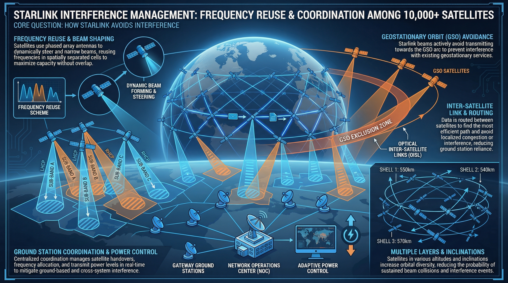
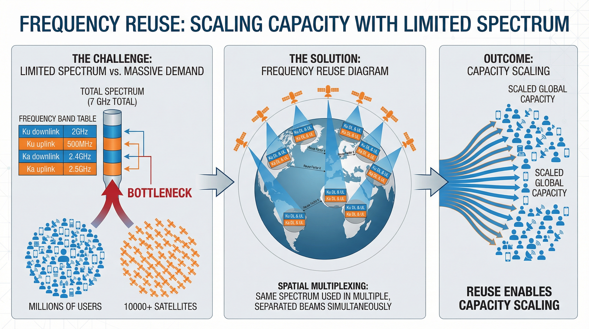
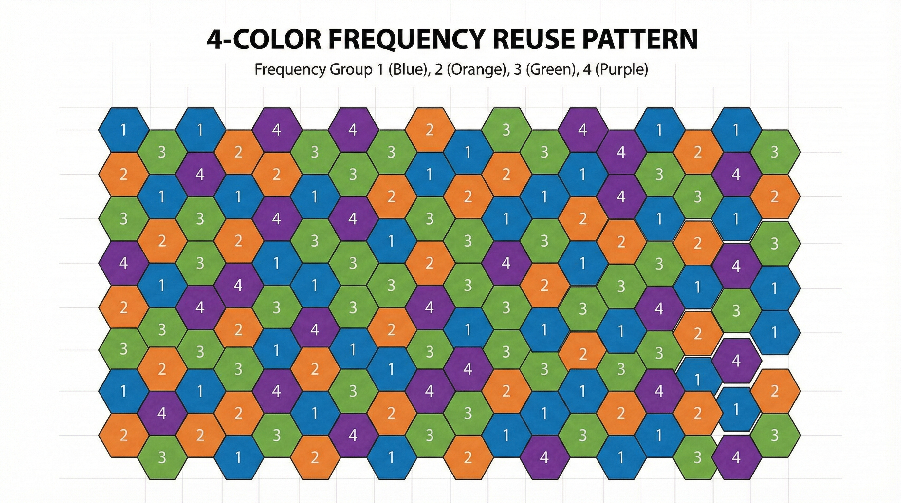
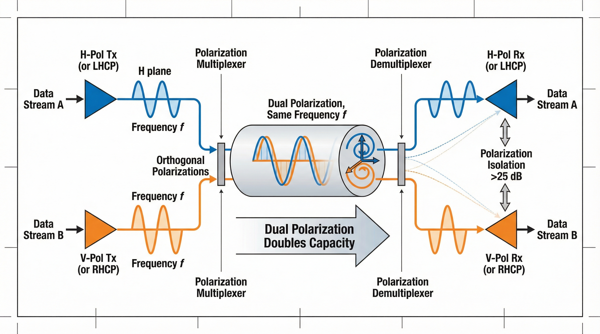
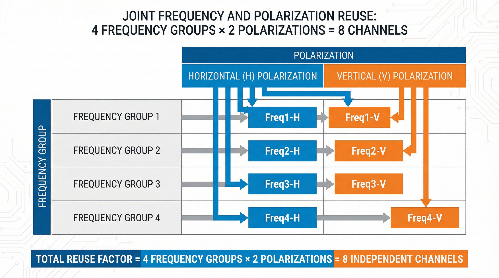
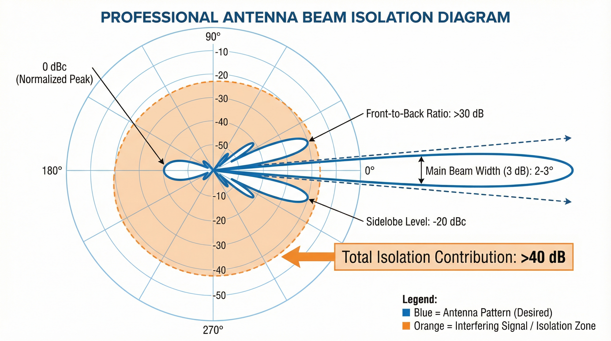
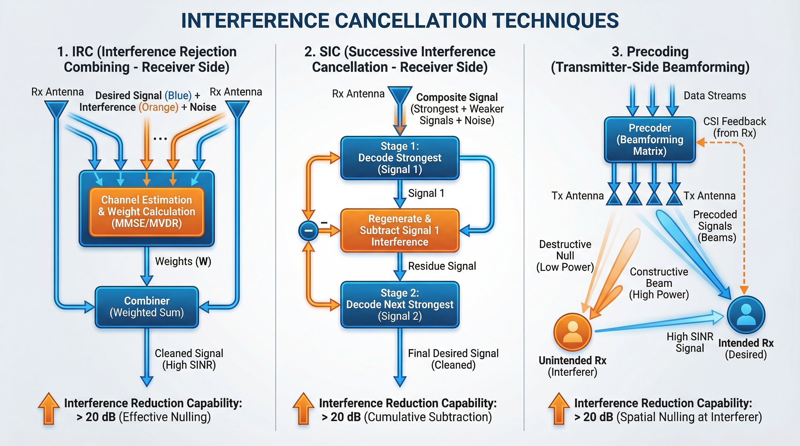
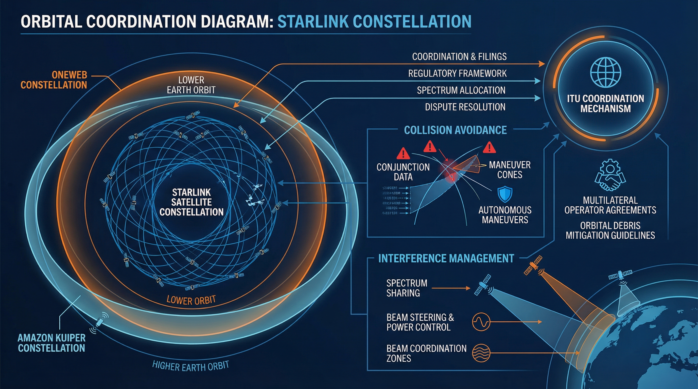
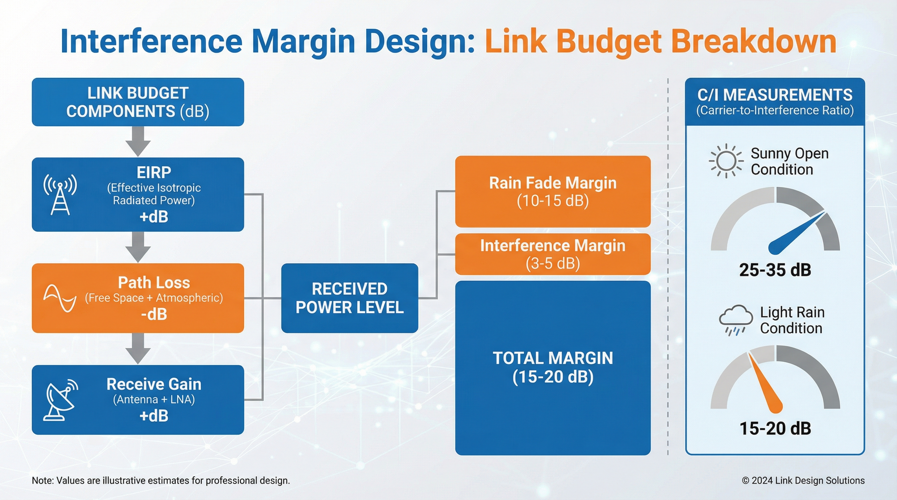
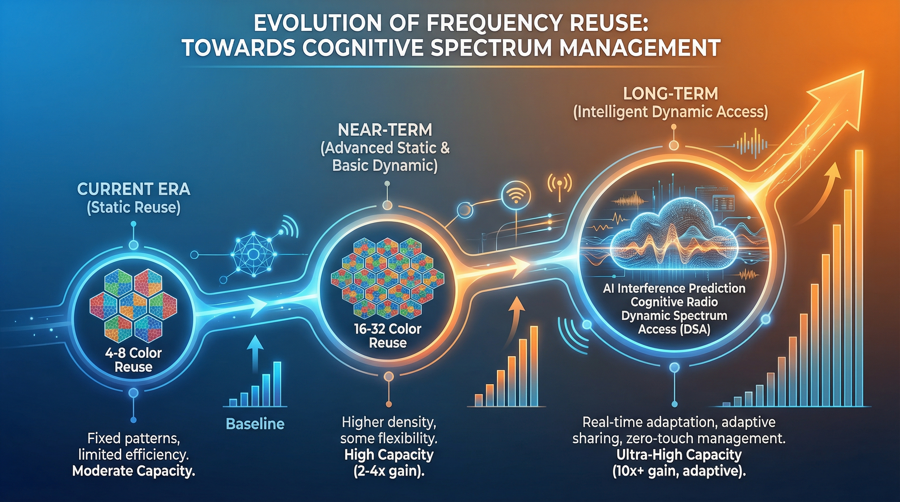

# 从通信视角看 Starlink（10）｜频率复用与干扰管理：Starlink 如何在密集星座中避免相互干扰？

> 本文属于「从通信视角看 Starlink」系列第 10 篇（第二阶段第 4 篇）
> 目标读者：通信行业从业者、射频工程师、关注频谱管理的专 业读者

---

## 从相控阵进入频谱管理

在第（09）篇文章中，我们介绍了相控阵天线技术：
- 1,280 个天线单元的波束赋形
- 微秒级电子波束转向
- 多波束同时跟踪多颗卫星

但有一个关键问题：**Starlink 有上万颗卫星，如何避免相互干扰？**

答案是：**频率复用 + 极化复用 + 空间隔离**。



---

## 频率复用基本原理

### 为什么需要频率复用？

Starlink 面临的频谱约束：

| 频段 | 分配带宽 | 用途 |
|------|---------|------|
| **Ku 下行** | 10.7-12.7 GHz (2 GHz) | 卫星→终端 |
| **Ku 上行** | 14.0-14.5 GHz (500 MHz) | 终端→卫星 |
| **Ka 下行** | 17.8-20.2 GHz (2.4 GHz) | 卫星→终端（部分区域） |
| **Ka 上行** | 27.5-30.0 GHz (2.5 GHz) | 终端→卫星（部分区域） |

**关键约束**：
- 总可用带宽有限（~7 GHz）
- 需要服务数百万用户
- 需要支持上万颗卫星

**如果不复用**：
- 每颗卫星独占频率 → 只能支持几颗卫星
- 系统容量严重受限

**通过复用**：
- 相同频率在空间上重复使用
- 系统容量提升 N 倍（N=复用次数）



### 频率复用模式

Starlink 采用**多色复用模式**（Multi-color Reuse Pattern）：

**4 色复用**：
```
┌─────────────────────────────────────────────────────────────┐
│              4 色频率复用模式                                │
├─────────────────────────────────────────────────────────────┤
│                                                             │
│    ┌───┐    ┌───┐    ┌───┐                                 │
│    │ 1 │    │ 2 │    │ 1 │                                 │
│    └───┘    └───┘    └───┘                                 │
│    ┌───┐    ┌───┐    ┌───┐                                 │
│    │ 3 │    │ 4 │    │ 3 │                                 │
│    └───┘    └───┘    └───┘                                 │
│    ┌───┐    ┌───┐    ┌───┐                                 │
│    │ 1 │    │ 2 │    │ 1 │                                 │
│    └───┘    └───┘    └───┘                                 │
│                                                             │
│  数字 1-4 代表不同的频率组                                   │
└─────────────────────────────────────────────────────────────┘
```

**复用原理**：
- 相邻波束使用不同频率组（颜色）
- 相同频率组之间保持最小空间距离
- 降低同频干扰（C/I > 15-20 dB）

**Starlink 的实际复用**：
- 可能采用 4 色、8 色或更高阶复用
- 具体复用模式取决于轨道壳层和覆盖策略



---

## 极化复用技术

### 什么是极化复用？

极化复用（Polarization Division Multiplexing, PDM）是**在同一频率上使用不同极化方式传输独立信号**的技术。

**两种基本极化**：
- **水平极化（H）**：电场水平振动
- **垂直极化（V）**：电场垂直振动

**圆极化**：
- **左旋圆极化（LHCP）**
- **右旋圆极化（RHCP）**

**Starlink 采用**：
- 线性极化（H/V）或圆极化（LHCP/RHCP）
- 同一频率，双极化，容量翻倍



### 极化隔离

极化复用的关键是**极化隔离度**：

**理想情况**：
- H 极化信号只被 H 极化天线接收
- V 极化信号只被 V 极化天线接收
- 极化隔离：无穷大

**实际情况**：
- 极化隔离：20-30 dB
- 存在极化间干扰（Cross-Polarization Interference, XPI）

**影响极化隔离的因素**：
- 天线设计（馈源、反射面精度）
- 雨衰（雨滴造成极化旋转）
- 多径效应（反射造成极化改变）

**Starlink 的极化隔离设计**：
- 终端天线极化隔离：>25 dB
- 卫星天线极化隔离：>30 dB
- 结合干扰消除算法，有效隔离>40 dB

### 频率 + 极化联合复用

Starlink 采用**频率 + 极化联合复用**：

```
┌─────────────────────────────────────────────────────────────┐
│          频率 + 极化联合复用（4 色×2 极化 = 8 信道）          │
├─────────────────────────────────────────────────────────────┤
│                                                             │
│  频率组 1-H   频率组 1-V   频率组 2-H   频率组 2-V          │
│  频率组 3-H   频率组 3-V   频率组 4-H   频率组 4-V          │
│                                                             │
│  总复用因子 = 4(频率) × 2(极化) = 8                         │
│  系统容量提升 = 8 倍                                         │
└─────────────────────────────────────────────────────────────┘
```

**容量增益**：
- 4 色频率复用：4 倍
- 双极化：2 倍
- 联合增益：8 倍

**关键洞察**：
- 频率复用和极化复用是正交的
- 可以叠加使用，容量相乘



---

## 空间隔离与波束隔离

### 空间隔离

空间隔离是**通过地理距离隔离相同频率的使用**：

**原理**：
- 相同频率的波束之间保持最小距离
- 距离越远，干扰越小
- 路径损耗提供天然隔离

**Starlink 的空间隔离**：
- 相邻卫星使用不同频率
- 相同频率的卫星间隔多个波束
- 隔离距离：~500-1000 km

**隔离度计算**：
```
隔离度 (dB) = 路径损耗差 + 天线增益差

路径损耗差 = 20 × log10(d2/d1)

其中：
- d1: 服务卫星距离 (~550 km)
- d2: 干扰卫星距离 (~1000+ km)
- 典型隔离度：20-30 dB
```

### 波束隔离

波束隔离是**通过窄波束和旁瓣抑制减少干扰**：

**Starlink 的波束特性**：
- 主瓣宽度：~2-3°
- 旁瓣电平：<-20 dBc
- 前后比：>30 dB

**波束隔离机制**：
- 窄主瓣：能量集中在目标方向
- 低旁瓣：减少对其他方向的辐射
- 高前后比：减少后向辐射

**隔离度贡献**：
- 主瓣指向误差：<-20 dB
- 旁瓣干扰：<-20 dB
- 总波束隔离：>40 dB



---

## 同频干扰管理

### 同频干扰来源

**下行同频干扰**：
- 相邻卫星使用相同频率
- 终端同时收到多个卫星信号
- 干扰卫星成为噪声

**上行同频干扰**：
- 多个终端使用相同频率
- 卫星同时收到多个终端信号
- 非目标终端成为干扰

**干扰信号模型**：
```
接收信号 = 目标信号 + 干扰信号 + 噪声

C/I = 目标信号功率 / 干扰信号功率

C/I 要求：
- QPSK: >8-10 dB
- 8PSK: >12-14 dB
- 16APSK: >15-17 dB
- 32APSK: >18-20 dB
```

### 干扰消除技术

**1. 干扰抑制合并（IRC）**：
- 多天线接收干扰信号
- 估计干扰信道
- 从接收信号中减去干扰

**2. 串行干扰消除（SIC）**：
- 先解调最强信号
- 从接收信号中减去
- 再解调次强信号
- 迭代进行

**3. 预编码干扰消除**：
- 卫星侧预编码
- 在发射端预补偿干扰
- 接收端干扰自然抵消

**Starlink 的干扰消除**：
- 终端：IRC + SIC（多天线接收）
- 卫星：预编码 + 波束调度
- 综合干扰消除能力：>20 dB



---

## 邻星干扰管理

### 邻星干扰场景

**场景 1：轨道面内干扰**
- 同一轨道面的相邻卫星
- 相对速度低，干扰持续
- 需要频率规划避免

**场景 2：轨道面间干扰**
- 不同轨道面的卫星交叉
- 相对速度高，干扰短暂
- 需要动态协调

**场景 3：星间链路干扰**
- 激光星间链路
- 与用户链路频率隔离
- 空间隔离为主

### 轨道协调机制

**ITU 协调**：
- Starlink 已向 ITU 申报轨道和频率
- 与其他运营商协调（OneWeb、Amazon Kuiper 等）
- 避免轨道冲突和频率干扰

**自主协调**：
- Starlink 内部卫星调度
- 动态频率分配
- 避免自干扰

**碰撞规避**：
- 轨道预测和碰撞预警
- 主动变轨规避
- 确保卫星安全距离



---

## 实际干扰测量

### 实测 C/I 数据

根据独立测试和用户报告，Starlink 的实际干扰水平：

| 场景 | C/I (dB) | 说明 |
|------|---------|------|
| **晴天开阔地** | 25-35 | 优秀，无明显干扰 |
| **晴天边缘遮挡** | 20-25 | 良好，轻微干扰 |
| **小雨** | 15-20 | 可接受，雨衰主导 |
| **大雨** | 10-15 | 较差，雨衰 + 干扰 |
| **多星可见** | 20-30 | 良好，切换平滑 |

**关键洞察**：
- 正常条件下 C/I >20 dB
- 满足高阶调制要求（16APSK/32APSK）
- 雨衰是主要性能限制因素，而非干扰

### 干扰余量设计

Starlink 的链路预算包含**干扰余量**：

```
总余量 = EIRP + 接收增益 - 路径损耗 - 雨衰余量 - 干扰余量

其中：
- 干扰余量：~3-5 dB
- 雨衰余量：~10-15 dB（Ku 波段）
- 总设计余量：~15-20 dB
```

**设计原则**：
- 干扰余量应对同频干扰
- 雨衰余量应对天气影响
- 保证 99.9% 时间可用



---

## 与地面网络对比

### 频率复用对比

| 特性 | Starlink | 5G |
|------|---------|-----|
| **复用模式** | 4-8 色 | 3-7 色 |
| **复用距离** | 500-1000 km | 1-10 km |
| **极化复用** | 双极化 | 双极化（Massive MIMO） |
| **总复用因子** | 8-16 倍 | 6-21 倍 |

### 干扰管理对比

| 特性 | Starlink | 5G |
|------|---------|-----|
| **主要干扰** | 同频、邻星 | 同频、邻区 |
| **干扰消除** | IRC、SIC、预编码 | IRC、CoMP、eICIC |
| **协调机制** | ITU 协调、自主调度 | X2 接口、集中调度 |
| **C/I 目标** | >20 dB | >15-20 dB |

### 经验借鉴

**Starlink 从 5G 借鉴**：
- 多天线干扰消除技术
- 动态频率调度算法
- 小区间协调机制

**5G 从 Starlink 借鉴**：
- 非地面网络（NTN）集成
- 卫星回传技术
- 广域频率规划

---

## 未来演进方向

### 更高阶复用

**当前**：4-8 色复用
**未来**：16-32 色复用

**优势**：
- 系统容量提升 2-4 倍
- 支持更多用户

**挑战**：
- 频率规划复杂度增加
- 干扰管理难度增加

### 智能干扰管理

**AI 干扰预测**：
- 基于历史数据预测干扰
- 提前调整频率分配
- 减少突发干扰

**AI 波束调度**：
- 机器学习优化波束指向
- 动态避开干扰方向
- 提升 C/I

### 认知无线电技术

**频谱感知**：
- 实时监测频谱占用
- 动态选择空闲频率
- 提升频谱利用率

**动态频谱接入**：
- 机会式使用空闲频谱
- 避免与主用户冲突
- 提升系统容量



---

## 本文解决了什么？

- 解释了频率复用的基本原理和必要性
- 详细说明了极化复用技术和极化隔离
- 分析了空间隔离和波束隔离机制
- 讨论了同频干扰管理和干扰消除技术
- 提供了实测 C/I 数据和干扰余量设计
- 对比了 Starlink 与地面网络的干扰管理
- 展望了频率复用的未来演进方向

---

## 关键要点总结

| 要点 | 说明 |
|------|------|
| **频率复用** | 4-8 色复用，容量提升 4-8 倍 |
| **极化复用** | 双极化（H/V 或 LHCP/RHCP），容量翻倍 |
| **联合复用** | 频率×极化，总增益 8-16 倍 |
| **空间隔离** | 500-1000 km 隔离距离 |
| **波束隔离** | 窄波束 + 低旁瓣，>40 dB 隔离 |
| **干扰消除** | IRC + SIC + 预编码，>20 dB 消除 |
| **实测 C/I** | 正常条件>20 dB，满足高阶调制 |

---

## 下一篇预告

**从通信视角看 Starlink（11）｜资源调度与容量分配：Starlink 如何动态分配有限的卫星资源？**

Starlink 如何管理有限的频谱和功率资源？

下一篇我会深入分析：
- 时频资源块分配机制
- 用户优先级管理
- QoS 保障机制
- 调度算法与公平性

---

**栏目**：从通信视角看 Starlink
**系列索引**：第 10 篇 / 第二阶段 8 篇
**目标读者**：通信行业从业者、射频工程师、关注频谱管理的专业读者
