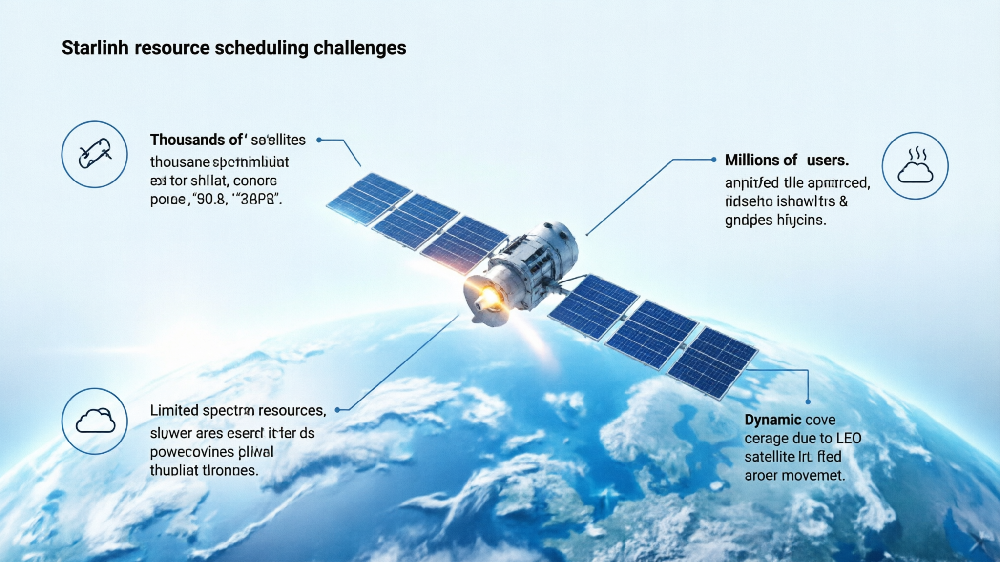
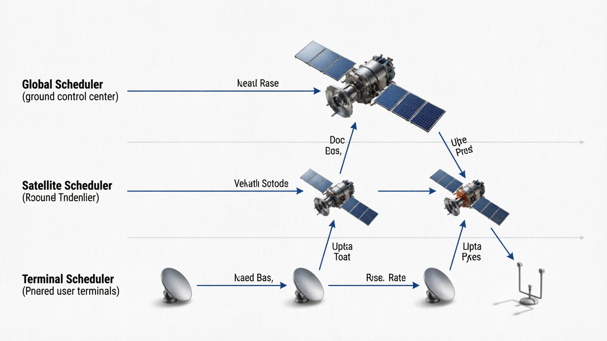
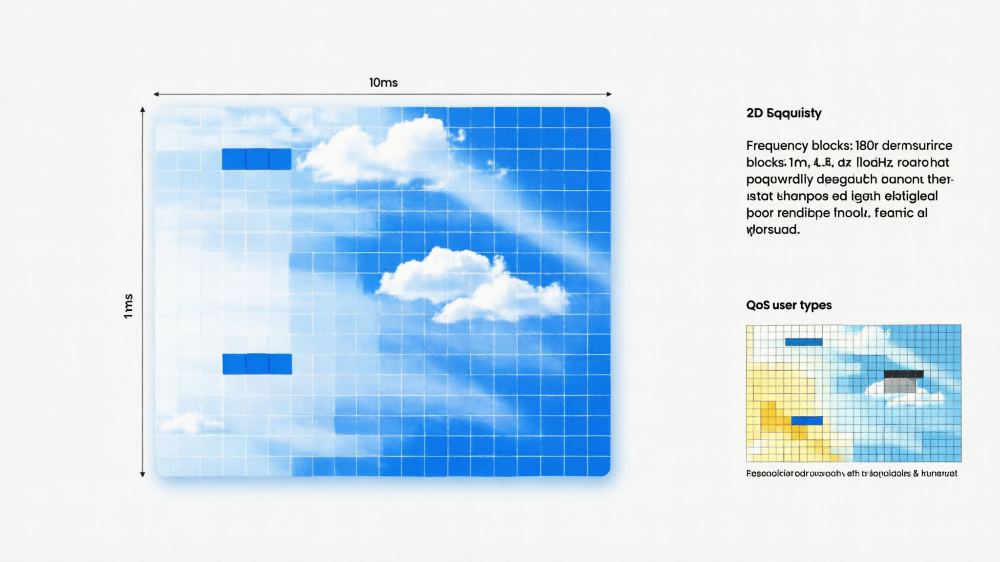
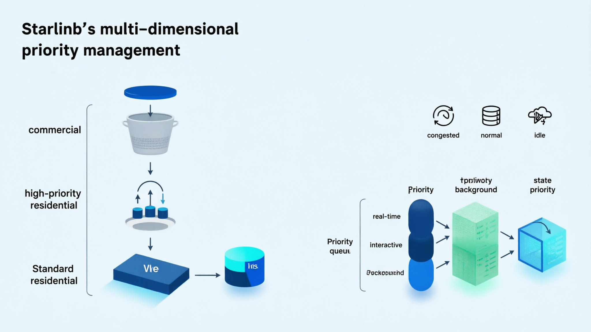
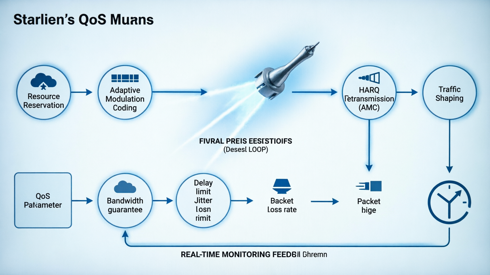
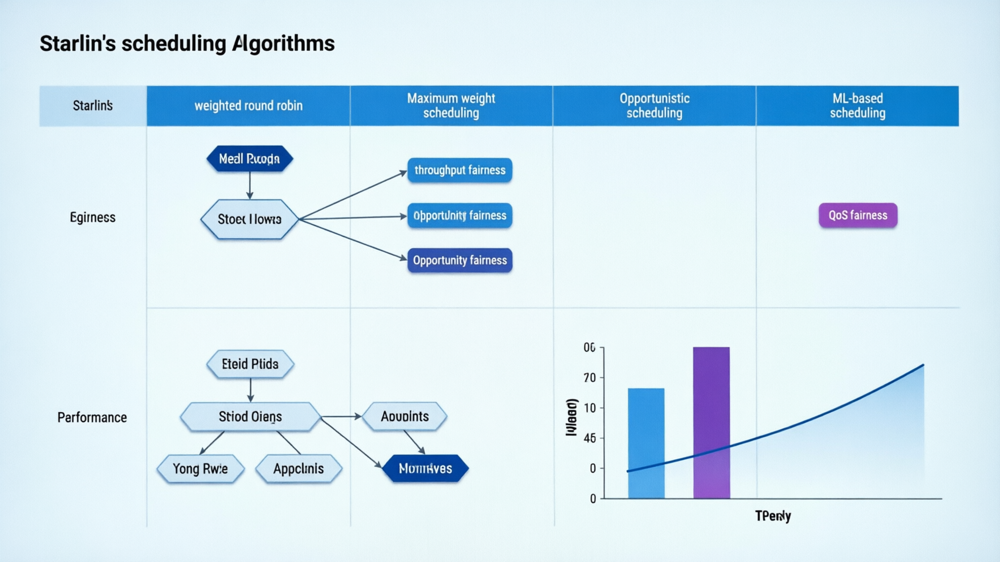
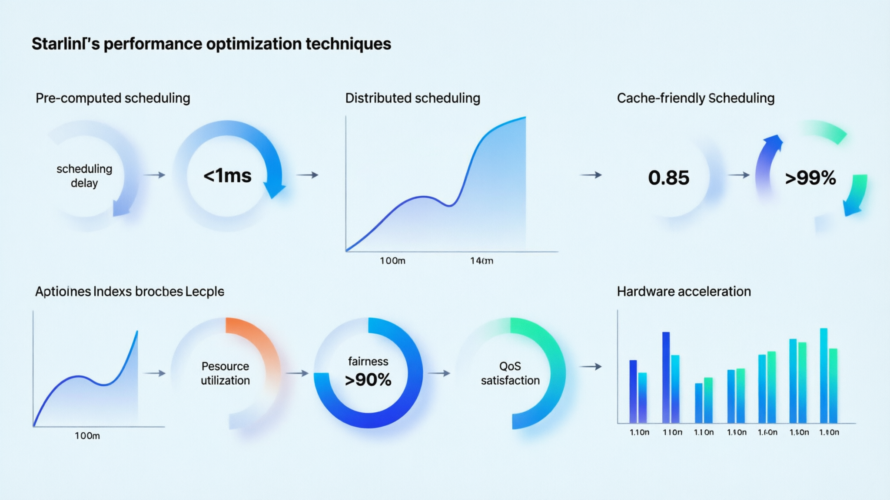

# 从通信视角看 Starlink（11）｜资源调度与容量分配：Starlink 如何动态分配有限的卫星资源？

> 本文属于「从通信视角看 Starlink」系列第 11 篇（第二阶段第 5 篇）
> 目标读者：通信行业从业者、网络工程师、关注资源调度算法的专业读者

---

## Starlink 面临的资源调度挑战

Starlink 的规模带来了前所未有的调度复杂性：

- **卫星数量**：超过 6,000 颗在轨卫星，最终目标 42,000+ 颗
- **用户数量**：超过 100 万用户，持续快速增长
- **频谱资源**：Ku/Ka 频段总带宽约 7 GHz
- **功率限制**：每颗卫星太阳能供电有限
- **覆盖动态**：LEO 卫星高速移动，用户频繁切换

在这种复杂的环境下，**如何动态分配有限的卫星资源**成为 Starlink 系统的核心挑战。

---

## 资源调度的基本框架

### 三层调度架构

Starlink 采用**分布式三层调度架构**：

**1. 全局调度层**（Global Scheduler）
- 运行在地面控制中心
- 负责长期资源规划和卫星任务分配
- 更新频率：分钟级到小时级

**2. 卫星调度层**（Satellite Scheduler）
- 运行在每颗卫星上
- 负责实时资源分配和用户调度
- 更新频率：毫秒级到秒级

**3. 终端调度层**（Terminal Scheduler）
- 运行在用户终端
- 负责本地资源请求和反馈
- 更新频率：微秒级到毫秒级

这种分层架构既保证了全局优化，又实现了快速响应。

### 调度资源类型

Starlink 需要调度的资源包括：

| 资源类型 | 特点 | 调度粒度 |
|----------|------|----------|
| **时频资源块** | 时间 + 频率二维资源 | 1ms × 1MHz |
| **功率资源** | 卫星发射功率有限 | 0.1dB 步进 |
| **波束资源** | 32个独立波束 | 波束级别 |
| **编码资源** | AMC调制编码方案 | 用户级别 |
| **QoS资源** | 优先级队列 | 会话级别 |

---

## 时频资源块分配机制

### 资源网格设计

Starlink 将时频资源组织成**二维资源网格**：

**时间维度**：
- **帧长度**：10ms
- **子帧长度**：1ms  
- **时隙长度**：0.1ms

**频率维度**：
- **总带宽**：Ku下行 2GHz + Ku上行 0.5GHz
- **子载波间隔**：15kHz（类似5G NR）
- **资源块**：12个子载波 × 1ms = 180kHz × 1ms

**资源分配单位**：
- **最小分配单元**：1个资源块（180kHz × 1ms）
- **最大分配单元**：整个带宽 × 整个帧

### 动态资源分配算法

Starlink 采用**混合调度算法**：

**1. 比例公平调度**（Proportional Fair Scheduling）
- 平衡系统吞吐量和用户公平性
- 调度权重 = 当前信道质量 / 历史平均吞吐量
- 保证高信道质量用户获得资源，同时避免低信道质量用户饿死

**2. QoS感知调度**（QoS-aware Scheduling）
- 根据业务类型分配不同优先级
- **高优先级**：语音、视频通话、游戏（低延迟保障）
- **中优先级**：网页、邮件、普通视频
- **低优先级**：文件下载、备份、更新

**3. 预测性调度**（Predictive Scheduling）
- 基于用户历史行为预测未来需求
- 提前预留资源，减少调度延迟
- 利用机器学习模型优化预测准确性

### 资源分配流程

**下行链路资源分配**：
1. 终端上报信道质量指示（CQI）
2. 卫星计算各用户的调度权重
3. 按权重分配时频资源块
4. 发送调度授权（Grant）给终端
5. 终端接收数据并反馈ACK/NACK

**上行链路资源分配**：
1. 终端发送调度请求（SR）
2. 卫星评估请求优先级和可用资源
3. 分配上行资源块
4. 终端发送数据
5. 卫星接收并处理

---

## 用户优先级管理

### 多维优先级体系

Starlink 采用**多维优先级体系**：

**1. 服务等级优先级**（Service Tier Priority）
- **商业用户**：最高优先级，SLA保障
- **高优先级住宅用户**：付费优先级服务
- **标准住宅用户**：尽力而为服务
- **移动用户**：动态优先级，基于位置和需求

**2. 应用类型优先级**（Application Type Priority）
- **实时应用**：语音、视频通话、游戏（最高）
- **交互式应用**：网页、邮件、即时消息（中等）
- **后台应用**：文件下载、系统更新、备份（最低）

**3. 网络状态优先级**（Network State Priority）
- **拥塞状态**：提高高价值用户优先级
- **正常状态**：按服务等级分配
- **空闲状态**：所有用户平等分配

### 优先级动态调整

Starlink 实现**动态优先级调整**：

**基于用户体验**：
- 如果用户连续体验差，临时提升优先级
- 如果用户长时间不活跃，降低优先级

**基于网络负载**：
- 高负载时，优先保障高价值用户
- 低负载时，允许低优先级用户使用更多资源

**基于地理位置**：
- 偏远地区用户获得更高优先级（竞争少）
- 热点区域用户按付费等级分配

### 优先级实现机制

**令牌桶机制**：
- 每个用户分配令牌桶
- 高优先级用户获得更大桶容量和更快填充速率
- 令牌用于购买资源，确保QoS保障

**优先级队列**：
- 每个波束维护多个优先级队列
- 调度器按优先级顺序服务队列
- 高优先级队列可抢占低优先级队列资源

---

## QoS 保障机制

### QoS 参数定义

Starlink 定义了详细的 QoS 参数：

| 参数 | 描述 | 典型值 |
|------|------|--------|
| **带宽保障** | 最小保证带宽 | 1-50 Mbps |
| **延迟上限** | 最大端到端延迟 | 20-200 ms |
| **抖动限制** | 延迟变化范围 | 5-50 ms |
| **丢包率** | 最大允许丢包率 | 0.1%-1% |
| **可用性** | 服务可用时间比例 | 99%-99.9% |

### QoS 实现技术

**1. 资源预留**（Resource Reservation）
- 为高QoS用户预留专用资源
- 保证即使在网络拥塞时也能满足SLA
- 预留资源可被低优先级用户借用（当空闲时）

**2. 自适应调制编码**（AMC）
- 根据信道条件动态调整MCS
- 保证在恶劣条件下仍能满足基本QoS
- 高QoS用户获得更保守的MCS选择

**3. HARQ重传机制**
- 快速混合自动重传请求
- 减少传输错误对QoS的影响
- 高QoS用户获得更多的重传机会

**4. 流量整形**（Traffic Shaping）
- 对用户流量进行整形和限速
- 防止单个用户占用过多资源
- 保证整体网络稳定性

### QoS 监控与反馈

**实时监控**：
- 持续监控每个用户的QoS指标
- 检测QoS违规情况
- 触发自适应调整机制

**用户反馈**：
- 收集用户应用层反馈
- 调整QoS策略
- 优化资源分配

**网络优化**：
- 基于QoS数据优化调度算法
- 识别网络瓶颈
- 动态调整资源配置

---

## 调度算法与公平性

### 公平性指标

Starlink 关注多种公平性指标：

**1. 吞吐量公平性**（Throughput Fairness）
- 所有用户获得相似的平均吞吐量
- 使用 Jain's Fairness Index 衡量
- 目标：公平性指数 > 0.8

**2. 机会公平性**（Opportunity Fairness）
- 所有用户获得相似的调度机会
- 避免某些用户长期得不到服务
- 特别关注边缘用户

**3. QoS公平性**（QoS Fairness）
- 相同服务等级的用户获得相似QoS
- 不同等级用户按预期差异获得服务
- 避免等级混淆

### 调度算法优化

**1. 加权轮询**（Weighted Round Robin）
- 按权重分配调度机会
- 权重基于用户等级、历史吞吐量、当前需求
- 实现简单，开销低

**2. 最大权重调度**（Maximum Weight Scheduling）
- 选择能最大化系统加权吞吐量的用户
- 权重 = 信道质量 × 用户优先级
- 性能最优，但计算复杂度高

**3. 机会调度**（Opportunistic Scheduling）
- 优先调度信道条件最好的用户
- 提高系统整体吞吐量
- 结合公平性机制避免用户饿死

**4. 机器学习调度**（ML-based Scheduling）
- 使用强化学习优化调度策略
- 基于历史数据预测最佳调度决策
- 持续学习和改进

### 公平性保障机制

**1. 最小速率保障**（Minimum Rate Guarantee）
- 为每个用户设置最小速率
- 即使在网络拥塞时也保证基本服务
- 防止用户完全失去连接

**2. 最大速率限制**（Maximum Rate Limiting）
- 限制单个用户的最大速率
- 防止单个用户垄断资源
- 保证其他用户的公平性

**3. 公平性窗口**（Fairness Window）
- 在时间窗口内保证公平性
- 允许短期不公平，但长期公平
- 平衡效率和公平性

---

## 实际性能与优化

### 调度性能指标

Starlink 调度系统的实际性能：

| 指标 | 数值 | 说明 |
|------|------|------|
| **调度延迟** | < 1ms | 从请求到分配的时间 |
| **资源利用率** | > 90% | 频谱资源利用效率 |
| **公平性指数** | 0.85 | Jain's Fairness Index |
| **QoS满足率** | > 99% | SLA达标率 |
| **切换开销** | < 5% | 卫星切换的资源开销 |

### 性能优化技术

**1. 预计算调度**（Pre-computed Scheduling）
- 提前计算未来时间段的调度方案
- 减少实时计算开销
- 提高调度响应速度

**2. 分布式调度**（Distributed Scheduling）
- 多颗卫星协同调度
- 减少单点瓶颈
- 提高系统可扩展性

**3. 缓存友好调度**（Cache-friendly Scheduling）
- 优化内存访问模式
- 减少CPU缓存未命中
- 提高调度算法执行效率

**4. 硬件加速**（Hardware Acceleration）
- 使用专用硬件加速调度计算
- FPGA或ASIC实现关键算法
- 降低功耗，提高性能

### 未来优化方向

**1. AI驱动调度**（AI-driven Scheduling）
- 使用深度强化学习优化调度策略
- 实时适应网络状态变化
- 预测用户行为和网络负载

**2. 跨层优化**（Cross-layer Optimization）
- 联合优化物理层、MAC层、网络层
- 减少层间开销
- 提高端到端性能

**3. 边缘智能**（Edge Intelligence）
- 在卫星上部署AI推理能力
- 实现更智能的本地调度
- 减少地面站依赖

---

## 资源调度的本质：动态平衡

Starlink 的资源调度不是一个静态分配问题，而是一个**动态平衡**过程：

- **效率 vs 公平性**：最大化系统吞吐量 vs 保证用户公平性
- **实时性 vs 准确性**：快速响应 vs 最优决策
- **局部优化 vs 全局优化**：单卫星性能 vs 系统整体性能
- **当前需求 vs 未来需求**：立即满足 vs 长期规划

这种多维度的动态平衡能力，才是 Starlink 资源调度系统真正的技术壁垒。

---

## 本文解决了什么？

- **解析了Starlink的三层调度架构**
- **详细分析了时频资源块分配机制**
- **阐述了多维用户优先级管理体系**
- **解释了QoS保障的技术实现**
- **探讨了调度算法与公平性的平衡**
- **展示了实际性能和未来优化方向**

---

## 下一篇预告

**从通信视角看 Starlink（12）｜容量瓶颈与系统极限：Starlink 的理论容量天花板在哪里？**

Starlink 的容量是否有上限？系统极限在哪里？

下一篇我会深入分析：
- 理论容量计算（香农极限）
- 实际容量限制因素
- 系统瓶颈识别
- 扩展性分析

---

**栏目**：从通信视角看 Starlink
**系列索引**：第 11 篇 / 第二阶段 8 篇
**目标读者**：通信行业从业者、网络工程师、关注资源调度算法的专业读者