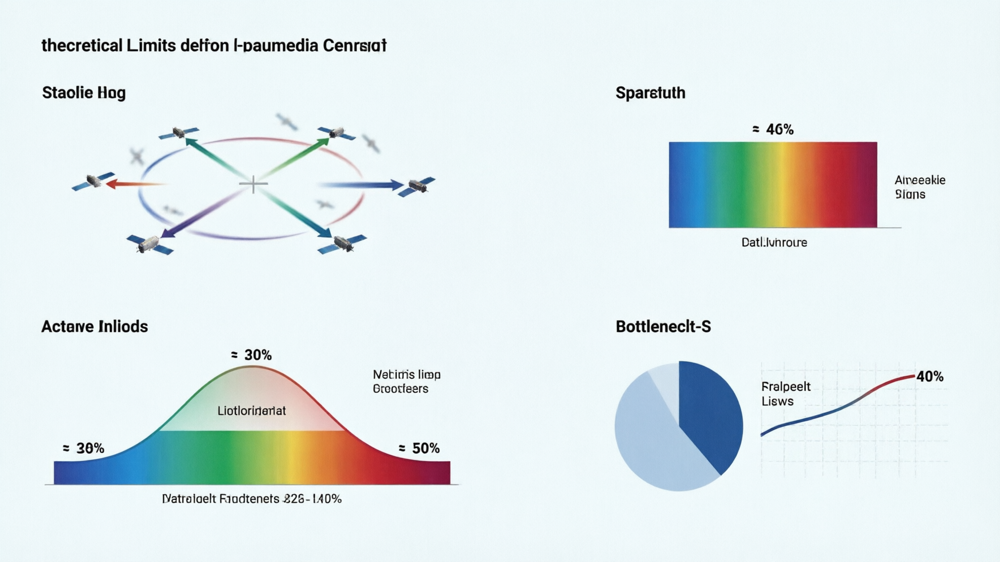
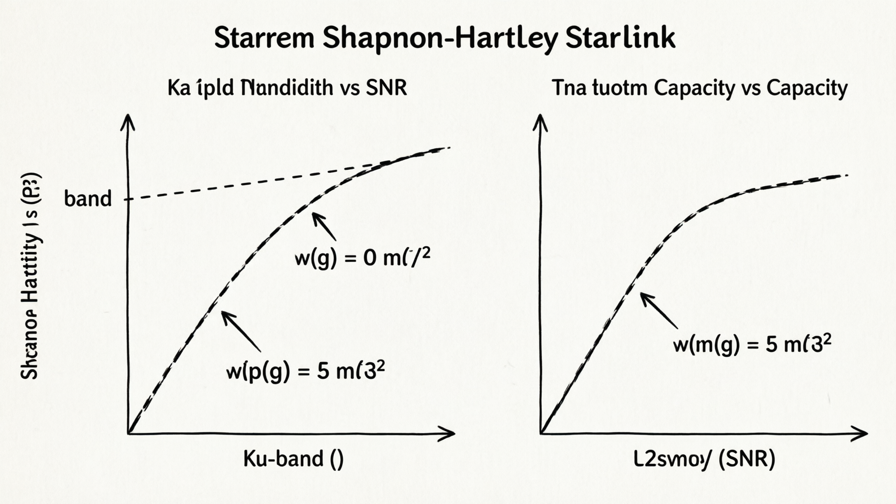
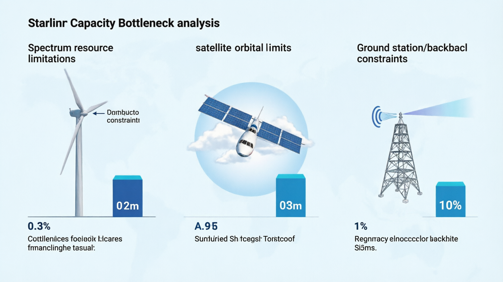
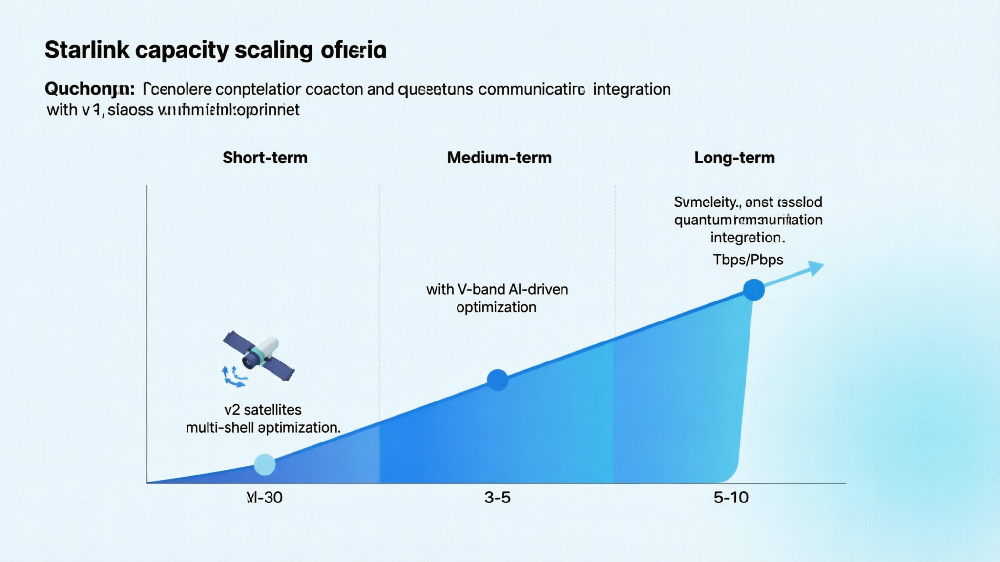

# 从通信视角看 Starlink（12）｜容量瓶颈与系统极限：Starlink 的理论容量天花板在哪里？

> 本文属于「从通信视角看 Starlink」系列第 12 篇（第二阶段第 6 篇）
> 目标读者：通信行业从业者、系统架构师、关注容量规划的专业读者

---

## Starlink 容量是否有上限？

这是一个看似简单但极其复杂的问题。

表面上看，Starlink 可以通过不断增加卫星数量来线性扩展容量。但实际上，**任何通信系统都有其物理和工程上的根本限制**。

在第（05）篇中，我们分析了单颗卫星和系统的容量计算。在第（11）篇中，我们探讨了资源调度机制。现在，我们需要回答一个更根本的问题：

**Starlink 的理论容量天花板究竟在哪里？**

---

## 香农极限：理论容量的终极边界

### 香农-哈特利定理回顾

任何通信系统的最大理论容量由香农定理决定：

**C = B × log₂(1 + SNR)**

其中：
- **C** = 信道容量（bps）
- **B** = 带宽（Hz）
- **SNR** = 信噪比（Signal-to-Noise Ratio）

这个公式告诉我们，**容量存在绝对的理论上限**。

### Starlink 的香农极限计算

**Ku频段香农极限**：
- **总带宽**：B = 2.5 GHz（下行2.0 GHz + 上行0.5 GHz）
- **典型SNR**：SNR = 20 dB = 100（良好条件下）
- **理论容量**：C = 2.5×10⁹ × log₂(1+100) ≈ 2.5×10⁹ × 6.66 ≈ **16.65 Tbps**

**Ka频段香农极限**（如果全面使用）：
- **总带宽**：B = 5.0 GHz（假设可用）
- **典型SNR**：SNR = 15 dB = 31.6（Ka频段雨衰影响）
- **理论容量**：C = 5.0×10⁹ × log₂(1+31.6) ≈ 5.0×10⁹ × 5.04 ≈ **25.2 Tbps**

**综合香农极限**：约 **40-50 Tbps**

这是Starlink在现有频谱资源下的**绝对理论上限**。

---

## 实际容量限制因素

### 1. 频谱资源限制

**现实频谱分配**：
- **Ku频段**：实际可用约 2.5 GHz（需与GEO卫星协调）
- **Ka频段**：部分区域可用，但受监管限制
- **V频段**：未来可能，但技术挑战巨大

**频谱效率限制**：
- **实际频谱效率**：3-4 bps/Hz（vs 理论极限 6-7 bps/Hz）
- **调制编码开销**：约15-20%的协议开销
- **保护间隔**：防止干扰需要的频率保护带

**实际频谱容量**：约 **8-12 Tbps**

### 2. 卫星数量与轨道限制

**轨道壳层容量**：
- **550 km壳层**：最多容纳约 4,000 颗卫星（避免碰撞）
- **多壳层部署**：5个主要壳层，总计约 20,000 颗卫星
- **实际部署目标**：42,000+ 颗（需要更密集的轨道管理）

**卫星间干扰**：
- **同轨干扰**：相邻卫星信号相互干扰
- **交叉链路干扰**：不同壳层卫星间的干扰
- **协调成本**：随着卫星数量增加，协调复杂度指数增长

**实际卫星容量**：约 **15-20 Tbps**（考虑干扰和协调开销）

### 3. 功率与能源限制

**太阳能供电限制**：
- **每颗卫星功率**：约 5-10 kW（太阳能电池板面积限制）
- **发射功率分配**：需要在多个波束间分配有限功率
- **热管理限制**：高功率发射产生热量，需要散热

**功率效率**：
- **EIRP限制**：等效全向辐射功率受法规限制
- **功放效率**：功率放大器效率约 30-50%
- **实际可用功率**：约 60-70% 的理论值

**功率限制容量**：约 **12-18 Tbps**

### 4. 地面站与回传限制

**地面站容量**：
- **单个地面站**：支持约 10-20 颗卫星同时连接
- **全球地面站数量**：约 1,000-2,000 个（地理和成本限制）
- **回传带宽**：依赖光纤网络，存在地理覆盖限制

**星间链路替代**：
- **激光链路容量**：每条链路 10-100 Gbps
- **星间网络拓扑**：网状网络可减少对地面站依赖
- **路由复杂度**：大规模星间路由带来延迟和复杂性

**回传限制容量**：约 **10-15 Tbps**（无星间链路）→ **20-25 Tbps**（有星间链路）

---

## 系统级容量瓶颈识别

### 容量瓶颈排序

| 瓶颈类型 | 限制容量 | 可扩展性 | 解决方案 |
|----------|----------|----------|----------|
| **频谱资源** | 8-12 Tbps | 低 | 申请新频段、提高频谱效率 |
| **卫星数量** | 15-20 Tbps | 中 | 多壳层、更密集轨道 |
| **功率限制** | 12-18 Tbps | 低 | 更高效功放、更大太阳能板 |
| **地面回传** | 10-25 Tbps | 高 | 星间链路、更多地面站 |

**最关键的瓶颈**：**频谱资源**（无法通过技术手段大幅突破）

### 用户密度瓶颈

**热点区域容量**：
- **城市郊区**：同时可见 3-5 颗卫星
- **单区域总容量**：约 200-300 Gbps
- **用户密度**：100-1,000 用户/km²
- **人均带宽**：200-3,000 Kbps（高峰期可能更低）

**容量不均衡问题**：
- **农村地区**：容量过剩，用户稀少
- **城市地区**：容量紧张，用户密集
- **海洋/偏远地区**：容量充足，但用户价值低

这种不均衡使得**系统总容量无法被充分利用**。

### 时间维度瓶颈

**动态容量需求**：
- **白天 vs 夜晚**：容量需求差异巨大
- **工作日 vs 周末**：使用模式不同
- **季节性变化**：旅游、假期等影响

**容量利用率**：
- **峰值利用率**：80-90%（热点区域）
- **平均利用率**：30-50%（全局平均）
- **闲置容量**：大量卫星在非高峰时段容量闲置

---

## 扩展性分析与未来展望

### 短期扩展（1-3年）

**v2卫星部署**：
- **容量提升**：单星容量提升 4-5 倍
- **系统总容量**：达到 1-2 Pbps
- **频谱效率**：提升至 4-5 bps/Hz

**多壳层优化**：
- **容量密度**：热点区域容量提升 2-3 倍
- **用户体验**：减少拥塞，提升QoS

**星间链路完善**：
- **回传依赖**：减少 50-70%
- **容量利用率**：提升至 60-70%

### 中期扩展（3-5年）

**V频段应用**：
- **新增频谱**：10-20 GHz 可用带宽
- **容量翻倍**：系统总容量达到 2-4 Pbps
- **技术挑战**：雨衰严重，需要先进编码

**AI驱动优化**：
- **智能调度**：容量利用率提升 20-30%
- **预测性分配**：减少拥塞，提升用户体验
- **动态资源分配**：实时优化容量分配

**直连手机支持**：
- **新增用户类型**：移动用户容量需求
- **容量压力**：增加 10-20% 的系统负载
- **商业模式**：高价值用户，更高ARPU

### 长期扩展（5-10年）

**完整星座部署**：
- **卫星数量**：42,000+ 颗
- **系统容量**：5-10 Pbps
- **全球覆盖**：真正的无缝覆盖

**量子通信集成**：
- **安全容量通道**：超高安全性通信
- **容量补充**：专用高价值通道
- **技术前沿**：保持技术领先优势

**太空数据中心**：
- **在轨处理**：减少地面传输需求
- **边缘计算**：提升响应速度，降低容量需求
- **智能分流**：优化容量使用效率

---

## 容量经济学：成本与收益平衡

### 容量成本趋势

| 时期 | 容量成本 | 主要驱动因素 |
|------|----------|--------------|
| **早期**（2020-2022） | $100+/Gbps/月 | 发射成本高、卫星成本高 |
| **现在**（2026） | $10-20/Gbps/月 | 规模效应、可重复使用火箭 |
| **未来**（2030+） | $1-5/Gbps/月 | 完整星座、技术成熟 |

**经济可行性阈值**：当容量成本 <$10/Gbps/月时，Starlink 在很多场景具备竞争力。

### 收益模型分析

**用户分层收益**：
- **标准用户**：$120/月，共享容量
- **高优先级用户**：$200-500/月，保障容量
- **商业用户**：$500-2000/月，专用容量
- **移动用户**：$150/月，动态容量

**ARPU与容量关系**：
- **容量充足时**：ARPU稳定，用户增长驱动收入
- **容量紧张时**：ARPU提升（通过分级定价），但用户增长受限
- **最优平衡点**：容量利用率 70-80%，ARPU最大化

### 投资回报分析

**资本支出**：
- **卫星制造**：$200-500万/颗
- **发射成本**：$100-200万/颗
- **地面站**：$100-500万/个
- **总CapEx**：$100-200亿（完整星座）

**运营支出**：
- **容量成本**：$10-20/Gbps/月
- **维护成本**：$1-2亿/年
- **用户获取**：$100-200/用户

**盈亏平衡点**：
- **用户数量**：500-1000万用户
- **时间周期**：5-8年
- **关键假设**：ARPU $120-200，用户增长率 20-30%/年

---

## 容量的本质：动态平衡的艺术

Starlink 的容量不是一个固定数字，而是一个**动态平衡系统**：

- **物理限制**：香农极限、频谱资源、轨道空间
- **工程限制**：功率、热管理、制造成本
- **经济限制**：投资回报、用户付费意愿
- **运营限制**：调度算法、QoS保障、用户体验

**真正的技术壁垒**不是单一的容量数字，而是**在多重约束下实现最优容量利用的能力**。

---

## 本文解决了什么？

- **明确了Starlink的理论容量天花板**（40-50 Tbps香农极限）
- **识别了实际容量的主要限制因素**（频谱、卫星、功率、回传）
- **分析了系统级容量瓶颈**（用户密度不均、时间维度变化）
- **展望了容量扩展路径**（短期、中期、长期）
- **探讨了容量经济学**（成本、收益、投资回报）

---

## 下一篇预告

**从通信视角看 Starlink（13）｜拥塞与切换：Starlink 如何处理用户移动和网络拥塞？**

当用户在移动，或者网络出现拥塞时，Starlink 如何保证服务质量？

下一篇我会深入分析：
- LEO卫星快速切换机制
- 拥塞检测与缓解策略
- 移动性管理与无缝切换
- QoS保障在动态环境中的实现

---

**栏目**：从通信视角看 Starlink
**系列索引**：第 12 篇 / 第二阶段 8 篇
**目标读者**：通信行业从业者、系统架构师、关注容量规划的专业读者